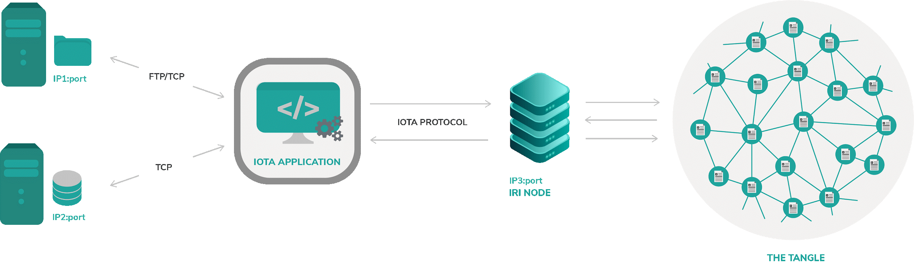
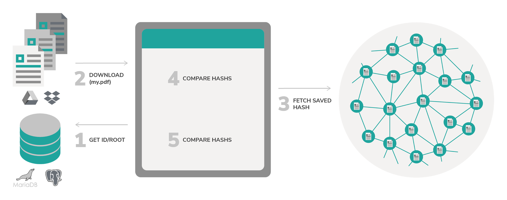
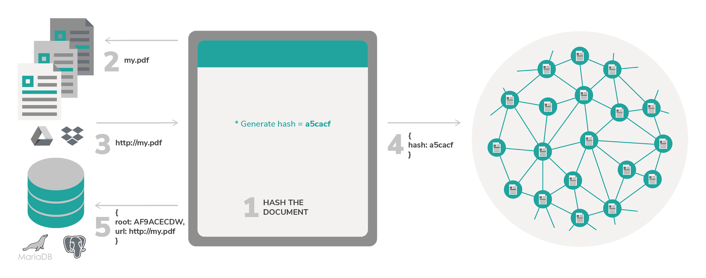

# Application architecture

**The Document immutability application consists of two parts: A graphical user interface (GUI), written in React and a back-end API, written in NodeJS.**

:::warning:Disclaimer
Running an open source project, like any human endeavor, involves uncertainty and trade-offs. We hope the architecture described below helps you to deploy similar systems, but it may include mistakes, and can’t address every situation. If you have any questions about your project, we encourage you to do your own research, seek out experts, and discuss them with the IOTA community.
:::

## Instructions and technical concepts

This projects assumes some level of programming knowledge.

- [PoC source code](https://github.com/iotaledger/poc-document-immutable-blueprint)
- [Proof of existence library](https://www.npmjs.com/package/@iota/poex-tool)

Here is an illustration of the system components:



### File storage

A database for storing documents, it can be either maintained by the user or a third party provided as a service like (Google drive, D2ropbox etc..), usually for scalability and faster development reasons, better to have it as a service.

### Database

This can be a commonly used DB like MariaDB, postgreSQL etc. 
The main role is to persist references/link to the stored file. Without these references the stored files are lost forever (in case of a lost link to the actual data).

### IOTA Application 

This is where our application logic resides, it contains an app that is responsible for interacting with all application components. For example, Generating Hash and Document ID, storing the document in the file storage, persisting data in the Database using postgreSql then publishing it to the Tangle.
The application layer is also the one responsible for checking the document immutability.

### The Tangle

The Tangle is the technology enabler for IOTA ecosystem, in this PoC scope, we are going to use it as a source of truth to hold and expose all the document signatures to check their immutability.
In order to use the Tangle you have to connect an IRI node, from there your data is spread and duplicated into other nodes.

## Prerequisites

- Hardware
    - Any processor able to run this app smoothly, included mobile phones.
- Software 
    - Node.js 8+
    - Any supported Browser (Chrome, Firefox)
    - IOTA.js
    - Storage service like Google Drive or Dropbox
    - Database (either locally postgres or online like Firebase)
- Programming language(s) used:
    - Javascript
    - HTML/CSS
- Required 3rd party licenses
    - Apache 2.0, MIT, usually inherited by our libraries IOTA.JS
- IOTA knowledge
  - Intermediate Javascript knowledge 
  - Understanding how to send Transaction with Metadata using IOTA.JS
- Partner knowledge
  - Sending 0 value Transactions.
  - How to use databases (optional)
  - How to use Google drive APIs (optional)

### Deployment

There is no restriction on the manner of deployment, you can run this completely using online services (e.g. Google drive and Firebase) or completely on your own server - depending on your needs you might choose one or another.

:::warning:Disclaimer
Running an open source project, like any human endeavor, involves uncertainty and trade-offs. We hope the architecture described below helps you to deploy similar systems, but it may include mistakes, and can’t address every situation. If you have any questions about your project, we encourage you to do your own research, seek out experts, and discuss them with the IOTA community.
:::

## Generic Diagram (Document hashing)

Usually when it comes to document storage a common pattern is to use an external storage service, as this comes with a lot of benefits such as simpler indexing, easy scalability and faster development.

These external document stores can be hosted by you or provided as a service (e.g. Google drive, dropbox etc)

This figure shows the case of document signing and how the interaction between the external document storage and the rest of the system is done.


### 1 - Document hashing

Document hashing is a crucial step where we generate document Hash, this Hash will be used in the persistence metadata step.

### 2 - Storage

We store the document in one of the chosen services and make sure we got a URL for it to get the document back again later when doing verification.

### 3 - Get Document ID

Usually when using an external file storage, after the upload we get a Document ID where we can save somewhere else to retrieve the file later.

### 4 - Publish the Hash to the Tangle

Publish the hash of the document in the Tangle in a Transaction metadata, this will ensure that the saved hash is not compromised nor changed overtime.

### 5 - Persist document Metadata in the Database

After the sending of new Transaction, we get a TX HASH then we Persist the generated Document ID (the URL) along with the TX HASH into the Database, we can also put more metadata along with it such as Date/time, size etc.
This will not have any benefits for the scope of this PoC, probably will be more useful when more requirements are needed.

## Generic Diagram (Document verification)

In a similar manner to the Document hashing step, Document verification is composed with the exact system components, the only difference is that the steps execution.



### 1 - Get ID/ROOT(TX Hash)

The first step would be that we query the saved metadata of the signed document, it contains essentially the TX Hash and the document ID, the response return should at least contain these properties:

The first step would be that we query the saved metadata of the signed document, it contains essentially the TX Hash and the document ID, the response return should at least contain these properties:

```json
{
    Url: http://my_document.pdf,
    txHash: AD9FE...YA99F9
}
```

### 2 - Download the Document

From the previous queried URL we download the file from the document storage

### 3 - Fetch from Tangle

Then we fetch the Hash from the Tangle, the response will be something similar to this:

```json
{
    Hash: ac5e...f1f8
}
```

This is can be considered as minimal data can be stored in the tangle, but it's up to the user to store even more data if needed.

### 4 - Calculate the hash again
Once the document is downloaded we calculate the hash of it using the exact same way we did it the first time (using the same hashing algorithm) to ensure deterministic results.
Let’s suppose that our document hasn’t changed since our first storage, using the same hash method should produce the same hash:

```json
    Hash = ac5e...f1f8
```

### 5 - Compare hashes

Since the both hashes (the one fetched from Tangle and the calculated one) matches we can safely stamp the document as valid.

## Hashing algorithms

At the time of writing we highly recommend using at least 128 bits hashing algorithm.

:::warning:Disclaimer
It is recommended to use 128 bits hashing algorithm ( eg: SHA256 ), hashing algorithm like MD5 or SHA1 are vulnerable to attack as they are proven in practice that can be hijacked.
:::


- SHA256 - 2<sup>128</sup>
- SHA512 - 2<sup>256</sup>
- SHA-3	- Up to 2<sup>512</sup>
- BLAKE2s - 2<sup>128</sup>
- BLAKE2b - 2<sup>256</sup>

Read more [here](https://en.wikipedia.org/wiki/Hash_function_security_summary)

## Sequence Diagram

In this section we are going to describe some scenarios that can happen when using the PoC, there are mainly two main scenarios described below.


### Signing the document Scenario 

In this scenario we cover the case where the user or whom is responsible for uploading the document the very first time wants to protect the document against mutability. 

1.	Hashing the document
2.	Uploading the document
3.	Retrieving a URL after upload is complete
4.	Publish to the tangle the calculated hash
5.	Persisting the Generated Root (TX Hash) and URL.




### Verifying document Scenario 

This is the second case when anyone is concerned about checking the document signature, the following diagram will explain how the document is being verified.

1.	Query the database for the document metadata (URL/ROOT(TX Hash) in this case)
2.	Download the original file using the queried URL
3.	Fetch the saved hash in the tangle 
4.	Calculate the document hash again
5.	Compare the saved hash with the newly calculated one.


