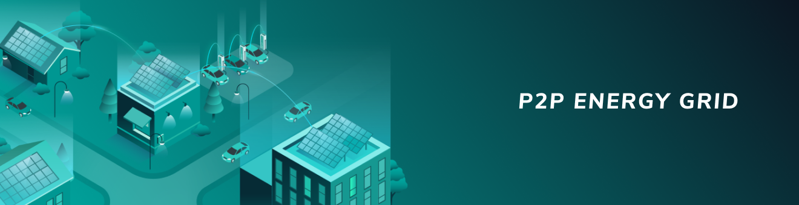

# Application blueprints

**Application blueprints explain how you can use IOTA to solve real-world problems and to support well-defined business needs.**

Blueprints are designed to do the following:

* Describe a problem and a solution
* Present an architecture that shows you how to solve the problem with IOTA
* Explain how you can test, edit, and deploy the blueprint

-------------------------

## [Data Marketplace](../data-marketplace/overview.md)
Data silos make it difficult to buy and sell data among different data points. To overcome this challenge, the Data Marketplace uses IOTA MAM channels to open up the data silos and allow users to make micropayments of IOTA tokens to the data owners in exchange for data.
-------------------------

-------------------------

## [Peer-to-peer energy grid](../data-marketplace/overview.md)
Although the supply of energy is often automated, the payment system is expensive to integrate and often requires manual intervention. By creating a peer-to-peer energy grid with IOTA, you can automate the transfer of power and the payment for that power. This automation makes your infrastructure more dynamic and easier to update.
-------------------------

-------------------------

## [Tangle data storage](../data-marketplace/overview.md)
Data silos make it difficult to buy and sell data among different data points. To overcome this challenge, the Data Marketplace uses IOTA MAM channels to open up the data silos and allow users to make micropayments of IOTA tokens to the data owners in exchange for data.
-------------------------

-------------------------

## [Track and trace](../track-and-trace/overview.md)
Due to a lack of both due diligence and a vendor-neutral data source, returnable assets that are used within distribution networks are often not returned to their original owners. This blueprint describes how the IBCS Group implemented a track and trace system for recovery of returnable assets, using the IOTA Tangle and other IOTA technologies.
-------------------------
