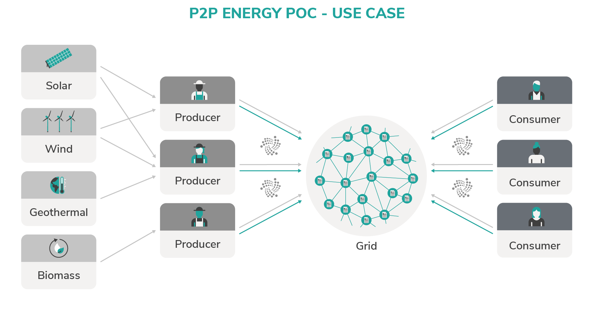

# Peer-to-peer energy grid

**Although the supply of energy is often automated, the payment system is expensive to integrate and often requires manual intervention. By creating a peer-to-peer energy grid with IOTA, you can automate the transfer of power and the payment for that power. This automation makes your infrastructure more dynamic and easier to update.**

This blueprint demonstrates how entities in a peer-to-peer (P2P) energy grid can trade energy. The distributed and machine-based nature of the P2P energy grid make this an ideal use case for IOTA. Using IOTA technologies, you can create an infrastructure where even low-powered devices can communicate with the grid in a traceable and immutable way.

Trading energy on a P2P energy grid involves four high-level entities:

**Entity** | **Role**
---|---
Source|Generate electricity such as solar or wind for a producer|
Producer| Manage several sources and receive payment from the grid
Consumer |Use the power provided by the grid in return for payment|
Grid| Coordinate the distribution of power from the producers to the consumers, and distribute payments|
 

:::info:
This blueprint can be replicated in any scenario where a resource is distributed to consumers in return for payment, for example water supply.
:::

## Glossary

* IRI - The IOTA reference implementation is the reference implementation of the IOTA node software
* MAM - Masked Authentication Messaging is a second layer data communication protocol which adds functionality to emit and access an encrypted data stream, like RSS, over the Tangle https://blog.iota.org/introducing-masked-authenticated-messaging-e55c1822d50e
* source - an entity in the PoC that supplied energy
* producer - an entity in the PoC that aggregates information from Sources and supplied that information to the Grid
* consumer - an entity that uses power from the Grid and is charged for its use
* grid - the grid processes information from Producers and Consumers to create payment channels

## Additional resources

* [IRI repository](https://github.com/iotaledger/iri) 
* [MAM repository](https://github.com/iotaledger/mam.client.js)
* [iota.js repository](https://github.com/iotaledger/iota.js)

