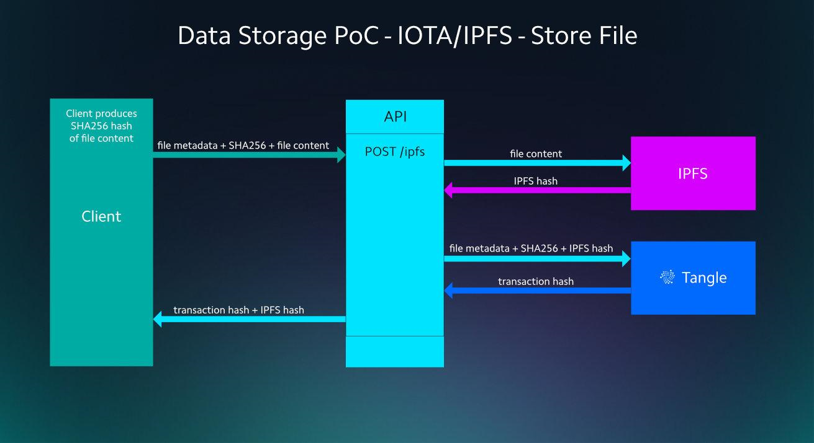
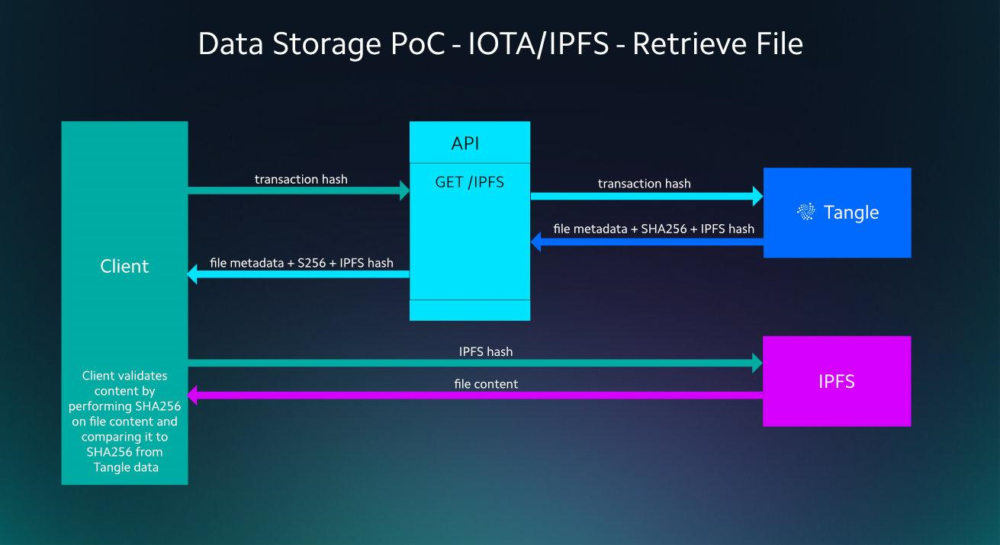

# Application architecture

**The Tangle data storage application consists of two parts: A graphical user interface (GUI), written in React and a back-end API, written in NodeJS.**

:::warning:Disclaimer
Running an open source project, like any human endeavor, involves uncertainty and trade-offs. We hope the architecture described below helps you to deploy similar systems, but it may include mistakes, and can’t address every situation. If you have any questions about your project, we encourage you to do your own research, seek out experts, and discuss them with the IOTA community.
:::

## Prerequisites

This projects assumes some level of programming knowledge, specifically in: JavaScript, React and Node.js.

## Instructions and technical concepts 

- [PoC source code](https://github.com/iotaledger/poc-ipfs/blob/master/README.md) - 
Consists of two parts a front-end GUI written in React and a back-end written as a Node.js API.
In order to reproduce this PoC there is no requirement to deploy dedicated hardware.
- [Front-end deployment instructions](https://github.com/iotaledger/poc-ipfs/blob/master/client/DEPLOYMENT.md)
- [Node.js API deployment instructions](https://github.com/iotaledger/poc-ipfs/blob/master/api/DEPLOYMENT.md)

The presented infrastructure makes use of the IOTA Tangle and an `InterPlanetary File System` (IPFS) node that you run yourself. The following image shows the main architecture components.


:::warning:Disclaimer
Running an open source project, like any human endeavor, involves uncertainty and trade-offs. We hope the architecture described below helps you to deploy similar systems, but it may include mistakes, and can’t address every situation. If you have any questions about your project, we encourage you to do your own research, seek out experts, and discuss them with the IOTA community.
:::

## Prerequisites

To test, edit, and deploy this application, you need programming knowledge in JavaScript, React, and NodeJS.

## API

The API implements two methods:

- `storeFile()`
- `retrieveFile()`
  
### File storage

To store a file using the API, the client does the following:

* Select the file to upload
* Generate SHA256 hash of the file content
* Capture additional file meta data
* Send the meta data, SHA256 hash, and file contents to the IPFS node (POST /ipfs)

Behind the scenes, the API does the following:

* Upload the file content to IPFS, which returns the IPFS hash
* Store the metadata, SHA256 and IPFS hash on the Tangle, which returns a transaction hash
* Return the Tangle transaction hash to the client



The `storeFile()` method takes a JSON object in the following format:

```javascript
IPFSStoreRequest {
   /**
    * The name of the file.
    */
   name: string;

   /**
    * The description of the file.
    */
   description: string;

   /**
    * The size of the file.
    */
   size: number;

   /**
    * The modified date of the file.
    */
   modified: Date;

   /**
    * The sha256 hash of the file.
    */
   sha256: string;

   /**
    * The file data encoded in base64.
    */
   data: string;
}
```

On receipt of the JSON object, the file is uploaded to the IPFS node.

```javascript
import ipfsClient from "ipfs-http-client";

const buffer = Buffer.from(request.data, "base64");
const ipfs = ipfsClient(config.ipfs);
const addResponse = await ipfs.add(buffer);
```

The response from the `add()` method contains the IPFS hash, which is combined with the metadata and the SHA256 hash before being attached to the Tangle.

```javascript
const nextAddress = generateAddress(config.seed, 0, 2);

const tanglePayload = {
   name: request.name,
   description: request.description,
   size: request.size,
   modified: request.modified,
   sha256: request.sha256,
   ipfs: addResponse[0].hash
};

const iota = composeAPI({
        provider: config.provider
    });

const trytes = await iota.prepareTransfers(
   "9".repeat(81),
   [
	   {
		   address: nextAddress,
		   value: 0,
		   message: TrytesHelper.toTrytes(tanglePayload)
	   }
   ]);

const bundle = await iota.sendTrytes(trytes, config.depth, config.mwm);
   
```

The bundle returned from the `sendTrytes()` method contains the transaction hash that's then returned to the client.

### File retrieval

To retrieve a file and validate its contents the client does the following:

* Request the metadata, SHA256 and IPFS hash using the transaction hash from the API (GET /ipfs)
* Get the file contents from IPFS using the IPFS hash
* Perform a SHA256 on the retrieved file content
* Compare the calculated SHA256 with the one returned from the API



To retrieve and validate the file, the transaction hash is read from the Tangle.

```javascript
const iota = composeAPI({
        provider: config.provider
    });

const transactions = await iota.getTrytes([request.transactionHash]);
const txObject = asTransactionObject(transactions[0]);
const ascii = trytesToAscii(txObject.signatureMessageFragment);
const payload = JSON.parse(ascii)
```

Then, the transaction hash is used to request the file from the IPFS node, using any public IPFS gateway such as [Cloudflare](https://cloudflare-ipfs.com/ipfs/:hash)

Assuming the file was returned into a buffer, the file is hashed using a SHA256 algorithm and the resulting hash is compared to the one from the transaction's message.

```javascript
const sha256 = crypto.createHash("sha256");
sha256.update(fileBuffer);
const ipfsSha256 = sha256.digest("hex");
if (ipfsSha256 === payload.sha256) {
   console.log("All Is Well");
} else {
   console.log("Oh no, hash does not match");
}
```

## Data security

Because the IPFS is a distributed web, anyone who has the IPFS hash can download and read the contents of the file. 

To prevent unauthorized entities from reading the data, you could encrypt it before uploading it to the IPFS node.

## Alternative data storage solutions

In this application, data is uploaded to an IPFS node, however the same principles apply if you were to upload to an alternative data storage solution.

To use alternative storage solutions such as Amazon S3 or Azure Storage, you just need to upload the data to it with a unique hash (for example the SHA256 hash of the file).
