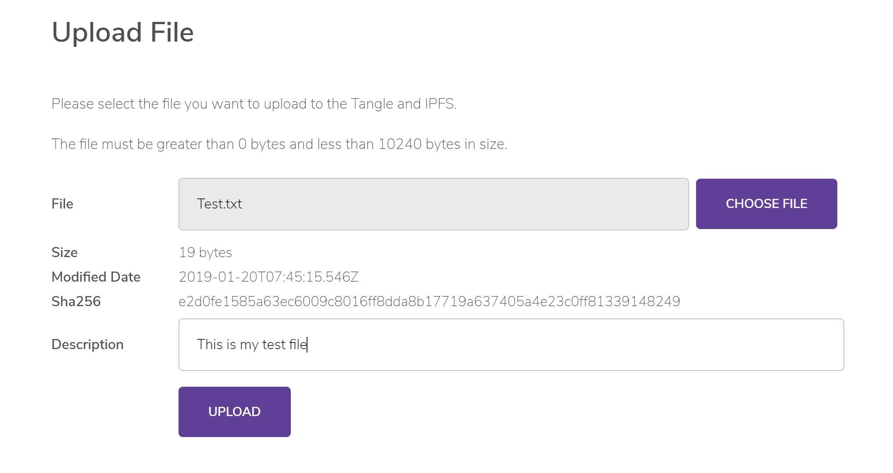
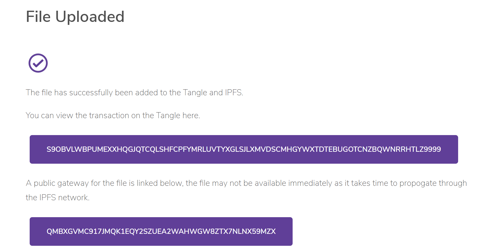
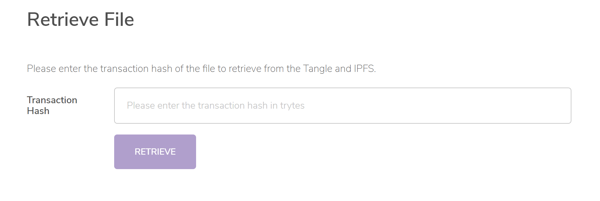
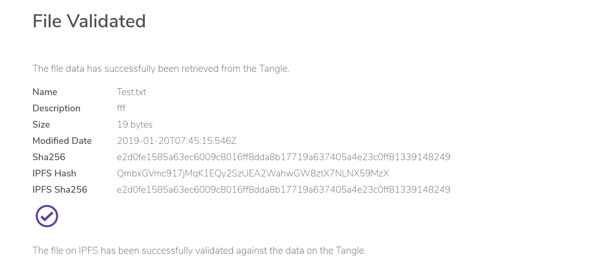

# Deploy and test the Tangle data storage app

**To start storing data in the IPFS node and the Tangle, deploy the application and use our graphical user interface to upload file data, retrieve file data, and compare hashes to verify the contents.**

## Deploy the Tangle data storage app

The deployment instructions are hosted on GitHub in the following markdown files:

- [PoC source code](https://github.com/iotaledger/poc-ipfs/blob/master/README.md) - 
Consists of two parts a front-end GUI written in React and a back-end written as a Node.js API.
In order to reproduce this PoC there is no requirement to deploy dedicated hardware.
- [Front-end deployment instructions](https://github.com/iotaledger/poc-ipfs/blob/master/client/DEPLOYMENT.md)
- [Node.js API deployment instructions](https://github.com/iotaledger/poc-ipfs/blob/master/api/DEPLOYMENT.md)

## Test the Tangle data storage app

1. After the application loads, the following image is displayed:

    

    :::info:
    The file size limitation is only for the purposes of this blueprint. Real-world implementations can allow any file size.
    :::

2. Select a file, and see that the other fields are automatically populated with metadata

    

3. Click **Upload** to store the metadata on the IPFS node and the Tangle. If everything went well, you should see a confirmation message.

    

4. To retrieve and validate a file, go to the Retrieve File page.

    

5. Enter a transaction hash and click **RETRIEVE**. The transaction hash will be passed to the API, which will retrieve the IPFS hash from the transaction's message, which is used to download the file and validate its SHA256 hash against the one stored in the transaction.

    

This completes the full lifecycle for storing, retrieving, and validating a file. The file metadata, SHA256 hash and IPFS hash that are stored in a transaction on the Tangle are immutable. If the file contents that you retrieve from the IPFS node don't match the ones on the Tangle, then the contents of that file can no longer be trusted.
