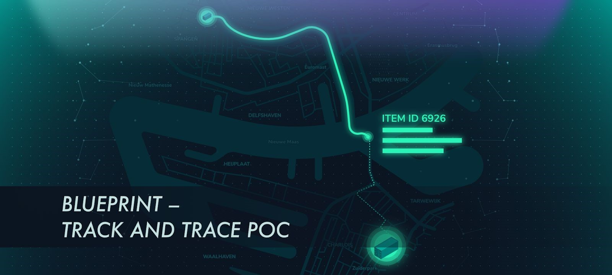

# Track and trace overview

**Due to the lack of due diligence and the lack of a vendor-neutral data source, returnable assets that are used within distribution networks are seldom returned to their original owners. This blueprint describes how a track and trace system for recovery of returnable assets has been implemented by the IBCS Group, using the IOTA Tangle and other IOTA technologies.**

Integration of this system within IBCS Group’s business processes is presented in order to provide a guide for other organizations willing to replicate and adapt the produced software to scenarios and business processes similar to the ones presented.

## Business case 

Misplacement of returnable assets represents an economic loss for the asset owners. This also affects ability to fulfil producers next deliveries and is a waste of time and resources when owners try to recover their missing returnable assets.

A returnable asset is an asset, such as a glass rack, that's used by multiple parties in the distribution and logistics chain while handling and delivering other valuable assets such as glasses.

In the case of the glass manufacturing industry, a returnable asset is used to ship glasses from a glass producer (owner of the asset) to a distributor. Instead of returning the returnable asset to the glass producers, the glass distributors might use them to ship other glasses to a window manufacturer. Then, the window manufacturers might use the returnable asset to deliver windows to the final end customer, either directly or through a different reseller. 

The table below summarizes the different stakeholders and roles considered in this business case. The table also shows how complex it is to keep track of all the relations involved in the handling of returnable assets. 

| **Stakeholder**       | **Role** |
|:---------------|:--------|
| Glass Producers | Deliver glasses either to distributors (directly) or to Window Manufacturers (through Logistic Provider). Own the returnable assets. |
| Window Manufacturers | Deliver windows to windows resellers either directly or through logistic providers. Might own their own returnable assets and use for the delivery. Or they might also re-use returnable assets received from glass producers.  |
| Distributors   | Receive glasses or windows delivered directly or through logistic providers together with returnable assets used for the delivery. Re-use the returnable assets to deliver glasses or windows further down to the distribution chain.  | 
| Windows Resellers   | Receive windows from distributors and use received returnable assets to arrange their delivery to end-customers. | 
| End-customers    | Receive windows directly from windows resellers or through logistic providers which use glass producers and windows manufacturers returnable assets. Often dispose returnable assets or do not know to whom and how to return.  | 
| Logistic Providers   | Move assets and returnable assets along the distribution chain.  | 

This image presents a simplified stakeholders map and the different actions each stakeholder should perform when in contact with a given returnable asset. The following entities are represented:

**Dotted arrows:** Path of a returnable asset
**Green circles:** Stakeholders such as custodians
**Purple circle:** Owner of the returnable asset 

### Challenges

So far, tracking and tracing returnable assets has been unsuccessful for the following reasons: 

- Custodians don't see economic value in a returnable asset. Instead, returnable assets are more likely to be seen as disposable assets
- Custodians are neither incentivized to help track returnable assets nor held accountable for not doing so
- Tracking returnable assets requires access to data that's stored in a number of proprietary systems, all of which belong to different custodians. These different systems increase the complexity to predict, map, and integrate the data, and exceed the perceived benefits in tracking returnable assets.

It's not possible to report the custody of assets using a centralized database because this database will also reveal to third parties, proprietary knowledge about different stakeholders, customers, and distribution chains. Moreover, it will be difficult to create a system that's able to centrally track all the possible interactions envisioned for a number of stakeholders that aren't known up front.

### Solution

The use of IOTA, a permissionless, distributed ledger technology, provides a solution to seamlessly collect and share information about returnable assets, despite all of the involved custodians and without the need to integrate any proprietary system. While doing that, IOTA can still guarantee access control of the collected information through the use of the second layer MAM protocol.

Thanks to the permissionless nature of IOTA, no trust is required among those who run the infrastructure because it's spread across the whole IOTA network. 

In addition, no former knowledge of all parties who write information to the ledger is required, thus simplifying the creation of a track-and-trace system that can be used by all the different stakeholders and industry sectors as needed and with minimum integration and onboarding time.

As a result, the following benefits are envisioned: 

- Asset owners can track and request the return of their returnable assets, thus saving money resulting from the need to buy new assets

- Asset owners can save the time and the costs associated with searching for missing assets

- Asset owners can better predict and plan shipments of their production by knowing the exact number and the exact location of any returnable assets that are available to them

- Custodians can track the returnable assets they handle, be rewarded for returning them, and increase their reputation with asset owners

- Custodians can save costs associated with supporting requests for returnable assets that are declared missing

:::info:
While this solution already solves the track and trace problem, in future scenarios the use of the IOTA token (and Qubic smart contracts) could allow you to create incentives to reward custodians who participate in tracking and tracing returnable assets, despite the country and the currency in which the assets are handled.
:::

## Demo

See this website for a [demonstration of the application](http://tradedemo.iota.org/).

## Abbreviations 
 
- IF - IOTA Foundation
- HW - Hardware
- SW - Software
- JS - JavaScript
- IRI - IOTA reference implementation, the SW written in Java that allows users to become part of the [IOTA network](root://iri/0.1/introduction/overview.md) as both a transaction relay and network information provider through the easy-to-use [API](root://iri/0.1/references/api-reference.md).
- DBMS - Database management systems
- MAM -	Masked Authenticated Messaging, a second layer data communication protocol that adds functionality to publish and control access to an encrypted data stream, over the Tangle 
 	 	 
## Additional resources

- [IRI Repository](https://github.com/iotaledger/iri )
- [MAM eloquently explained](https://blog.iota.org/introducing-masked-authenticated-messaging-e55c1822d50e) 
- [MAM Source code Repository](https://github.com/iotaledger/mam.client.js) 
- [iota.js Repository](https://github.com/iotaledger/iota.js)
