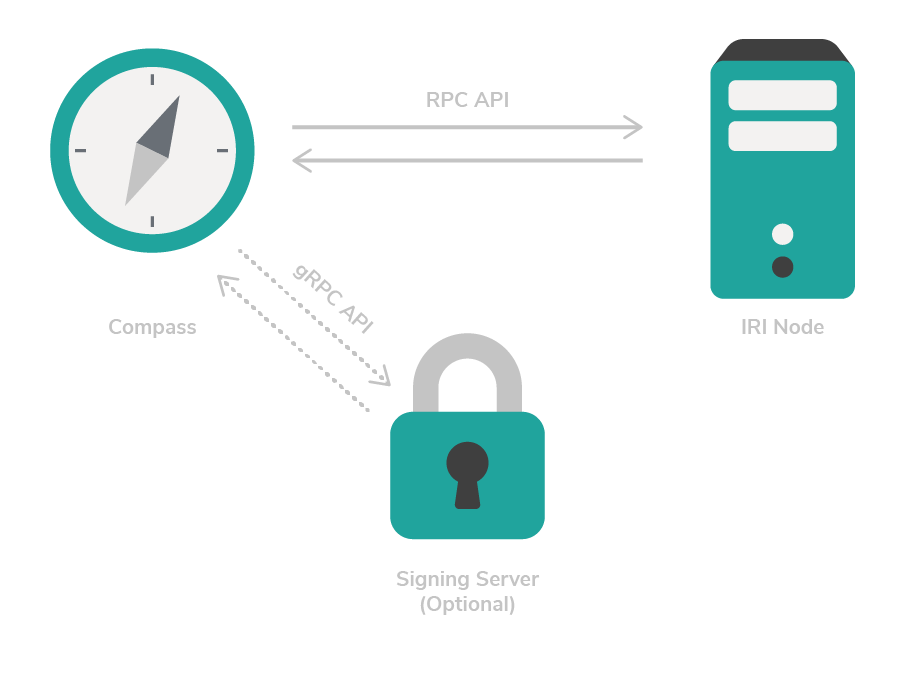

# Create an IOTA network

**If you want to test your application in your own IOTA network, you can run Compass and connect it to an IRI node.**

For this basic setup, you'll install an IRI node and Compass on the same server or virtual machine. But, you could run multiple IRI nodes and connect them to each other as neighbors.

:::info:
You could also install a signing server for increased security.

A signing server reduces the attack surface of Compass by moving sensitive operations such as signing to an external service. Compass interacts with the signing server through a gRPC API.
:::



To create your own IOTA network, you must complete the following tasks in order:

1. [Install the dependencies](#install-the-dependencies)
2. [Calculate the Merkle tree](#calculate-the-merkle-tree)
3. [Run an IRI node](#run-an-iri-node)
4. [Run Compass](#run-compass)
5. [Test the network](#test-your-network)

## Prerequisites

A Linux server with the following minimum requirements. If you are on a Windows or Mac operating system, you can [create a Linux server in a virtual machine](root://general/0.1/how-to-guides/set-up-virtual-machine.md).

* A new installation of an Ubuntu 18.04 Server / Virtual Machine
* At least 8GB RAM
* Preferably 4+ CPU cores, the more cores the faster the Merkle tree will be generated.
* At least a 10GB SSD

## Install the dependencies

Compass uses [Bazel](https://bazel.build/) to build and [Docker](https://www.docker.com/) to run, so we need to make sure both are installed.

1. Install the dependencies for Bazel

	```bash
	sudo apt-get install pkg-config zip g++ zlib1g-dev unzip python
	```

2. Download the latest Bazel installer

	```bash
	wget https://github.com/bazelbuild/bazel/releases/download/0.18.0/bazel-0.18.0-installer-linux-x86_64.sh
	```

3. Check that you can execute the script before you run it

	```bash
	chmod +x bazel-0.18.0-installer-linux-x86_64.sh
	```

4. Install Bazel under your active user, using the `--user` flag

	```bash
	./bazel-0.18.0-installer-linux-x86_64.sh --user
	```
	You may need to restart your computer after you install Bazel.

5. Install the necessary packages

	```bash
	sudo apt install apt-transport-https ca-certificates curl software-properties-common
	```

6. Install Docker 

	```bash
	curl -fsSL https://download.docker.com/linux/ubuntu/gpg | sudo apt-key add -
	sudo add-apt-repository "deb [arch=amd64] https://download.docker.com/linux/ubuntu bionic stable"
	sudo apt update
	sudo apt install docker-ce
	```
	
7. Install the `jq` tool for formatting JSON data

	```bash
	sudo add-apt-repository universe
	sudo apt install jq
	```

## Calculate the Merkle tree

For this guide, we use a [Merkle tree](root://the-tangle/0.1/concepts/the-coordinator.md#milestones) with a depth of 16, which allows Compass to send milestones for around 45 days, depending on the interval between them. The interval between milestones depends on two factors:

* The `tick` interval that Compass waits between creating, signing, and sending a bundle
* The length of time it takes to create, sign and send a bundle

:::info:
The greater the depth, the longer it takes to create the Merkle tree, but the more bundles Compass can sign and send.

So, a depth of 24 would allow Compass to send milestones for over 31 years, but it would take a long time to create the Merkle tree. A depth of 8 would allow Compass to send milestones for only a couple of hours, but it would take only seconds to create the Merkle tree.
:::

The Compass repository includes a tool to create a Merkle tree and save it in a `data` directory for Compass to use later on. 

1. Clone the Compass GitHub repository

	```bash
	git clone https://github.com/iotaledger/compass.git
	cd compass
	```

2. Build the `layers_calculator` tool that will create the Merkle tree

	```bash
	bazel run //docker:layers_calculator
	```

	This process can take some time. You should see the following in the output:

	```
	INFO: SHA256 (https://github.com/grpc/grpc-java/archive/fe7f043504d66e1b3f674c0514ce794c8a56884e.zip) = 19c51698d4837d1978a10ed7a01f4e45a0b15bcbd3db44de2a2a1c3bdd1cf234
	Analyzing: target //docker:layers_calculator (8 packages loaded)
	```

3. Create a seed for Compass. Compass will use this seed to derive public/private keys for signing bundles.

	```bash
	cat /dev/urandom |LC_ALL=C tr -dc 'A-Z9' | fold -w 81 | head -n 1 
	```

4. Create a backup of the seed

	:::danger:Keep you seed safe
	An attacker with the seed could send fraudulent milestones and disrupt the operation of the network.
	:::

5. Change into the directory that contains the scripts for setting up and running Compass

	```bash
	cd docs/private_tangle
	```

6. Copy the example configuration file

	```bash
	cp config.example.json config.json
	```

7. Open the `config.json` file and replace the value of the `seed` field with the seed you created in step 3

	```bash
	nano config.json
	```

8. Change the value of the `depth` field to `16`

	The finished `config.json` file should look like this:

	```json
	{
		"seed": "MYSEEDHEREPLEASEREPLACEMEIMMEDIATELYWITHSOMETHINGSECURE99999999999999999999999999",
		"powMode": "CURLP81",
		"sigMode": "CURLP27",
		"security": 1,
		"depth": 16,
		"milestoneStart": 0,
		"mwm": 9,
		"tick": 60000,
		"host": "http://localhost:14265"
	}
	```
	
	:::info:
	Compass will stop sending milestones if the Merkle tree runs out of leaves (public/private keys). To avoid this problem, use an 	appropriate value for the `depth` field.
	:::

9. Create the Merkle tree by executing the script in the `docs/private_tangle` directory

	```bash
	sudo ./01_calculate_layers.sh
	```

This process will take a while (with a 4 core virtual machine it takes around 15 minutes). After the process finishes, the root of the Merkle tree is displayed in the output:

```shell
[main] INFO org.iota.compass.LayersCalculator - Calculating 65536 addresses.
...
[main] INFO org.iota.compass.LayersCalculator - Successfully wrote Merkle Tree with root: JMRTYHMGNZGNOLPSSBVLWRPMGIAMOXPLURNDIBKXIFTCJCLOYKH9FMVNKPBVFVMGSUFEYVUUIEARFQXAK
```

The Merkle tree is stored in the data directory, so Compass can use the private keys when it starts running.

## Run an IRI node

Compass must send milestones to an IRI node. Compass sends milestones to an IRI node through an HTTP RPC API.

To make the IRI node recognize Compass transactions as trusted milestones, we created a script that uses the default IRI Docker container with some additional parameters.

The IRI node must use a snapshot.txt file to set the initial state of the ledger.

The `snapshot.example.txt` file puts the total IOTA supply of 2.7Pi in the first address that's derived from the following seed:
`SEED99999999999999999999999999999999999999999999999999999999999999999999999999999`. The first address (index 0) of this seed is  `FJHSSHBZTAKQNDTIKJYCZBOZDGSZANCZSWCNWUOCZXFADNOQSYAHEJPXRLOVPNOQFQXXGEGVDGICLMOXX` (excluding the checksum). 

1. Create a `snapshot.txt` file

	```bash
	touch snapshot.txt
	nano snapshot.txt
	```

2. Add the following line to the `snapshot.txt` file:

	```shell
	FJHSSHBZTAKQNDTIKJYCZBOZDGSZANCZSWCNWUOCZXFADNOQSYAHEJPXRLOVPNOQFQXXGEGVDGICLMOXX;2779530283277761
	```

	:::warning:
	Do not exceed the maximum supply of 2.7Pi
	:::

3. Run the IRI

	```bash
	sudo ./02_run_iri.sh
	```

	:::info:
	If you see a `malformed snapshot state file` error, check the snapshot.txt file and make sure that you didn't include a line break at the end of the line.
	
	If you see a `NumberFormatException` error or an `IllegalArgumentException` error, check that no space characters are either side of the semicolon.
	:::

4. Press **Ctrl** + **C** in the command prompt. IRI will continue to run in the background.

:::danger:Important
If the IRI node that Compass is connected to is compromised, an attacker could manipulate Compass to receive favorable treatment. Possible scenarios include the following:
- Return tip transactions that prioritize the attackers transactions over the regular tip selection algorithm.
- Return tip transactions that conflict with the ledger state (double spend IOTA tokens) causing Compass to send an inconsistent milestone. IRI nodes will not accept this milestone and no more transactions will be confirmed.
- Stop propagating milestone transactions to the rest of the network, causing no more transactions to be confirmed.
:::

## Run Compass

After you've created the Merkle tree and you're running an IRI node, you can run Compass.

1. Go back to your `compass` directory and run Bazel

	```bash
	cd ~/compass/
	bazel run //docker:coordinator
	```
	
2. Change into the directory that contains the scripts for setting up and running Compass

	```bash
	cd docs/private_tangle
	```

3. Run Compass

	```bash
	sudo ./03_run_coordinator.sh -bootstrap -broadcast
	```

	:::info:
	Compass enters an indefinite `while` loop and starts sending milestones.

	When the `-bootstrap` flag is passed during setup, Compass creates a chain of four milestones that sequentially reference the previous milestone.

	Then, Compass sends milestones by doing the following:
	* Ask the IRI node for tip transactions ([tip selection](root://the-tangle/0.1/concepts/tip-selection.md))
	* Ask the IRI node to broadcast the milestone
	* Sleep until the next tick interval
	:::

:::success:Compass is sending milestones in your own IOTA network! :tada:
If you restart Compass, you don't need to pass it the `-bootstrap` flag (Compass won't start if you do). But, you should pass it 	the `-broadcast` flag as a security measure so that Compass broadcasts its milestones to the IRI node.
:::

## Test your network

You can connect to your IRI node on port 14265, using Trinity or a client library.

1. Connect to your IRI node

2. Enter the `SEED99999999999999999999999999999999999999999999999999999999999999999999999999999` seed

Your balance should be 2.7Pi (you may have to attach the first address to the Tangle).

Feel free to send test transactions and see them confirmed by Compass milestones.
