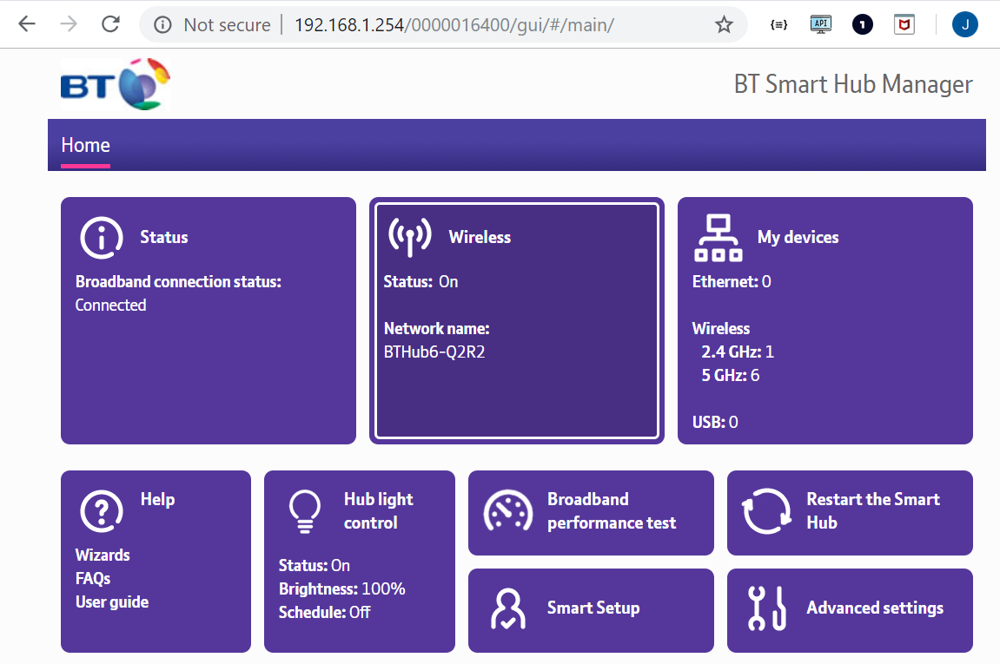
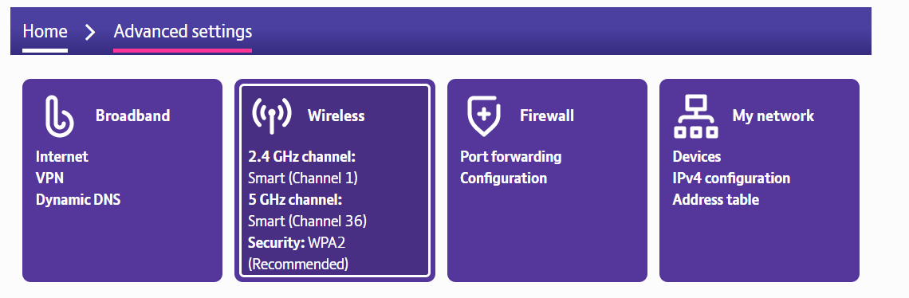
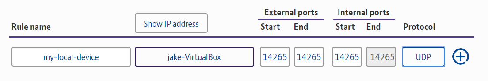

# Expose your local device to the Internet

**To connect a device to those outside of your local network, you can create port forwarding rules to forward requests from your public IP address to your device. A common reason to expose your local device to the Internet is to connect your IOTA node to neighbors.**

Before you can create port forwarding rules, you need a static IP address. If you already have one, [go straight to port forwarding](#create-a-port-forwarding-rule).

## Prerequisites

To complete this guide, you must have a Linux Ubuntu 18.04 server. If you don't have a Linux server and you're running a Windows or Mac operating system, you can [run one in a virtual machine](../how-to-guides/set-up-virtual-machine.md).

## Get a static IP address from your local network

Whenever a new device connects to a local network, it's assigned an internal IP address from a DHCP (dynamic host configuration protocol) server, which is usually your router.

Before you can create port forwarding rules, you need the internal IP address of your local device to stay the same. Otherwise, you'd need to update your port forwarding rules every time your IP address changed.

**Note:** Many ways exists to get a static IP from your local network, and this guide is just one way of doing so.

1. Find your gateway IP address (router's IP address) and make a note of it

    ```bash
    route -n
    ```

2. Find both the current internal IP address of your Linux server and the netmask length, and make a note of them

    ```bash
    ifconfig | grep netmask
    ```

    **Note:** In the output, the internal IP address is next to `inet`. Ignore the 127.0.0.1 IP address, this is your localhost. For the netmask, 255 represents 8 bits. Therefore the netmask length in this example is 3*8, which results in a length of 24.

3. Open the network configuration file

    ```bash
    sudo nano /etc/netplan/01-netcfg.yaml
    ```

4. Copy and paste the following into the file

    ```yaml
    # This file describes the network interfaces available on your system
    # For more information, see netplan(5).
    network:
    version: 2
    renderer: networkd
    ethernets:
        ens33:
        dhcp4: no
        dhcp6: no
        addresses: [192.168.1.77/24]
        gateway4: 192.168.1.1
        nameservers:
            addresses: [1.1.1.1,8.8.8.8]
    ```

    **Note:** Replace the value of the `gateway4` field to your gateway IP address. In the `addresses` field, replace the value on the left of the forward slash (/) with the internal IP address of your Linux server and replace the value on the right with the netmask length.

5. Apply your changes

    ```bash
    sudo netplan apply
    ```

Now that you're Linux server has a static IP address, you can [create port forwarding rules](#create-port-forwarding-rules).

**Important:** If your network configuration changes, for example you change your router, you may lose connection to your device. In this case, you should physically connect to your device and update the 01-netcfg.yaml file with a new static IP address.

**Note:** If you want your Linux server to have a public domain name and your public IP address is not static, you can use a dynamic domain name server (DDNS) such as [DuckDNS](https://www.duckdns.org/).

## Create a port forwarding rule

To expose a local device to the Internet, you must create port forwarding rules, which forward requests from certain ports of your public IP address to your local device's internal IP address.

### Prerequisites

You need administrator access to your router and a [static IP address from your local network](#get-a-static-ip-address-from-your-local-network).

---

All routers are different. In this guide, the router is a BT Hub 6, as a result the steps in this guide may be different for your router, but the concepts are the same. 

1. In a web browser, enter the IP address of your router. This IP address should be displayed on your router. If you can't see it, find it in the command prompt. You'll see your router's IP address under the `Gateway` column.

    ```bash
    route -n
    ```

2. Go to **Advanced settings**

    

3. Click **Firewall**

    

4. Create a new rule by doing the following:

    * Enter any name for your rule
    * Select your local device from the dropdown
    * Enter a port that you want to use to connect to your local device from the Internet
    * Select a protocol that the router should listen to

    

5. You may need to restart your router for the rules to take effect

6. Test your rules by checking that the port is open on your public IP address. To test your rules, you could use an online tool such as [yougetsignal.com](https://www.yougetsignal.com/tools/open-ports/).