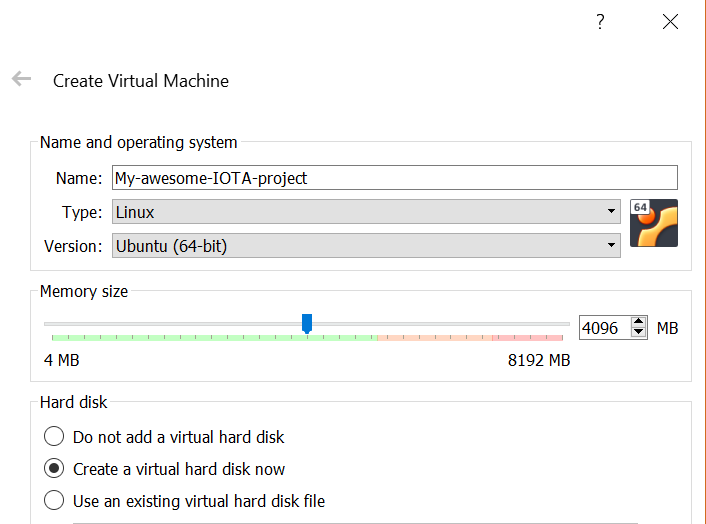
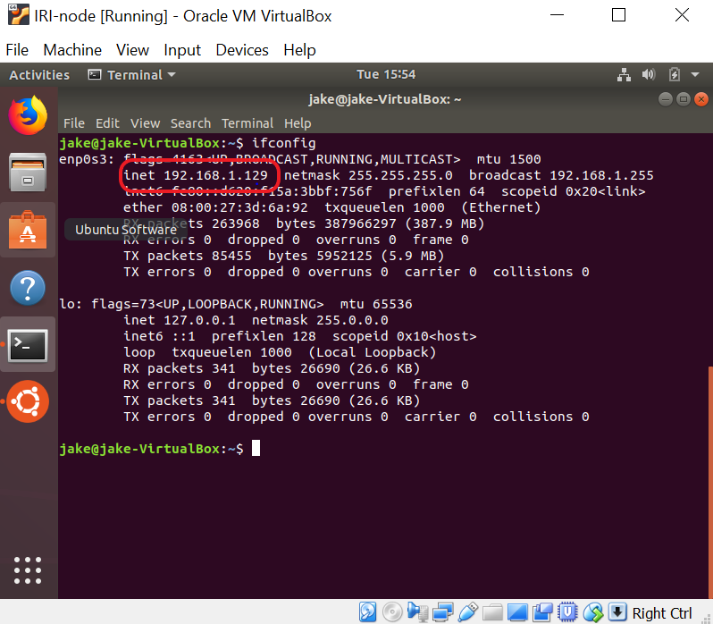

# Set up a Linux server on a virtual machine

**Many of the IOTA tutorials and guides require a Linux operating system. If your computer is running a different operating system, you can use Linux inside a virtual machine.**

Linux is an open-source operating system, which can come in packages called distributions. Each Linux distribution includes different built-in software for different goals.

One of the most popular Linux distributions is Ubuntu, which is the distribution that we use in our examples.

Linux is beneficial for the following reasons:
* Linux runs on many hardware platforms
* Linux distributions are open-source and almost all of them are free to use
* Linux is secure, reliable, and lightweight

**Note:** If you don't want to run a Linux virtual machine on your own computer, you can rent the use of a cloud computer from a company such as Amazon. By using this approach, you don't need to worry about port forwarding or running out of memory. Amazon AWS has a setup guide for [launching a Linux virtual machine on their cloud](https://aws.amazon.com/getting-started/tutorials/launch-a-virtual-machine/).

## Set up a Linux server

To run a Linux server on a Windows or Mac operating system, you must install a virtual machine and run Linux on it.

1. [Download and install VirtualBox for Windows or Mac](https://www.virtualbox.org/wiki/Downloads)

2. If you're on a Windows, [download and install the latest version of 7 Zip](https://www.7-zip.org/). If you're on a Mac, download and install the [Unarchiver application](https://itunes.apple.com/us/app/the-unarchiver/id425424353).

3. [Download the Ubuntu Server file (18.04 LTS)](https://www.ubuntu.com/download/server)

4. Go to the folder where you saved the file. If you're on a Windows, right-click the file and click **Extract here**. If you're on a Mac, double-click the file to extract it.

5. Open VirtualBox, and click **New**

6. Enter a name for your server, and use the slider to select the amount of RAM memory you'd like to dedicate to it

     

7. Follow the on-screen instructions and choose the default settings

8. Select your server from the list and click **Start**

9. In the window, open the file explorer and select the Ubuntu Server file that you downloaded in step 3

    

Congratulations :tada: You've got a Linux server running on your computer!

Our guides always require the use of a command prompt, so navigate to the Terminal application and open it.

## Connect to your Linux server

When Linux is running in a virtual machine, it's separated from the rest of your host operating system. As a result, you can't copy commands from outside the virtual machine and paste them into it.

To connect to your Linux server that's running on the same network, you can use a [secure shell](https://www.ssh.com/ssh/) (SSH) client.

### Configure your Linux server as an SSH server

Before your Linux server can understand messages that use the SSH protocol, you must configure it as an SSH server.

1. In the terminal of your Linux server, upgrade your software packages

    ```bash
    sudo apt-get upgrade
    ```

2. Install the network tools

    ```bash
    sudo apt install net-tools
    ```

3. Install an SSH server

    ```bash
    sudo apt-get install openssh-server
    ```

4. Close your Linux server, select your server from the list, and go to **Settings** > **Network**

5. In the Adapter 1 tab, change the **Attached to** field to **Bridged Adapter**

6. Start your Linux server, open the terminal and find out the IP address of your Linux server

    ```bash
    ifconfig
    ```

7. Make a note of the `inet` IP address

    

### Establish an SSH connection to your Linux server

When your Linux server is configured as an SSH server, you can connect to it from your host operating system.

To establish an SSH connection to your Linux server on a **Mac**, do the following:

1. Open the Terminal application. The fastest way to get there is by pressing `CMD+spacebar` and entering `terminal` in the search bar.

2. Establish an ssh connection. Change the IP_ADDRESS_FROM_STEP_7 placeholder with the IP address of your Linux server.

    ```bash
    ssh $IP_ADDRESS_FROM_STEP_7
    ```

To establish an SSH connection to your Linux server on a **Windows**, do the following:

1. [Download and install PuTTy](https://www.ssh.com/ssh/putty/download#sec-Download-PuTTY-installation-package-for-Windows)

2. Open PuTTy

3. Enter the IP address of your Linux server and click **Open**

    

You're now connected to your Linux server over SSH. Enter Linux commands in the PuTTy or host terminal to run them on your Linux server.

