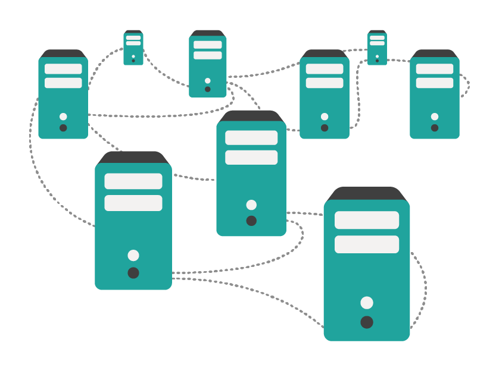
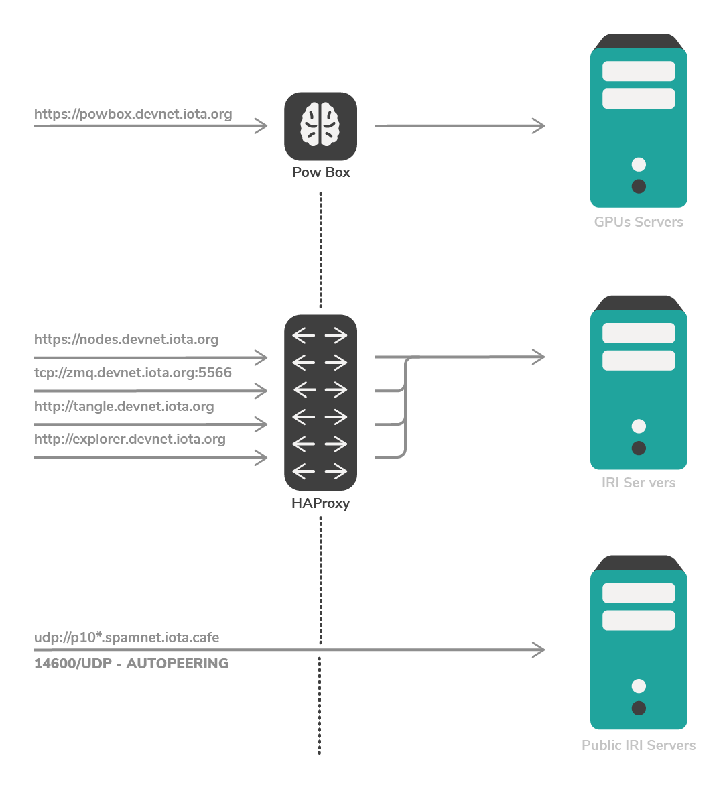
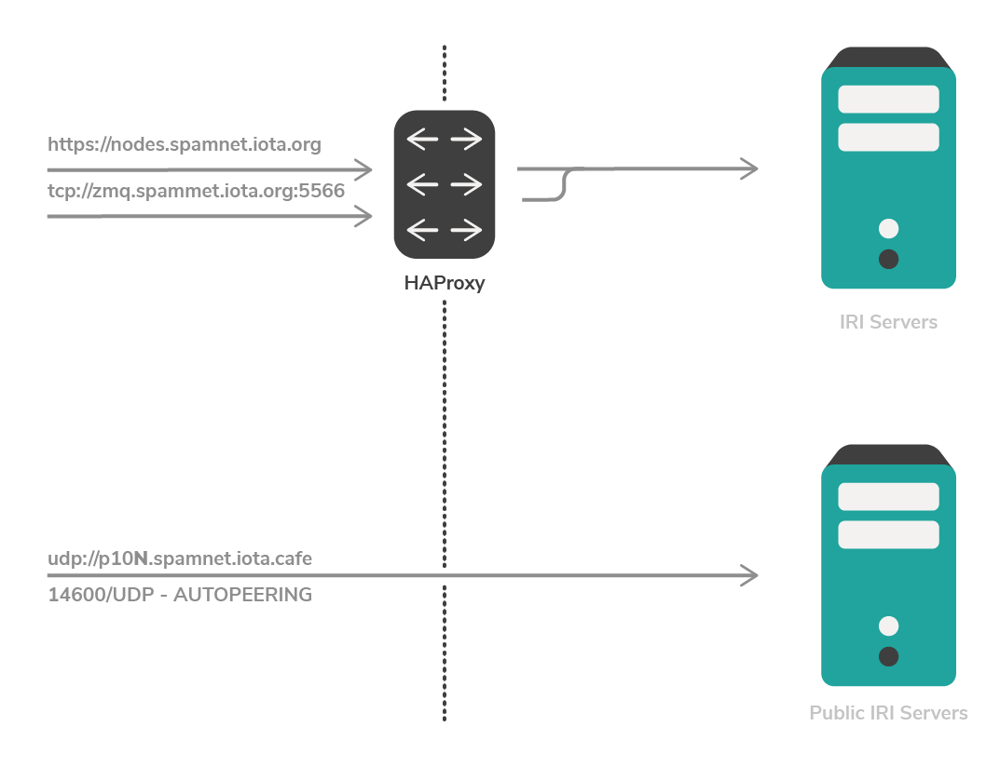

# IOTA networks

**In IOTA, bundles of transactions must be sent to [nodes](../introduction/what-is-a-node.md). IOTA has three [public networks](../references/iota-networks.md) of nodes. Each network has its own unique distributed ledger (the Tangle) that the nodes can append transactions to. You can choose to connect and send bundles to nodes on any public network.**

IOTA has the following [permissionless (public) networks](../introduction/what-is-dlt.md):
* **Mainnet:** IOTA token
* **Devnet:** Devnet token (free)
* **Spamnet:** Spamnet token (free)

All permissionless networks consist of nodes, clients, and the Coordinator.

:::info:
If you want to create and test an application on a permissioned (private) network, you can do so by running an instance of the open-source Coordinator code called [Compass](root://compass/0.1/introduction/overview.md).
:::

## Mainnet

When you buy IOTA tokens from a cryptocurrency exchange, those tokens are valid on the Mainnet.

:::info:
Cryptocurrency exchanges sell IOTA tokens in denominations of Mega IOTA (1,000,000), which is also written as MIOTA or Mi.

Learn more about [units of IOTA tokens](root://iota-basics/0.1/references/units-of-iota-tokens.md).
:::

### Minimum weight magnitude

Transactions on the Mainnet must use a [minimum weight magnitude](root://iota-basics/0.1/concepts/minimum-weight-magnitude.md) (MWM) of 14 to be valid.

## Devnet

The Devnet is similar to the Mainnet, except the tokens are free.

On this network, you can test your applications and build proofs of concept that use free Devnet tokens.

:::info:
[Receive free Devnet tokens](../tutorials/receive-test-tokens.md)
:::

### Minimum weight magnitude

Transactions on the Devnet must use a [minimum weight magnitude](root://iota-basics/0.1/concepts/minimum-weight-magnitude.md) (MWM) of 9 to be valid.

Compared to the Mainnet, this MWM reduces the time it takes for [proof of work](root://the-tangle/0.1/concepts/proof-of-work.md) (PoW) to be completed. So, it takes less time and computational power to create and send a transaction.

### IRI nodes

We host the following public IRI nodes on the Devnet:

#### Load balancer node

This endpoint gives you access to a high-availability proxy server, which is running an IRI node on the Devnet.

Use the load balancer for sending transactions and requesting information about the ledger from the IRI node.

**URL:** https://nodes.devnet.iota.org:443

#### ZMQ node

This endpoint gives you access to the [zero message queue](root://iri/0.1/concepts/zero-message-queue.md) of an IRI node on the Devnet.

Use the ZMQ node to subscribe to events in an IRI node.

**URL:** tcp://zmq.testnet.iota.org:5556

#### PoW node

This endpoint gives you access to an IRI node that can do remote proof of work.

Use the PoW node to save power on small devices.

**URL:** https://powbox.devnet.iota.org

## Spamnet

The Spamnet is for applications that send spam transactions.

On this network, you can test your applications and build proof of concepts that use free Spamnet tokens.

:::info:Receive free Spamnet tokens
The [faucet website](https://faucet.spamnet.iota.org) sends 1Ki (1000) Spamnet tokens to your specified address.
:::

### Minimum weight magnitude

Transactions on the Spamnet must use a [minimum weight magnitude](root://iota-basics/0.1/concepts/minimum-weight-magnitude.md) (MWM) of 7 to be valid. Compared to the Mainnet, this MWM reduces the time it takes for [proof of work](root://the-tangle/0.1/concepts/proof-of-work.md) (PoW) to be completed. So, it takes less time and computational power to create and send a transaction.

### IRI nodes

We host the following public IRI nodes on the Spamnet:

#### Load balancer node

This endpoint gives you access to a high-availability proxy server, which is running an IRI node on the Spamnet.

Use the load balancer for sending transactions and requesting information about the ledger from the IRI node.

**URL:** https://nodes.spamnet.iota.org:443

#### ZMQ node

This endpoint gives you access to the [zero message queue](root://iri/0.1/concepts/zero-message-queue.md) of an IRI node on the Spamnet.

Use the ZMQ node to subscribe to events in an IRI node.

**URL:** tcp://zmq.spamnet.iota.org:5556 
