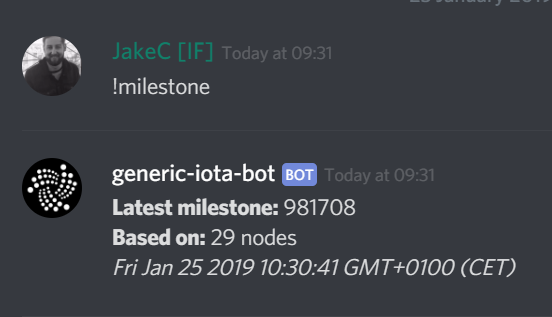

# Get started

**IOTA is a lightweight protocol that allows you to transfer immutable data and/or value in the form of IOTA tokens.**

To start integrating IOTA into your app or website you need complete these three steps:

1. [Create a seed](#step-1.-create-a-seed) so you can have access to addresses that can hold IOTA tokens

2. [Install a client library](#step-2.-install-a-client-library) so that you can interact with an IOTA network through a node

3. [Make a test API request](#step-2.-make-a-test-api-request) to confirm that you're connected to a synchronized node

:::info:Not a developer?
If you want to see how IOTA works without having to write code, you can [use Trinity to create a seed and send your first data transaction](../tutorials/send-a-zero-value-transaction-with-the-trinity-wallet.md).
:::

## Step 1. Create a seed

A [seed](../introduction/what-is-a-seed.md) is a unique password that gives you access to all your addresses. These addresses hold your IOTA tokens and as such have a balance. To transfer IOTA tokens, you must use your seed to prove that you own the address that holds them. Seeds can include only the number 9 and the uppercase letters A-Z.

:::warning:
You must keep your seed safe and back it up. If you lose your seed, you can't recover it.
:::

--------------------
### Linux
1\. Do the following in a command prompt:

```bash
cat /dev/urandom |tr -dc A-Z9|head -c${1:-81}
```

2\. Copy and paste the 81 character output somewhere. You'll need the seed later. It's a good idea to back up your seed now.
---
### macOS
1\. Do the following in a command prompt:

```bash
cat /dev/urandom |LC_ALL=C tr -dc 'A-Z9' | fold -w 81 | head -n 1
```

2\. Copy and paste the 81 character output somewhere. You'll need the seed later. It's a good idea to back up your seed now.
---
### Windows
1\. [Download the KeePass installer](https://keepass.info/)

KeePass is a password manager that stores passwords in encrypted databases, which can be unlocked with one master password or key file.

2\. Open the installer and follow the on-screen instructions

3\. Open KeePass and click **New**


4\. After you've followed the instructions and saved the KeePass file on your computer, right click the empty space and click **Add entry**


5\. Click **Generate a password**


6\. Select only the following options and click **OK**:

* Length of generated password: 81
* Upper-case (A, B, C, ...)
* Also include the following characters: 9
    
7\. Click **OK** to save your seed
--------------------

## Step 2. Install a client library

We have [three official libraries](root://client-libraries/0.1/introduction/overview.md). As well as these libraries, the IOTA community has created some [community ones](root://client-libraries/0.1/introduction/overview.md) so you can use a language that we don't officially support.

--------------------
### Node.js
To use the library, your computer must have one of the following supported versions of Node.js:

* Node.js 10 or higher. We recommend the [latest LTS](https://nodejs.org/en/download/).
* Node.js 8

To install the library packages, you must have one of the following package managers:

* [npm](https://www.npmjs.com/) (included in Node.js downloads)
* [Yarn](https://yarnpkg.com/)

Install the library with npm:

```bash
npm install @iota/core
```
Install the library with Yarn:

```bash
yarn add @iota/core
```

[See the JavaScript documentation](root://iota-js/0.1/introduction/overview.md).
---
### Java
Download the library with Gradle
Add the following repository to your **root** `build.gradle` file (not your module file):

```java
allprojects {
    repositories {
        maven { url 'https://jitpack.io' }
    }
}
```

Add the following dependency to your **module** `build.gradle` file:

```java
dependencies {
    compile 'com.github.iotaledger:iota-java:1.0.0-beta5'
}
```

[See the Java documentation](root://iota-java/0.1/introduction/overview.md).
---
### Go
To download the IOTA Go client library and its dependencies, we recommend that you use [Go modules](https://github.com/golang/go/wiki/Modules) (available since version 1.11) to manage dependencies in your project.

In any directory outside of GOPATH, initiate your project. Change the placeholder to your chosen path such as github.com/me/awesome-project.


```bash
go mod init <your-module-path>
```

Download the library and its dependencies:

```bash
$ go get github.com/iotaledger/iota.go/api
```
This command downloads the latest version of the IOTA Go client library and writes the version into the `go.mod` file.

[See the Go documentation](root://iota-go/0.1/introduction/overview.md).
--------------------

## Step 3. Make a test API request

Before you use a node, you should make sure that it's synchronized with the rest of the network. This way, you know that it has an up-to-date [view of the Tangle](root://dev-essentials/0.1/concepts/the-tangle.md).

A node is considered synchronized when the `latestMilestoneIndex` field is equal to the `latestSolidSubtangleMilestoneIndex` field.

The `latestMilestoneIndex` field is the index of the latest milestone that the node has received from its neighbors.

The `latestSolidSubtangleMilestoneIndex` field is the index of the latest milestone for which the node's ledger has all the transactions that the milestone directly and indirectly references.

:::info:
The `latestMilestoneIndex` and `latestSolidSubtangleMilestoneIndex` fields are accurate only when the IRI node is connected to synchronized neighbors.
:::

1. To check the current `latestMilestoneIndex` field, go to our [Discord](https://discord.iota.org) and enter **!milestone** in one of the channels

    

2. To check if your node is synchronized, call the `getNodeInfo()` method

    :::info:
    Here, we connect to a node on the Devnet, which is one of the [IOTA networks](../references/iota-networks.md) that you can use for testing. The Devnet is similar to the Mainnet, except the tokens are free.
    :::

--------------------
### JavaScript
```js
// Require the core package
const Iota = require('@iota/core');

// Create a new instance of the IOTA API object
// Use the `provider` field to specify which node to connect to
const iota = Iota.composeAPI({
provider: 'https://nodes.devnet.iota.org:443'
});

// Call the `getNodeInfo()` method for information about the node and the Tangle
iota.getNodeInfo()
// Convert the returned object to JSON to make the output more readable
.then(info => console.log(JSON.stringify(info, null, 1)))
.catch(err => {
    // Catch any errors
    console.log(err);
});
```
---
### Java
```java
// Create a new instance of the IOTA API object
IotaAPI api = new IotaAPI.Builder().build();
IotaAPI api = new IotaAPI.Builder()
        .protocol("https")
        .host("nodes.devnet.iota.org")
        .port("443")
        .build();
// Call the `getNodeInfo()` method for information about the node and the Tangle
GetNodeInfoResponse response = api.getNodeInfo();
// Print the response to the console
System.out.println(response);
```
---
### Go
```golang
package main

import (
    . "github.com/iotaledger/iota.go/api"
    "fmt"
)

var endpoint = "https://nodes.devnet.iota.org:443"

func main() {
	// Create a new instance of the IOTA API object
	api, err := ComposeAPI(HTTPClientSettings{URI: endpoint})
	handleErr(err)

    // Call the `getNodeInfo()` method for information about the node and the Tangle
	nodeInfo, err := api.GetNodeInfo()
    handleErr(err)

    // Print the response to the console
	fmt.Println(nodeInfo)
}

func handleErr(err error) {
	if err != nil {
		panic(err)
	}
}
```
--------------------

The node returns a response object:

```json
{
    "appName": "IRI Testnet",
    "appVersion": "1.5.6-RELEASE",
    "jreAvailableProcessors": 8,
    "jreFreeMemory": 12052395632,
    "jreVersion": "1.8.0_181",
    "jreMaxMemory": 22906667008,
    "jreTotalMemory": 16952328192,
    "latestMilestone": "FPRSBTMKOP9JTTQSHWRGMPT9PBKYWFCCFLZLNWQDFRCXDDHZEFIEDXRIJYIMVGCXYQRHSZQYCTWXJM999",
    "latestMilestoneIndex": 1102841,
    "latestSolidSubtangleMilestone": "FPRSBTMKOP9JTTQSHWRGMPT9PBKYWFCCFLZLNWQDFRCXDDHZEFIEDXRIJYIMVGCXYQRHSZQYCTWXJM999",
    "latestSolidSubtangleMilestoneIndex": 1102841,
    "milestoneStartIndex": 434525,
    "neighbors": 3,
    "packetsQueueSize": 0,
    "time": 1549482118137,
    "tips": 153,
    "transactionsToRequest": 0,
    "features": ["snapshotPruning", "dnsRefresher", "testnet", "zeroMessageQueue", "tipSolidification", "RemotePOW"],
    "coordinatorAddress": "EQQFCZBIHRHWPXKMTOLMYUYPCN9XLMJPYZVFJSAY9FQHCCLWTOLLUGKKMXYFDBOOYFBLBI9WUEILGECYM",
    "duration": 0
}
```

If the `latestMilestoneIndex` field is equal to the one you got from Discord and the `latestSolidSubtangleMilestoneIndex` field, the node is synchronized.

If not, try connecting to a different node. The [iota.dance website](https://iota.dance/) includes a list of Mainnet nodes.

:::success: Congratulations :tada:
You've confirmed your connection to a synchronized node. Now, you're ready to [send a transaction to it](../tutorials/send-a-zero-value-transaction-with-nodejs.md).
:::

:::info:
To learn what these fields mean, [see the API reference](root://node-software/0.1/iri/references/api-reference.md#getNodeInfo).
:::

## Run the code

<iframe height="600px" width="100%" src="https://repl.it/@jake91/Connect-to-a-node?lite=true" scrolling="no" frameborder="no" allowtransparency="true" allowfullscreen="true" sandbox="allow-forms allow-pointer-lock allow-popups allow-same-origin allow-scripts allow-modals"></iframe>

## Get involved

[Join our Discord channel](https://discord.iota.org) where you can:

* Take part in discussions with IOTA developers and the community
* Ask for help
* Share your knowledge to help others

We have many channels, including the following:

* `-dev`: These channels are read-only and are where developers discuss topics with each other and where you can see any code updates from GitHub.

* `-discussion`: These channels are where you can participate.

## Next steps

[Send your first data transaction with Node.js](../tutorials/send-a-zero-value-transaction-with-nodejs.md).

[Get some free test tokens](../tutorials/receive-test-tokens.md) and start transferring them in test transactions.