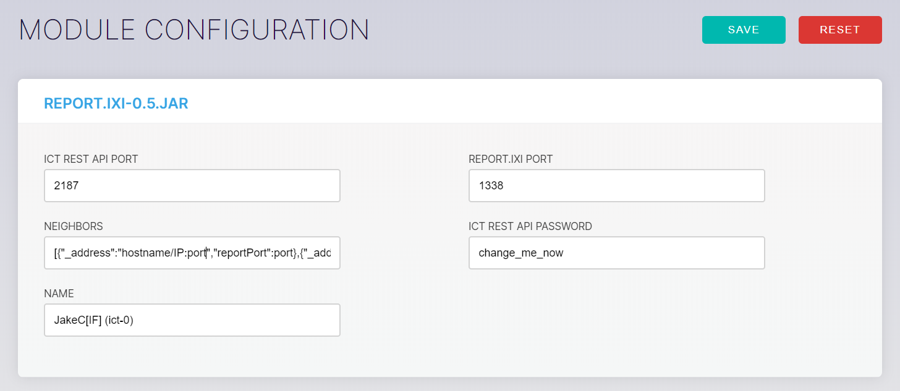

# Getting started with the ICT REST API

**The ICT REST API enables you to update and access data for modules, neighbors, and configuration settings**

In the following how-to guide we use Node JS to send an HTTP POST request to an ICT node's [`getInfo`](../references/api-reference.md#getInfo) endpoint.

## Prerequisites

To use the code samples in this guide, you must have the following:

* [Node JS (8+)](https://nodejs.org/en/)
* A code editor such as [Visual Studio Code](https://code.visualstudio.com/Download)
* Access to a command prompt
* An Internet connection
* Access to an [Ict node](../how-to-guides/run-an-ict-node.md)

## Find your REST API port and REST API password

ICT nodes wait to receive transactions from clients on the REST API port that's set in the report IXI module's configuration. All requests must also include the API password in a query parameter in the following format:

```json
"password=your-password"
```

1. On the Linux server that's running your ICT node, open the ict.cfg file

    ```bash
    sudo nano /home/ict/config/ict.cfg
    ```

2. Make a note of the values of the `gui_port` and `gui_password` fields. These values are the REST API port and the REST API password that authenticates API requests.

    **Important:** Make sure that the `gui-enabled` field is set to `true`, otherwise you won't be able to access the REST API.

3. Open the GUI by going to the URL of your ICT node on its GUI port

4. Go to **REPORT.IXI**, and make sure that the ICT REST API PORT and ICT REST API PASSWORD fields contain the same values as the `gui_port` and `gui_password` fields in the ict.cfg file

    

Now that you have your EST API port and REST API password, you can interact with your ICT node through the REST API.

## Get general information about an ICT node

To find out general information about a node, you can call the `getInfo` endpoint.

This endpoint returns the version of the ICT that a node is running, the default values of the configuration parameters, and, if a newer version of the ICT is available, the newer version number.

1. Create a working directory called node-info-example

    ```bash
    mkdir node-info-example
    cd node-info-example
    ```

2. In the `node-info-example` directory, install the [request module](https://github.com/request/request)

    ```bash
    npm install request --save
    ```

3. Create a file called index.js in the `node-info-example` directory

4. In the index.js file, copy and paste the following code.

    **Note:** Replace `http:localhost:2187` with the URL and REST API port of your node, and, in the `command` variable, replace `change_me_now` with the API password.

    ```js
    var request = require('request');

    var command = "password=change_me_now";


    var options = {
    url: 'http://localhost:2187/getInfo',
    method: 'POST',
    headers: {
        'Content-Type': 'application/x-www-form-urlencoded'
    },
    form: command
    };

    request(options, function (error, response, data) {
    if (!error && response.statusCode == 200) {
        var result = JSON.parse(data);
        console.log(JSON.stringify(result, null, 1));
    }
    });
    ```

The output should display something like the following:

```
{
"success":true,
"default_config":{
    "max_heap_size":1.01,
    "round_duration":60000,
    "max_forward_delay":200,
    "anti_spam_abs":1000,
    "gui_port":2187,
    "tangle_capacity":10000,
    "gui_password":"change_me_now",
    "port":1337,
    "neighbors":[],
    "name":"ict",
    "host":"0.0.0.0",
    "gui_enabled":true,
    "min_forward_delay":0
    },
"version":"0.5"
}
```

If the `getInfo` endpoint returns an `update` field, you can use the [`update`](../references/api-reference.md#update) endpoint to update the Ict to the latest version.

## Next steps

Request data from another [REST API endpoint](../references/api-reference.md).