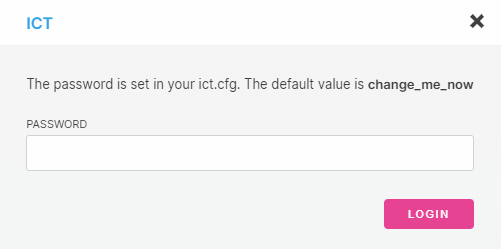

# Run an Ict node

**When you execute the Ict Java file on a Linux server, it becomes an Ict node that can send and receive transactions in the Ict network. By running a node, you help the network to become more distributed by adding to the number of nodes.**

## Prerequisites

To complete this guide, you need the following:

* Administrator access to your router
* An Internet connection
* A Linux server (this guide has been tested on [Raspbian Stretch Lite](https://www.raspberrypi.org/downloads/raspbian/))
* A [public IP address](root://general/0.1/how-to-guides/expose-your-local-device.md) that's either static or connected to a dynamic DNS service such as [duckdns.org](https://www.duckdns.org)

Ict can run on any Internet-connected device that can run a Java runtime environment (JRE). For example, Ict can be run on a Raspberry Pi, a Rock64, a laptop, a VPS, a virtual machine, or an Android phone.

## Download the Ict Java file

You have two options for downloading the latest Ict software:
* Download the pre-built Java file from GitHub (quickest option)
* Build the Java file from the source code on GitHub

Before you download the Ict, make sure your system is up to date, create a new user called `ict`, and download and install the Java 8 JRE.

1. Install the latest security patches for your system

    ```bash
    sudo apt-get update
    sudo apt-get upgrade -y
    ```

2. Create a new user called `ict` and set its home directory to `/home/ict`

    ```bash
    sudo useradd -d /home/ict -m -s /bin/bash ict
    ```

3. Change into the `/home/ict` directory

    ```bash
    cd /home/ict
    ```

4. Download and install the Java 8 JRE and accept the Oracle terms and conditions

    ```bash
    export JAVA_VERSION=8u201-1
    sudo apt-get install -y software-properties-common --no-install-recommends
    sudo add-apt-repository -y ppa:webupd8team/java
    sudo apt-get update
    sudo apt-get install -y oracle-java8-installer=${JAVA_VERSION}~webupd8~1 --no-install-recommends
    sudo apt install oracle-java8-set-default
    ```

### Download the pre-built Ict Java file

The pre-built IRI Java file is available on the [IOTA GitHub repository](https://github.com/iotaledger/ict/releases). Downloading and executing this file is the quickest and simplest way to install the Ict.

1. Download the latest Ict Java file into your `/home/ict` directory. Replace the `${VERSION}` variable with the [latest version](https://github.com/iotaledger/iri/releases) of the Ict.

    ```bash
    sudo wget https://github.com/iotaledger/ict/releases/download/${VERSION}/ict-${VERSION}.jar
    ```

    The download may take some time. If everything went well, you should see the following line near the end of the output:

    ```
    HTTP request sent, awaiting response ... 200 OK
    ```

2. Change into the `/home/ict` directory and list the files

    ```bash
    cd ..
    ls
    ```

    You should see the Ict Java file (.jar). This file is the one that you need to execute to start the node. But, before you do that, you need to [configure the Ict](#configure-the-ict).

### Build the Ict Java file from the source code

Instead of downloading the pre-built Ict Java file, you may want to build the file from the source code the any of the following reasons:
* You want to be sure that the code you run is the same as the source code
* You want to modify the source code before you run it

1. Change into your `/home` directory

    ```bash
    cd /home
    ```

2. Install Git

    ```bash
    sudo apt-get install -y git
    ```
    :::info:
    To make sure that Git is installed, do the following: `git --version`. You should see a version number. If not, try installing Git again.
    :::

3. Install NPM

    ```bash
    sudo apt-get install -y npm
    ```
    :::info:
    To make sure that NPM is installed, do the following: `npm -v`. You should see a version number. If not, try installing NPM again.
    :::

4. Install Gradle

    ```bash
    sudo apt-get install -y gradle
    ```

    :::info:
    To make sure that Gradle is installed, do the following: `gradle -v`. You should see a version number. If not, try installing NPM again.
    :::

5. Clone the source code from GitHub

    ```bash
    sudo git clone https://github.com/iotaledger/ict
    ```

6. Change into the `ict` directory

    ```bash
    cd ict
    ```

7. Build the Ict Java file

    ```bash
    sudo gradle fatJar
    ```

    If everything went well, you should see the `BUILD SUCCESSFUL` message in the output.

8. Install the dependencies for the ict website and build the files

    ```bash
    cd web
    sudo npm install
    sudo npm run build
    `````

    If everything went well, you should see the `Built in xxxs.` message in the output.

9. Change into the `/home/ict` directory and list the files

    ```bash
    cd ..
    ls
    ```

    You should see the Ict Java file (.jar). This file is the one that you need to execute to start the node. But, before you do that, you need to configure the Ict.

## Configure the Ict

Before a node can start receiving and sending transactions, you need to configure it so that it can connect to neighbors.

1. Execute the Ict Java file with the `--config-create` flag to create the directories and the default configuration file

    ```bash
    sudo java -jar ict-0.5.1.jar --config-create
    ```

    You should see the following at the end of the output:

    ```
    ALL   |NEW   |REQ   |INV   |IGN   |ADDRESS
    ```

    This line means that your node is running and that it's not yet configured because it's not receiving any transactions. That's OK. By executing the file, all the directories that you need are created for you. You should have the following directories as well as an `ict.cfg` configuration file:

    * `logs`: This directory stores all the log messages that the node creates
    * `modules`: This directory stores the IXI modules that are installed on your node
    * `web`: This directory stores the JavaScript, HTML, and CSS files that render the Ict website

2. Open the `ict.cfg` configuration file

    ```bash
    sudo nano ict.cfg
    ```

3. Change the value of the `gui_password` field to your own password. This password is used to log into the Ict website and to authenticate REST API requests.

4. Make a note of the value of the `gui_port` (GUI port) and `port` (Ict port) fields and [forward those ports to your device](root://general/0.1/how-to-guides/expose-your-device.md). The Ict port must be forward through the UDP protocol. The GUI port must be forwarded through the UDP and TCP protocols.

5. [Find some neighbors](../how-to-guides/find-neighbors.md)

6. In the `neighbors` field, enter each IP address or URL of your neighbors and their Ict port separated by a colon

    ```
    neighbors=[example.com:1337,example2.com:1337,example3.com:1337]
    ```

    :::warning:Warning
    Don't include any spaces before or after the commas, otherwise the node won't be able to read the neighbors.
    :::

Now that you've configured the Ict, you can execute the file again with your new configuration settings.

## Run your configured node

To run the node, you need to execute the Ict Java file.

1. Execute the Ict Java file. Replace the `${VERSION}` variable with the version of the Ict that you downloaded.

    ```bash
    cd /home/ict
    java -jar ict-${VERSION}.jar
    ```

2. Go to a web browser such as Google Chrome

3. In the address bar, enter the IP address or the URL of your node followed by a colon and your GUI port. This port is in your /home/ict/ict.cfg file in the `gui_port` field. The default port is 1337.

    :::info:
    If you can't access this page, [make sure that you've forwarded the GUI port to your device](root://general/0.1/how-to-guides/expose-your-device.md).
    :::

4. Log into the Ict website with the password that you changed in the `gui_password` field.

    

    :::info:
    When you've logged in, you can use this website to access and change your configuration settings, see data about your neighbors, and view the log messages.
    :::

5. Click **Log** and check that you are receiving transactions from your neighbors. You should see something like the following:

    ```
    01.03.2019 09:03
    106 |58 |0 |0 |0 neighbor URL/neighbor IP:neighbor port

    01.03.2019 09:03
    32 |13 |0 |0 |0 neighbor URL/neighbor IP:neighbor port

    01.03.2019 09:03
    175 |155 |0 |0 |0 neighbor URL/neighbor IP:neighbor port
    ```

    :::success:Success
    Congratulations :tada: You're node is running, connected to neighbors, and sending and receiving transactions. [Find out what the data in these logs means](../references/log-data.md).
    :::

6. Press **Ctrl**+**C** to stop the Ict

## Create a systemd service to control your node

A `systemd` service runs when a Linux system boots up. By using a `systemd` service, you can start, stop, restart, and control logging for the Ict with simple one-line commands.

1. Create a new `systemd` file

    ```bash
    sudo nano /etc/systemd/system/ict.service
    ```

2. Copy and paste the following into the file. Replace the `${VERSION}` variable with the version of the Ict that you downloaded.

    ```
    [Unit]
    Description=IOTA Ict Service
    After=network-online.target
    
    [Service]
    WorkingDirectory=/home/ict
    ExecStart=/usr/bin/java -jar /home/ict/ict-${VERSION}.jar
    KillMode=process
    Type=simple
    User=ict
    StandardOutput=inherit
    StandardError=inherit

    [Install]
    WantedBy=multi-user.target
    ```

3. Save the file by pressing **Ctrl**+**X**, **y** then **Enter**

4. Give yourself permission to execute the `ict` service and enable it to start at boot

    ```bash
    chmod u+x /etc/systemd/system/ict.service
	systemctl daemon-reload
	systemctl enable ict
    ```

5. Start the Ict and check that it's running

    ```bash
    systemctl start ict
    systemctl status ict
    ```

    If the Ict is running, you should see the `active (running)` message in the output.

6. Display the log messages

    ```bash
    journalctl -fu ict
    ```

7. To stop displaying the log messages press **Ctrl**+**C**. The Ict will continue running in the background

### Stop and restart the Ict

You can use the following `systemd` commands to start, stop, and restart the Ict:

```bash
# Start the Ict
sudo systemctl start ict
# Restart the Ict
sudo systemctl restart ict
# Stop the Ict
sudo systemctl stop ict
```

### View log messages

You can view the log messages as they are written by doing the following:

```bash
journalctl -fu ict
```

If you want more detailed log messages, you can stop the Ict add execute the Ict Java file with the `--debug` flag. Replace the `${VERSION}` variable with the version of the Ict that you downloaded.

```bash
systemctl stop ict
java -jar /home/ict/ict${VERSION}.jar --debug
```

## Next steps

Learn to [send API requests to your node](../how-to-guides/getting-started-api.md), and [install some IXI modules](../how-to-guides/install-ixi-modules.md) to extend the functionality of your node.

