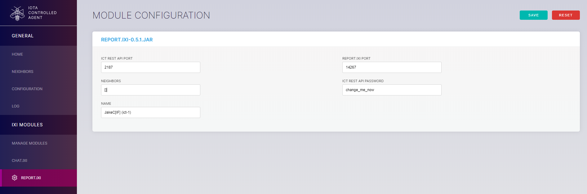

# Run an Ict node

**When you run the Ict on a Linux server, it becomes an Ict node that can send and receive transactions in the Ict network. By running an Ict node, you help the network to become more distributed by adding to the number of nodes.**

## Prerequisites

To complete this guide, you need the following:

* Administrator access to your router
* An Internet connection
* A Linux distribution (this guide has been tested on various Linux distributions such as Debian, Raspbian, Gentoo, and Red Hat)
* A static IP address on the Internet, or a [domain name from a dynamic DNS service](root:general/0.1/how-to-guides/expose-your-local-device.md#get-a-domain-name-for-your-router)

Ict can run on any Internet-connected device that can run a Java runtime environment (JRE). For example, Ict can be run on a Raspberry Pi, a Rock64, a laptop, a VPS, a virtual machine, or an Android phone.

---

To automate the installation of Ict, this guide uses a [script](https://github.com/phschaeff/ict-install) that was written by an IOTA community member called `schaeff (Phil#1641)` on Discord.

1. Install Git

    ```bash
    sudo apt-get install git
    ```

    **Note:** To make sure that Git is installed, do the following: `git --version`. You should see a version number. If not, try installing Git again.

2. Install the installation script

    ```bash
    sudo git clone https://www.github.com/phschaeff/ict-install
    ```

    **Note:** This command clones the script's GitHub repository into the `ict-install` directory.

3. Change into the `ict-install` directory and run the script by passing it the following arguments:

    * The option to either build the Ict from the source code (`BUILD`) or to download the pre-compiled release file (`RELEASE`)
    * The name of your Ict node. This name will appear in the report.ixi modules.

    **Note:** Your node name should not contain any spaces. The naming convention is `name (ict-0)`, where you increment the number after `ict` for each Ict node that you run. For example, `JakeC[IF] (ict-0)`.

    ```bash
    cd ict-install
    sudo bash install-ict.sh <BUILD/RELEASE> "<nodename> (ict-0)"
    ```

    The installation script does the following:

    * Install dependencies such as Java 11
    * Add a new user called `ict`
    * Download Ict from the [IOTA Foundation GitHub repository](https://github.com/iotaledger/ict/releases)
    * Download the chat.ixi and report.ixi IXI modules
    * Create a [**systemd** service](https://www.raspberrypi.org/documentation/linux/usage/systemd.md) in the `/lib/systemd/system/` directory
    * Start Ict and display the log messages

4. Go to the [`ict-help` channel on Discord](https://discord.gg/fNGZXvh) and ask for neighbors. If someone else is looking for a neighbor, you will receive a direct message where you can exchange the URL, Ict port, and report port of your Ict nodes.

    **Note:** To avoid unwanted connections, don't share your URL or ports with anyone other than neighbors. You can have a maximum of 3 neighbors.

5. When you have the details of your neighbors, open the Ict configuration file

    ```bash
    sudo nano /home/ict/config/ict.cfg
    ```

6. Enter your neighbors in the square brackets in the `neighbors` field. You can enter either a neighbor's IP address or domain name followed by the Ict port, for example, `neighbors=[IPaddress:port,domainName:port]`.

    **Note:** Make sure no spaces come before or after the commas in the list of neighbors.

7. Change the value of the `gui_password` field, then make a note of the value of the `gui_port` port.

8. Use the **systemd** service to restart the Ict and make your changes take effect

    ```bash
    sudo systemctl restart ict
    ```

9. In a web browser, go to the URL and GUI port of your Ict node. For example, `example.com:1337`. Click **REPORT.IXI** and change the values of the ICT REST API PASSWORD and the ICT REST API PORT fields to the values of the `gui_password` and `gui_port` fields from step 7.

    

    **Note:** These configuration files are also in the following directory: `/home/ict/omega-ict/modules/`.

10. Click Save

You should see that the NEIGHBORS field is automatically updated with your neighbors in the ict.cfg file.

Click **Log** and check that you are receiving transactions from your neighbors. You should see something like the following:

```
01.03.2019 09:03
106 |58 |0 |0 |0 neighbor URL/neighbor IP:neighbor port

01.03.2019 09:03
32 |13 |0 |0 |0 neighbor URL/neighbor IP:neighbor port

01.03.2019 09:03
175 |155 |0 |0 |0 neighbor URL/neighbor IP:neighbor port
```

Congratulations :tada: You're Ict node is running, connected to neighbors, and sending and receiving transactions.

Go to [ictreport.com](https://www.ictreport.com/) or [ictge.economic-clustering.com](https://ictge.economic-clustering.com/) and search for the name of your node, for example JakeC[IF]. You should see your node and the connections among your neighbors.

## Stop and restart the Ict

For easier management, the installation script runs the Ict as a **systemd** service. As a result, you can safely close the command prompt or the SSH connection and the Ict will continue running.

You can use the following **systemd** commands to start, stop, and restart Ict as well as display the logs:

```bash
# Display the logs as they are being written
journalctl -fu ict
# Start the Ict
sudo systemctl start ict
# Restart the Ict
sudo systemctl restart ict
# Stop the Ict
sudo systemctl stop ict
```

## Next steps

Learn to [send API requests to your Ict node](../how-to-guides/interact-with-ict.md).

