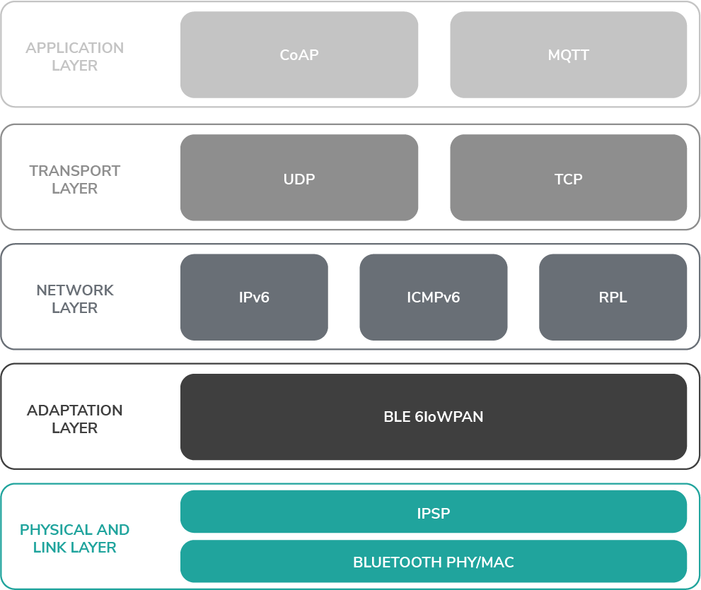
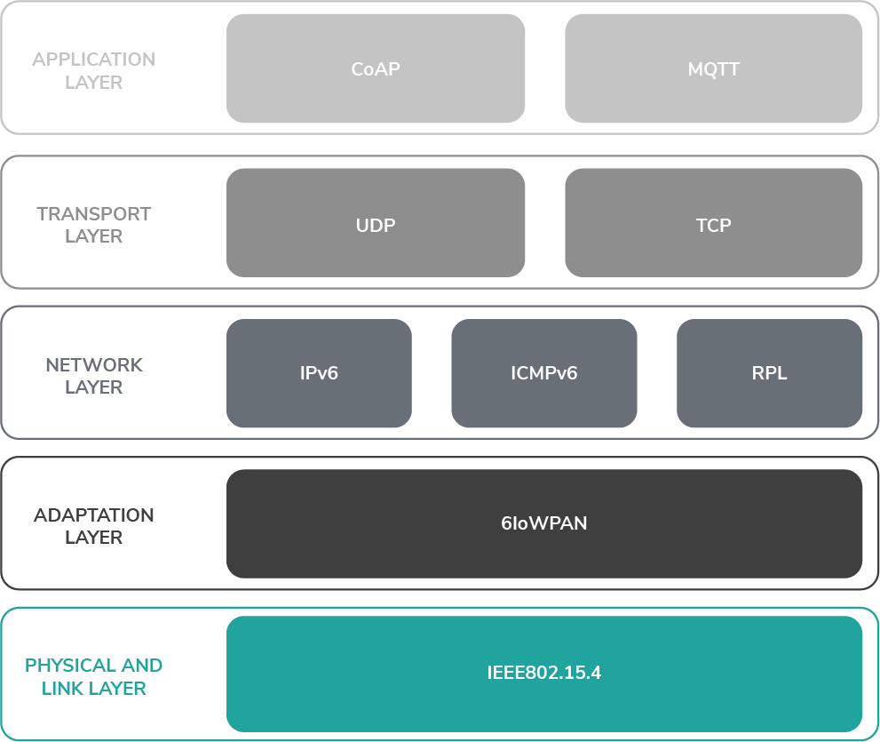
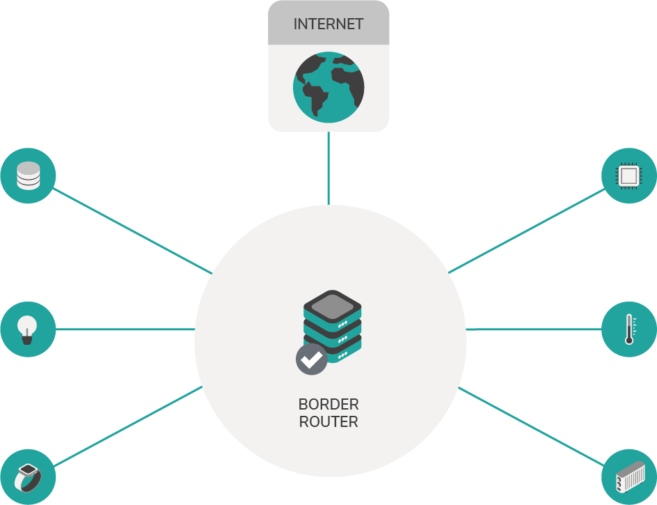
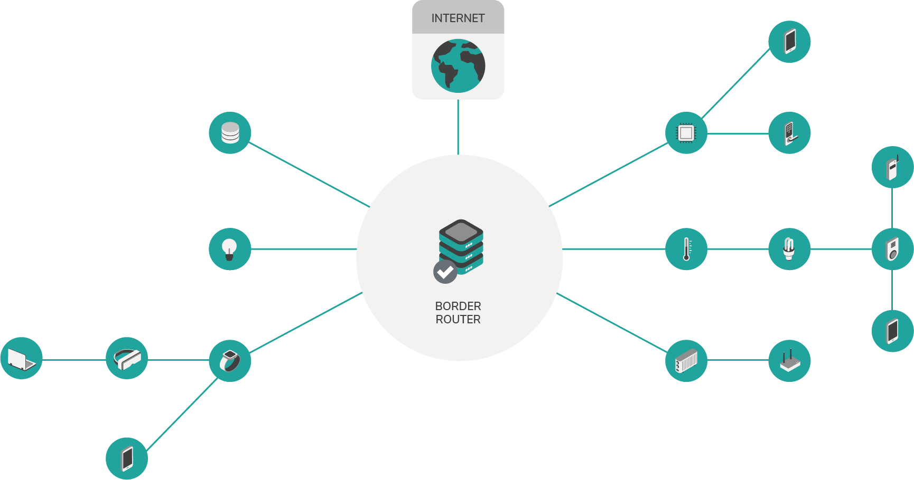

# 6LoWPAN

**6LoWPAN is a networking system that combines the latest version of the Internet Protocol (IPv6) and Low-power Wireless Personal Area Networks (LoWPAN). 6LoWPAN, allows small devices with limited processing ability to transmit information wirelessly using an internet protocol for a variety of applications including wireless sensor networks.**

## Network stack

### IPv6 over Bluetooth Low Energy

### 6LoWPAN

## Network topology

6LoWPAN includes two types of network topologies: Star and mesh tree.

### Star

The star topology is the simplest form of network topology. In the star topology,all devices directly communicate with the border router, which acts as a switch to pass on their messages.

|**Advantages**|**Disadvantages**|
|:---------|:------------|
|A single device failure does not affect the entire network|More cables are required because each computer connects to the border router|
|Easy to extend|The border router is a single point of failure|
|Fast data transfer|

### Mesh tree

A mesh tree topology is a network topology in which all the network nodes are connected to most of the other nodes. In this topology, no switch acts as a central point of communication to pass on the messages. Instead, messages are routed through the network.

|**Advantages**|**Disadvantages**|
|:---------|:------------|
|Easy to diagnose a faulty device|Can be difficult to add more devices to the network|
|Secure and private connections|

## Naming convention

The following naming conventions are used to describe 6LoWPAN mesh networks.

### LLN

LLN stands for low power and lossy networks. 
It describes a type of network where some devices might be not be available all the time. 
For example when a device only wakes up in a certain interval.
It also describes a network where a packet might get lost, due to unreliable devices.
The range of the radio can also play a role in it. 

### Host

Host describes a device which is not a router. In a mesh tree the host is a leaf node.

### Node

Node refers to any device in the network structure. This can either be a host or a router.

### IEEE 802.15.4

[IEEE 802.15.4](https://standards.ieee.org/standard/802_15_4-2015.html) is the PHY and MAC layer for the 6LoWPAN network. 

The Direct Sequence Spread Spectrum modulation used in IEEE 802.15.4 
interferes less with other protocol on the same frequency. 

### 6LoWPAN

6LoWPAN is a system that combines the latest version of the Internet Protocol (IPv6) and Low-power Wireless Personal Area Networks (LoWPAN). 6LoWPAN, allows small devices with limited processing ability to transmit information wirelessly using an internet protocol for a variety of applications including wireless sensor networks.

It uses header compression to reduce the size of local IPv6 addresses to conform to the IEEE 802.15.4 protocol, which allows for a packet size of up to 127 bytes.

The 6LoWPAN layer uses transparent packet fragmentation to combine the IEEE 802.15.4 packets.

The standard is defined in the following documents:
[RFC 8025](https://datatracker.ietf.org/doc/rfc8025/), 
[RFC 6775](https://datatracker.ietf.org/doc/rfc6775/), 
[RFC 6282](https://datatracker.ietf.org/doc/rfc6282/), 
[RFC 8066](https://datatracker.ietf.org/doc/rfc8066/) 

### IPv6 over Bluetooth Low Energy

The IPv6 over Bluetooth Low Energy protocol uses 6LoWPAN techniques to enable IPv6 packets over Bluetooth Low Energy. The standard is described in [RFC7668](https://datatracker.ietf.org/doc/rfc7668/), which uses the 
[IPSP characteristics](https://www.bluetooth.org/docman/handlers/DownloadDoc.ashx?doc_id=296307) in Bluetooth >= 4.1.

The complete IP standard for Bluetooth is defined in the [Bluetooth 4.2 specification](https://www.bluetooth.org/DocMan/handlers/DownloadDoc.ashx?doc_id=286439).

### RPL (IPv6 Routing Protocol for Low-Power and Lossy Networks)

RPL is a routing protocol used for 6LoWPAN.

The standard is defined in [RFC 6550](https://datatracker.ietf.org/doc/rfc6550/).

[This video series](https://www.youtube.com/watch?v=6AP7p0sbBro&t=45s) is a good resource for understanding the details.

### 6LoWPAN border router

Border routers (sometimes known as edge routers) connect the 6LoWPAN with an IPv6 network.

The border router connects the network to either the Internet or a private network.

### 6LoWPAN router

A 6LoWPAN router routes the packets to hosts or other routers. The only difference between a router and a border router is that the border router is connected to the Internet.

