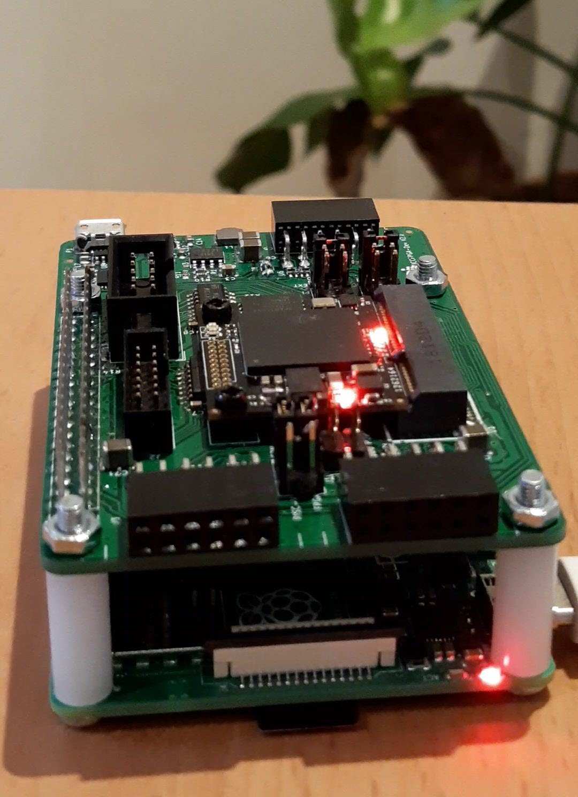

# Get started with the CryptoCore

**The CryptoCore is IOTA hardware designed for applications that need fast, dedicated proof of work and a secure memory. The device consists of an IOTA CryptoCore FPGA (ICCFPGA) module and a development board that doubles as a Raspberry Pi HAT, making it perfect for stand-alone applications and/or quick prototyping. In this guide, you learn how to get started with the CryptoCore on the Raspberry Pi 3/4.**



## Hardware

To complete this guide, you need the following:
- A PC
- A Raspberry Pi 3/4 with Raspbian installed, an Internet connection, SSH enabled, and the serial interface enabled
- A CryptoCore development kit

On the CryptoCore development board, make sure that jumpers J7, J8, and J9 are set to `PI`:


We recommend these external guides for setting up your Raspberry Pi:

- [Install Raspian](https://www.raspberrypi.org/documentation/installation/installing-images/README.md)
- [Connect to WiFi and enable SSH](https://www.e-tinkers.com/2017/03/boot-raspberry-pi-with-wifi-on-first-boot/)
- [Enable the serial interface](https://www.raspberrypi.org/documentation/configuration/raspi-config.md)

## Step 1. Set up the CryptoCore development environment

Before you can start using the CryptoCore, you need to install the necessary tools on your Raspberry Pi.

Complete the following steps in an ssh session between your PC and the Raspberry Pi.

1. Install `git`

  ```bash
  sudo apt update && sudo apt install git
  ```

2. Clone the `iccfpga-utils` repository

  ```bash
  cd ~
  git clone --recursive https://gitlab.com/iccfpga-rv/iccfpga-utils
  ```

3. Change into the `iccfpga-utils` directory and start the installer script, which clones, compiles, and installs all submodules

  ```bash
  cd iccfpga-utils/raspberry_scripts
  ./install_raspberry.sh
  ``` 

  When the script finishes, the Raspberry Pi will be rebooted.

4. Download the core and firmware files

  ```bash
  cd iccfpga-utils/raspberry_scripts
  ./download_bin.sh
  ```

5. Upload the CryptoCore program

  If you want the CryptoCore program to be available after a reboot, flash it into the QSPI flash memory (takes up to 7 minutes):

  ```bash
  sudo ./flash_core.sh
  ```

  If you want the CryptoCore program to be available only until the next reboot,upload it to RAM (takes a couple of seconds):

  ```bash
  sudo ./upload_core.sh
  ```

6. If you flashed the CryptoCore program into the QSPI flash memory, restart your Raspberry Pi

You should see a flashing LED on the CryptoCore, which means that the program was successfully uploaded.

## Step 2. Test the CryptoCore

After setting up the CryptoCore with all the necessary software, you can test it by running the 'hello world' program.

1. Open a serial terminal

  ```bash
  cd ~/iccfpga-utils
  ./start_serial.sh
  ```

2. Use the API to request the current version of the CryptoCore program
    
  ```bash
  {"command":"version"}
  ```

You should see something like the following:

```bash
{"version":"0.07rv","command":"version","duration":0,"code":200}
```

:::success: Congratulations :tada:
You've set up the CryptoCore and you're able to send commands to its API.
:::

## Next steps

Take a look at the [API reference](../references/api-reference.md) to find out what else you can make the CryptoCore do, using the serial terminal.

Read the [CryptoCore manual](https://gitlab.com/iccfpga-rv/iccfpga-manual/blob/master/iccfpga.pdf) for detailed information and guides.

