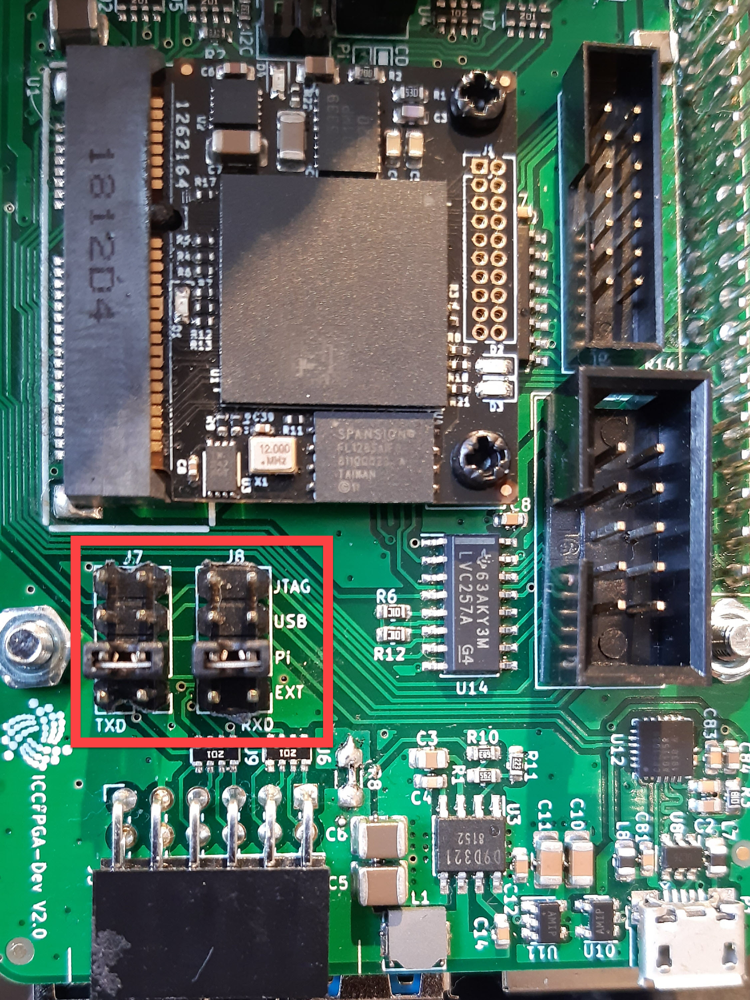
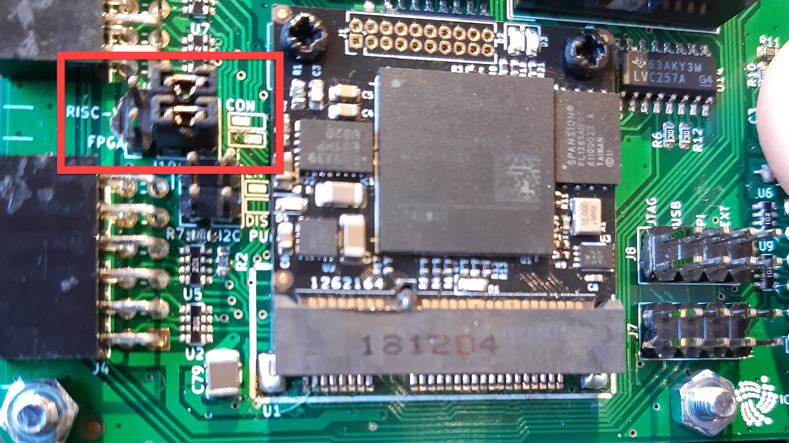
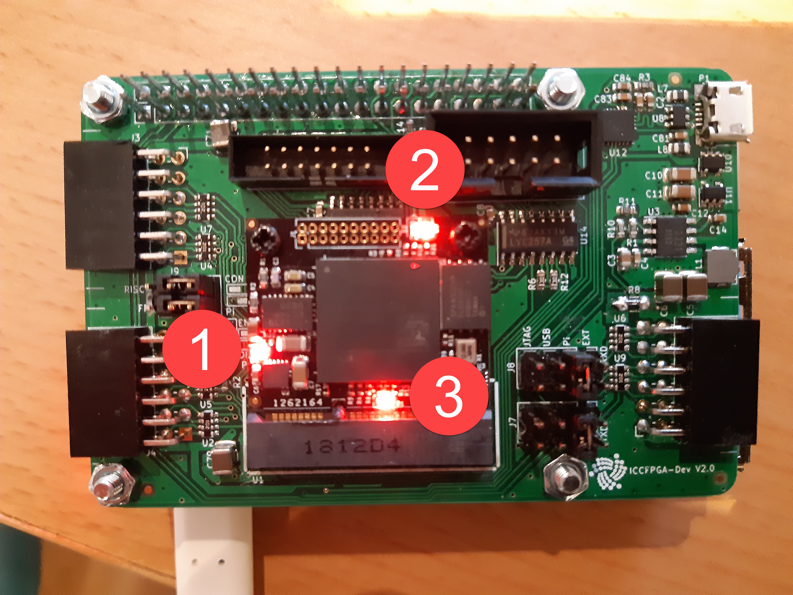

# Get started with the CryptoCore

**The CryptoCore is IOTA hardware designed for applications that need fast, dedicated proof of work and a secure memory. The device consists of an IOTA CryptoCore FPGA (ICCFPGA) module and a development board that doubles as a Raspberry Pi HAT, making it perfect for standalone applications and/or quick prototyping. In this guide, you learn how to get started with the CryptoCore on the Raspberry Pi 3/4.**


:::info:
The CryptoCore is in limited supply and currently available only to partners. If you're interested in receiving one, please get in touch with your representative at the IOTA Foundation.
:::

## Hardware

To complete this guide, you need the following:

- A PC with an SSH client installed

- A Raspberry Pi 3/4 with the following:
  - Raspbian installed
  - An Internet connection
  - SSH enabled
  - The serial interface enabled

  :::info:
  We recommend these external guides for setting up your Raspberry Pi:

  - [Install Raspian](https://www.raspberrypi.org/documentation/installation/installing-images/README.md)
  - [Connect to WiFi and enable SSH](https://www.e-tinkers.com/2017/03/boot-raspberry-pi-with-wifi-on-first-boot/)
  - [Enable the serial interface](https://www.raspberrypi.org/documentation/configuration/raspi-config.md)
  :::

- A CryptoCore development kit with jumpers J7, J8, and J9 set to `PI`:





## Step 1. Set up the CryptoCore development environment

Before you can start using the CryptoCore, you need to install the necessary tools on your Raspberry Pi.

Complete the following steps in an SSH session between your PC and the Raspberry Pi.

1. Install `git`

  ```bash
  sudo apt update && sudo apt install git
  ```

2. Clone the `iccfpga-utils` repository

  ```bash
  cd ~
  git clone --recursive https://gitlab.com/iccfpga-rv/iccfpga-utils
  ```

3. Change into the `iccfpga-utils` directory and start the installer script. This script clones, compiles, and installs all dependencies as well as installing the RISC-V firmware and the CryptoCore program.

  ```bash
  cd iccfpga-utils
  ./install_raspberry.sh
  ``` 

  When the script finishes, the Raspberry Pi will be rebooted.

4. Upload the RISC-V firmware and the CryptoCore program to the ICCFPGA

  If you want the CryptoCore program to be available after a reboot, flash it into the QSPI flash memory (takes up to 7 minutes):

  ```bash
  cd ~/iccfpga-utils/raspberry_scripts
  ./flash_core.sh
  ```

  :::info:
  Make sure to turn the Raspberry Pi off and on again from the socket to allow the FPGA to load the core and firmware files from flash memory.
  :::

  If you want the CryptoCore program to be available only until the next reboot, upload it to RAM (takes a couple of seconds):

  ```bash
  cd ~/iccfpga-utils/raspberry_scripts
  ./upload_core.sh
  ```

After uploading the RISC-V firmware and the CryptoCore program to the ICCFPGA, you should see three red LEDs on it:

- **1:** Power
- **2:** Indicates that the ICCFPGA has a valid CryptoCore program
- **3:** Indicates that the CryptoCore firmware is running



## Step 2. Test the CryptoCore

After setting up the CryptoCore with all the necessary software, you can test it by running the 'hello world' program.

1. Open a serial terminal

  ```bash
  cd ~/iccfpga-utils/raspberry_scripts
  ./start_serial.sh
  ```

  You should see the following:

  ```bash
  picocom v3.1

  port is        : /dev/ttyS0
  flowcontrol    : none
  baudrate is    : 115200
  parity is      : none
  databits are   : 8
  stopbits are   : 1
  escape is      : C-a
  local echo is  : yes
  noinit is      : no
  noreset is     : no
  hangup is      : no
  nolock is      : no
  send_cmd is    : sz -vv
  receive_cmd is : rz -vv -E
  imap is        : crcrlf,
  omap is        :
  emap is        : crcrlf,delbs,
  logfile is     : none
  initstring     : none
  exit_after is  : not set
  exit is        : no
  ```

2. In the serial terminal, enter the following command to request the current version of the CryptoCore program, using the API
    
  ```bash
  {"command":"version"}
  ```

  You should see something like the following:

  ```bash
  {"version":"0.07rv","command":"version","duration":0,"code":200}
  ```

3. Press **Ctrl + a** then **Ctrl + q** to exit the serial terminal

:::success: Congratulations :tada:
You've set up the CryptoCore and you're able to send commands to its API.
:::

## Troubleshooting

These are known issues that you may find while following this guide and some suggested steps to resolve them.

### No output in the serial terminal

If you see no messages returned in the serial terminal, make sure that [jumpers J7 and J8](#hardware) are connected to the correct pins.

### json decoding unsuccessful

If you see this message in the serial terminal, make sure that all three red LEDs are lit on the ICCFPGA.

If these lights aren't lit, try [uploading the RISC-V firmware and the CryptoCore program](#step-1-set-up-the-cryptocore-development-environment) again.

## TDO mismatch

If you see this message while trying to upload the RISC-V firmware and the CryptoCore program to the ICCFPGA, make sure that [jumper J9](#hardware) is connected to the correct pins.

## Next steps

Take a look at the [API reference](../references/api-reference.md) to find out what else you can make the CryptoCore do, using the serial terminal.

Read the [CryptoCore manual](https://gitlab.com/iccfpga-rv/iccfpga-manual/blob/master/iccfpga.pdf) for detailed information and guides.

