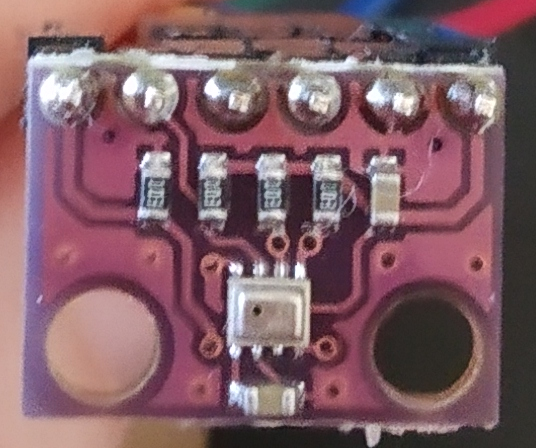

# Connect to a Bosch BME/BMP 280 sensor

**The Bosch BME/BMP 280 sensors are developed specifically for mobile applications where size and low power consumption are key design constraints. In this guide, you connect a Bosch BME/BMP 280 sensor board to your microcontroller.**

**BME 280 I2C board**

1. Solder the pin headers to the board

2. [Connect the sensor to your microcontroller](../how-to-guides/connect-a-I2C-sensor.md)

3. Connect the SDO pin to the VDDIO pin to give the BME/BMP 280 the [I2C device address 0x77.](https://ae-bst.resource.bosch.com/media/_tech/media/datasheets/BST-BMP280-DS001.pdf) (See "5.2 I²C Interface" for more information.)

4. If you have a BME/BMP 280 sensor without the board, you need to do the following to select the I2C interface:
- [Pull up the SCL and SDA lines](https://electronics.stackexchange.com/a/1852/201179)
- [Connect the CSB pin to the VDDIO pin](https://ae-bst.resource.bosch.com/media/_tech/media/datasheets/BST-BMP280-DS001.pdf)
 (see "5.1 Interface selection" for more information)

