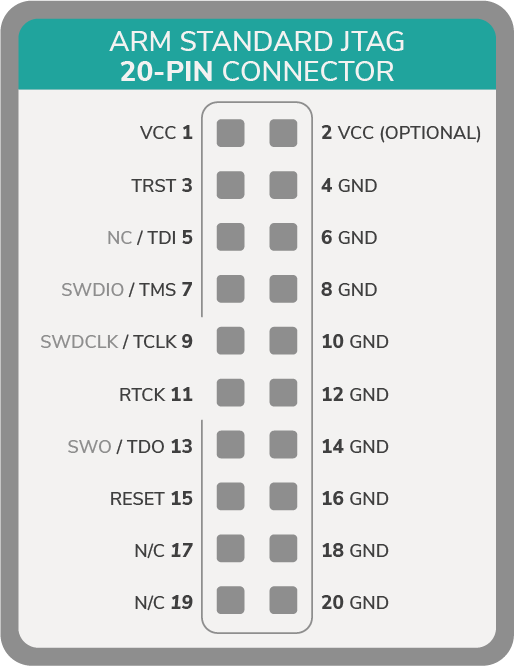
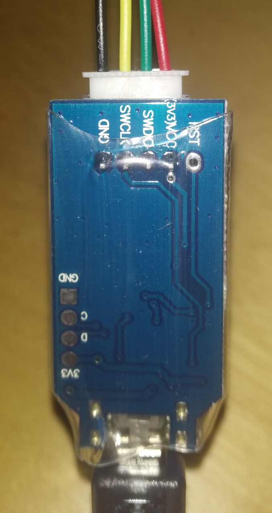

# Connect to an external programmer

**To flash anything to your nRF52 series microcontroller, you need a programmer. Some microcontrollers don't have an integrated programmer, in which case, you need to connect an external one.**

## Prerequisites

To complete this guide, you need the following:

- Linux-based PC to which to connect the programmer
- A programmer (J-Link, J-Link OB clone, or DAPLink)
- An nRF52 series microcontroller

:::info:
If you want a cheap option for flashing an nRF52 series microcontroller, consider buying a J-Link on-board (OB) clone.

The standard J-link programmers are more expensive because they can also be used on microprocessors.
:::

---

1. Connect the programmer to your development board

    **Option 1:** J-Link
        
    |    **nRF52**    |    **J-Link (pin)**   |
    |-------------|-------------------|
    |    VCC      |    VCC (1)        |
    |    GND      |    GND (4)        |
    |    SWD      |    SWDIO (7)      |
    |    SCLK     |    SWDCLK (9)     |

    The J-Link uses a standard 20 pin JTAG.

    

    
    
    **Option 2:** J-Link OB
    
    |    **nRF5x**    |    **J-Link OB**   |
    |-------------|----------------|
    |    VCC      |    VCC         |
    |    GND      |    GND         |
    |    SWD      |    SWDIO       |
    |    SCLK     |    SWDCLK      |

    

    
        
    **Option 3:** DAPLink
    
    Most DAPLink programmers are integrated on the development board and expose a micro-USB port. So, you need only to connect the microcontroller board to your PC with the correct USB cable.
    
2. If you use a J-Link or J-Link OB, connect it to your PC through a USB cable