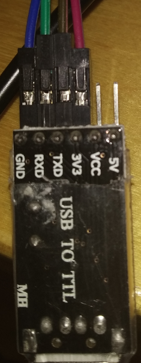

# Connect to the microcontroller's serial interface

**To read the output of your microcontroller, you need to be able to receive and transmit data on its serial port. To access the serial port on the microcontroller, you need a USB-to-UART connector (sometimes called a USB to TTL serial connector) that can plug into the USB port of your PC. Some microcontroller development boards include an integrated USB-to-UART connector, but others do not. In this case, you need to connect an external USB-to-UART connector to your microcontroller, then plug it into your PC to be able to communicate with the microcontroller.**

## Prerequisites

To complete this guide, you need the following:

- A USB-to-UART connector
- DuPont cables to connect the USB-to-UART connector to your microcontroller

## Connect to the USB-to-UART adapter

1. Connect the UART-to-USB dongle to your microcontroller on pins P0.6 and P0.8
    
    |    **nRF52 (pin)**   |    **USB-to-UART**  |
    |------------------|------------------|
    |    TX (P0.6)     |    RX            |
    |    RX (P0.8)     |    TX            |
    |    VCC           |    VCC           |
    |    GND           |    GND           |

    **USB-to-UART**

    

    :::info:
    Use a black cable for GND and a red one for VCC
    :::

2. Plug the UART-to-USB dongle into your PC

The microcontroller's pinout depends on the development board you use. In this guide, we use an nRF52832 module and an nrf52832 minimum test board.
    
:::info:
This breakout board is also compatible with the nRF51822 and nRF52832. If you are going to use the breakout board, make sure your microcontroller has 1.27mm pitch.
:::