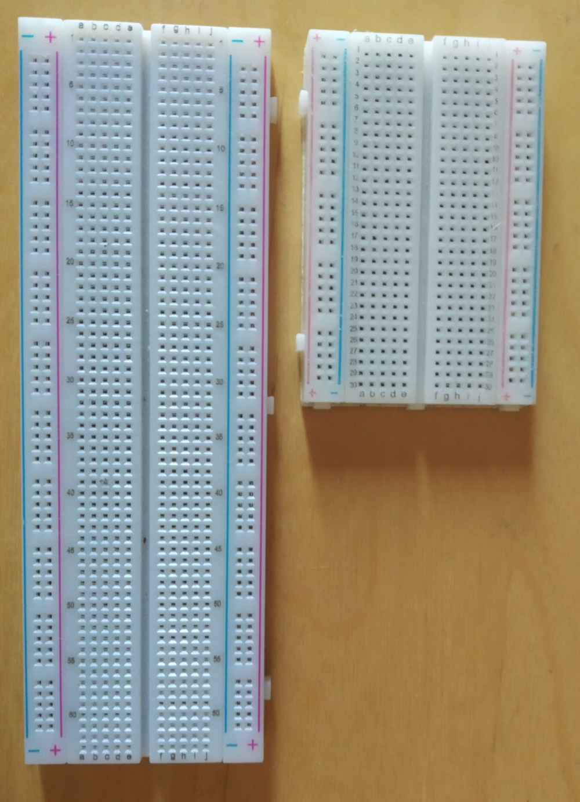
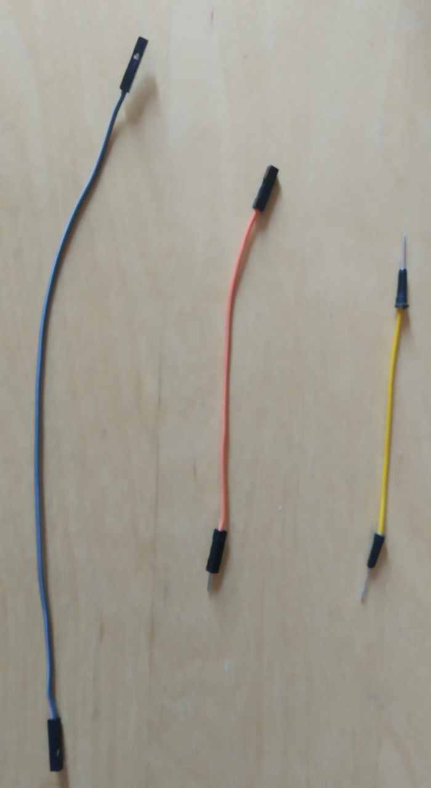
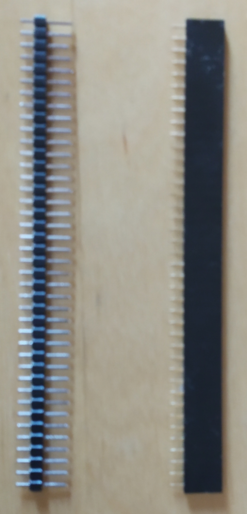

# Get started with microcontroller development

**In this guide, you learn how to get started with the nRF5 series of  microcontrollers. When you've completed this guide, you'll be able to follow our series of tutorials for using IOTA on the Internet of Things.**

The nrf52 series of microcontrollers are an ideal single-chip solution for wearables, toys, smart home devices and appliances, and wireless charging.

We use this series of microcontrollers in these tutorials because they include Bluetooth and are usually cheap. 

1. Buy one of the following nRF52 microcontrollers from a specialized electronic retailer
    
- nRF52832 breakout board by SparkFun
- nRF52 development kit
- nRF52832 micro development kit
- nRF52832 USB dongle
- nRF52832 module + nrf52832 minimum test board (Used in these tutorials)

    :::info:
    Make sure that the development board does not have half pin holes.
    :::

When you buy a microcontroller, keep the following in mind:

- If your microcontroller does not have an integrated programmer (sometimetimes called a debugger), you'll need to buy a separate one
- If your microcontroller does not have an integrated USB-to-UART connector (sometimes called a USB to TTL serial connector), you'll need to buy a separate one
    
2. If you buy a microcontroller that doesn't have an integrated programmer (sometimes called a debugger), buy one and [connect it](../how-to-guides/connect-programmer.md).

    :::info:
    A programmer is used to flash the code onto the microcontroller. 
    [Read more about what a programmer is.](https://www.engineersgarage.com/tutorials/microcontroller-programmer-burner)
    :::
    
3. If you buy a microcontroller that doesn't have an integrated USB-to-UART conncector, buy one and [use it to connect to your microcontroller's serial interface](../how-to-guides/connect-to-serial-interface.md).
    
    :::info:
    Buy one that works with your operating system.
    :::
    
4. **Optional:** Buy a breadboard, DuPont cables, and pin headers

    These components are often useful when you're building hardware projects.
    For example, if you want to connect more than one I2C sensor to a microcontoller that has only one I2C port.

    **Breadboard**
    
    A breadboard allows you to make temporary circuits for connecting hardware components without needing to solder them.
    
    

    **DuPont cables**

    DuPont cables are useful for plugging into a breadboard.
    
    You can usually order DuPont cables in multiples of 10, and they come in different variations such as female-to-female, male-to-female, and male-to-male. We recommended buying a mixture of variations.
    
    
    
    From left to right: female-to-female, male-to-female, male-to-male
    
    **Pin headers**

    Pin headers allow you to connect your different hardware components.
    
    The most commonly used header has a male-to-male connection.
    
    
    
    From left to right: male-to-male, male-to-female 
    
6. **Optional:** Buy a single-board computer

    :::info:
    A single-board computer (SBC) is often more powerful and has more memory than a microcontroller. As a result, you can use one to connect to your microcontroller or even to run an [IOTA node](root://ciri/0.1/how-to-guides/run-a-ciri-node-on-an-sbc.md).
    
    Some of the cheapest SBCs include the Raspberry Pi Zero or Orange Pi Zero. 
    We recommend a device with Wi-Fi and Bluetooth LE (version >= 4.0) so that you can easily connect to it.
    :::

7. Buy an I2C environment sensor such as the Bosch BME/BMP 280 sensor

    :::info
    We use an operating system called RIOT OS in our tutorials.
    
    Before buying any other sensors, check the [RIOT OS sensor driver list](http://riot-os.org/api/group__drivers__sensors.html) to make sure that they are supported.
    :::

## Next steps

[Set up your microcontroller](../how-to-guides/set-up-nrf52-microcontroller.md).
    
    