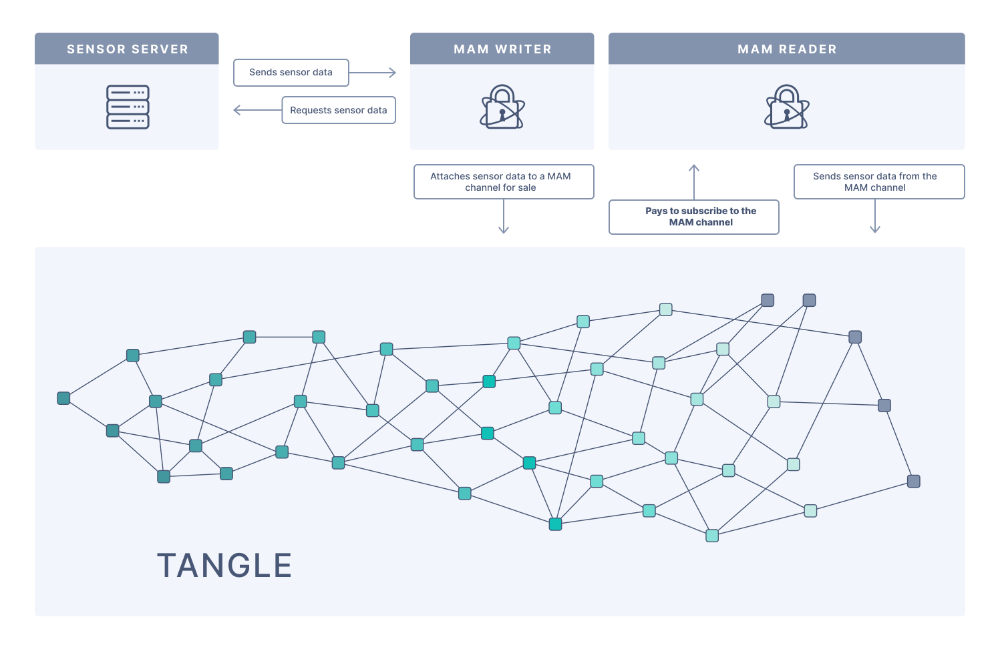

# Environment sensor to Tangle

**In this guide, we run an application that collects environment sensor data and attaches it to the Tangle on MAM channels, using MAMv1**

## Prerequisites

To complete this guide, you need the following:

- [Set up a Bluetooth star network](../how-to-guides/set-up-a-bluetooth-star-network.md)
- [Install Bazel](https://docs.bazel.build/versions/master/install.html)

## Architecture

The border router asks the sensor server for information, then sends that information to a node so that it can attach it to the Tangle.



## How to run the Sensor2Tangle application

1. Start the server on your microcontroller
    
    :::info:
    You need to execute the following command in the serial console of your microcontroller.
    The serial console of your microcontroller is opened in the terminal where you executed `make flash term`.
    :::
    
    ```bash
    server start
    ```
    
2. Clone the environment sensor client and MAM writer onto your SBC

    ```bash
    git clone https://github.com/iota-community/env-sensor-mam-writer.git
    ```

3. Change the configuration variables in the `app/server-client.c` file

    |**Variable**|**Description**|**Notes**|
    |:-------|:----------|:----|
    |`IOTA_SEED`| The seed that you want to use to sign MAM messages|You should change this default seed to your own, which does not contain any addresses that contain IOTA tokens|
    |`CLIENT_ADDRESS`| The IPv6 client address as a hex array|For example, the`fe80::f2d5:bfff:fe10:f1b1` address becomes `{ 0xfe, 0x80, 0x00, 0x00, 0x00, 0x00, 0x00, 0x00, 0xf2, 0xd5, 0xbf, 0xff, 0xfe, 0x10, 0xf1, 0xb1 }`. The university of Iowa has a [good explanation how the IPv6 addressing works.](https://its.uiowa.edu/support/article/1209).|
    |`SENSOR_ADDRESS`|The IPv6 address of the sensor node|Execute the command `ifconfig` on the shell of your sensor node, to find this address|

4. Run the MAM writer application

    ```bash
    cd env-sensor-mam-writer &&  bazel run -c opt //app
    ```

    The application requests the environment data from the sensor, then publishes that data to a MAM channel.

    Make a note of both the address and the bundle hash, which are logged to the console.

5. Open a new terminal window, and clone the MAM reader application onto your SBC

    ```bash
    git clone https://github.com/iota-community/env-sensor-mam-reader.git
    ```

6. Change the configuration variables in the `app/sensor_receiver.c` file

    |**Variable**|**Description**|
    |:-------|:----------|
    |`IOTA_ADDRESS`|The address that was returned by the writer application|
    |`IOTA_BUNDLE`|The bundle hash that was returned by the writer application|

7. Run the MAM reader application

    ```bash
    cd env-sensor-mam-reader && bazel run -c opt //app
    ```

The application logs the temperature data it gets from the MAM channel on the Tangle.
