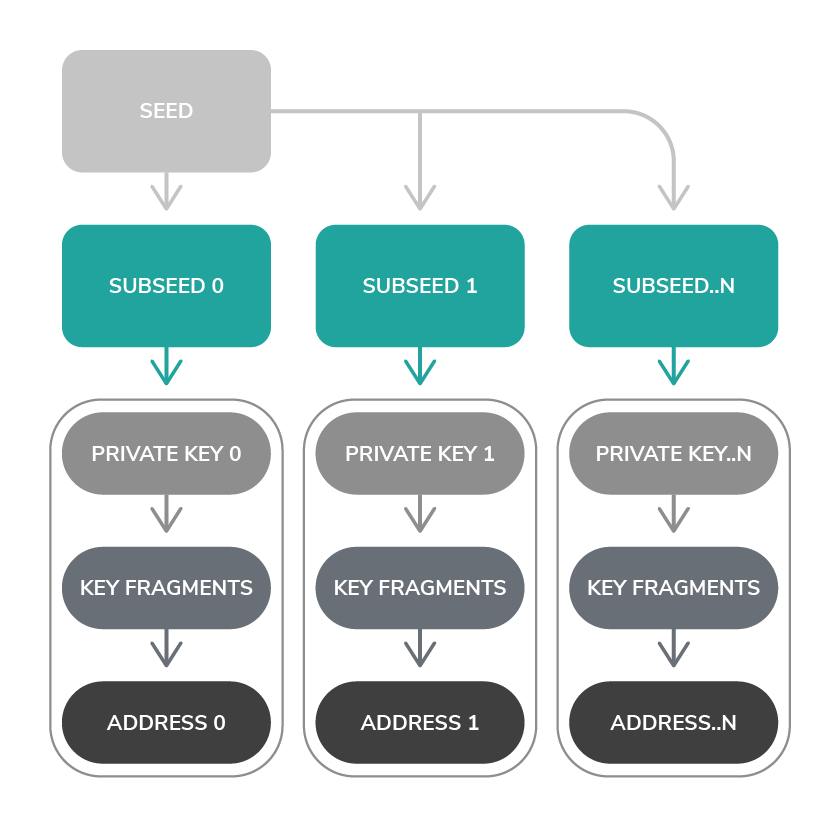

# Addresses and signatures

**Seeds are used to create private keys, and in turn, private keys are used to create addresses and signatures. Addresses are public and can safely be shared among others in the network. Signatures are cryptographic proof of ownership of an address. So, when a transaction contains a valid signature, it was created by the owner of the correct seed.**

## Private keys

Each private key is created from a cryptographic hashing function that takes a seed, an index, and a security level. Private keys are used to create addresses, so the index and security level of the private key also affect the address.

A private key can have one of three security levels, which determine its length. The higher the security level, the longer and more secure the private key.

As well as a security level, a private key has an index. Whenever the index is incremented, a new private key is created.

Private keys, like seeds, are secret and should never be shared with anyone.

### How private keys are created

The seed and index are combined and hashed to create an 81-tryte **subseed**:

    hash(seed + index)

To create a private key, the subseed is passed to a [cryptographic sponge function](https://en.wikipedia.org/wiki/Sponge_function), which absorbs it and squeezes it 27 times per security level.

The result of the sponge function is a private key that consists of 2,187, 4,374, or 6,561 trytes, depending on the [security level](../references/security-levels.md).

## Addresses

Addresses are public. Clients send tokens and messages to addresses using the [`address` field](../references/structure-of-a-transaction.md) of a transaction.

A private key is used to create an address with the same index and security level. As a result, the same seed, index, and security level will always result in the same private key and address.

**Tip:** Try [creating different addresses with the IOTA JavaScript client library](../how-to-guides/create-an-address.md).

### How addresses are created

To create an address, the private key is split into **81-tryte segments**. Then, each segment is hashed 26 times.

A group of 27 hashed segments is called a **key fragment**. Because a private key consists of 2,187, 4,374, or 6,561 trytes, a private key has one key fragments for each security level. For example, a private key with security level 1 consists of 2187 trytes, which is 27 segments, which results in one key fragment.

Each key fragment is hashed once to create one **key digest** for each security level. For example, one key fragment results in one key digest.

Then, the key digests are combined and hashed once to create an 81-tryte address.

## Signatures

Clients need a way of proving that they own an address before IRI nodes will validate a transaction that debits IOTA tokens from it.

To prove ownership, input transactions must be signed with the private key that was used to create the address. This signature is put into the [`signatureMessageFragment` field](../references/structure-of-a-transaction.md) of a transaction.

A signature is created from both the private key of an address and the bundle hash of the transaction that spends from the address. 

By using the bundle hash to create a signature, it's impossible for attackers to intercept a bundle and change any transaction without changing the bundle hash and invalidating the signature.

### How signatures are created

Signatures are created using the Winternitz one-time signature scheme. This signature scheme is quantum resistant, meaning that signatures are resistant to attacks from quantum computers.

To create a signature, the bundle hash of a transaction is normalized to make sure that only half of the private key is revealed in the signature.

**Note on address reuse:** This step is necessary because of the Winternitz one-time signature scheme. If the bundle hash weren't normalized, the scheme would reveal an unknown amount of the private key. By revealing half of the private key, an address can safely be debited from once. If an address is debited from more than once, more of the private key is revealed, so a sophisticated attacker can brute force its signature and steal the IOTA tokens.

Depending on the number of key fragments that a private key has, 27, 54, or 81 trytes of the normalized bundle hash are selected. These trytes correspond to the number of segments in a key fragment.

The selected trytes of the normalized bundle hash are [converted to their decimal values](../references/tryte-alphabet.md). Then, the following calculation is performed on each of them:

    13 - decimal value

The result of this calculation is the number of times that each of the 27 segments in the key fragment must be hashed to create the signature fragment. Each signature fragment is 2187 trytes.

Because a transaction's [`signatureMessageFragment` field](../references/structure-of-a-transaction.md) can contain only 2187 trytes, any input address with a security level higher than 1 must fragment the rest of the signature over zero-value output transactions.

### How IRI nodes verify signatures

IRI nodes verify a signature in a transaction by using the signature and the bundle hash to find the address of the input transaction.

To verify a signature, the bundle hash of a transaction is normalized.

Depending on the length of the signature, 27, 54, or 81 trytes of the normalized bundle hash are selected. These trytes correspond to the number of 81-tryte segments in a signature fragment.

The selected trytes of the normalized bundle hash are [converted to decimal values](../references/tryte-alphabet.md). Then, the following calculation is performed on each of them:

    13 + decimal value

The result of this calculation is the number of times that each of the 27 segments in the signature fragments must be hashed to create the key fragments.

Each key fragment is hashed once to create the **key digests**, which are combined and hashed once to create an 81-tryte address.

If the address matches the one in the transaction, the signature is valid.