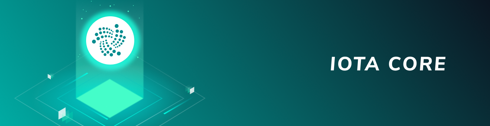

# Python client library

**The Python client library allows you to use any of the supported packages to write applications that act as a client or a server to interact with the Tangle.**

-------------------------

## [Core](../core/introduction/overview.md)
The Python core client library includes low-level methods for interacting with the Tangle. You can use this library to use the core IOTA protocol. For example, you can connect to nodes, create bundles, and promote and reattach pending transactions.
-------------------------
