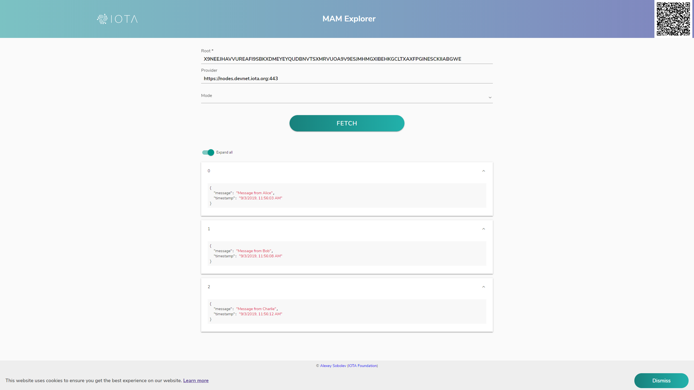

# Publish public messages

**If you want to publish messages to a channel that anyone can read, you can use a public channel. A public channel is one where the root of the Merkle tree is the address of the transaction that the message is published to. As a result, any user can find the message and decrypt it, using the address of the transaction that it's in. This type of channel is useful for public announcements or public social media applications that want the data to be immutable.**

Here, we connect to a node on the Devnet, which is one of the [IOTA networks](root://getting-started/0.1/references/iota-networks.md) that you can use for testing. The Devnet is similar to the Mainnet, except the tokens are free.

1. Require the MAM and Converter client libraries

  ```js
  const Mam = require('../lib/mam.client.js');
  const { asciiToTrytes, trytesToAscii } = require('@iota/converter');
  ```

2. Set the privacy mode to public, connect to a Devnet node, and set the MAM explorer URL to use for seeing messages in a user interface

  ```js
  const mode = 'public';
  const provider = 'https://nodes.devnet.iota.org';

  const mamExplorerLink = `https://mam-explorer.firebaseapp.com/?provider=${encodeURIComponent(provider)}&mode=${mode}&root=`;
  ```

3. Initialize the MAM state

  ```js
  let mamState = Mam.init(provider);
  ```

4. Create a function to convert ASCII data to trytes and store it in JSON before publishing it to a MAM channel

  ```js
  const publish = async packet => {
      // Create MAM message as a string of trytes
      const trytes = asciiToTrytes(JSON.stringify(packet));
      const message = Mam.create(mamState, trytes);

      // Save your new mamState
      mamState = message.state;
      // Attach the message to the Tangle
      await Mam.attach(message.payload, message.address, 3, 9)

      console.log('Published', packet, '\n');
      return message.root
  }
  ```

  :::info:
  The `message.root` property is the MAM channel ID for this MAM stream.
  :::

5. Create a function that publishes three MAM messages

  ```js
  const publishAll = async () => {
    const root = await publish({
      message: 'Message from Alice',
      timestamp: (new Date()).toLocaleString()
    })

    await publish({
      message: 'Message from Bob',
      timestamp: (new Date()).toLocaleString()
    })

    await publish({
      message: 'Message from Charlie',
      timestamp: (new Date()).toLocaleString()
    })

    return root
  }
  ```

6. Publish the messages, fetch them, and decrypt them

  ```js
  // Callback used to pass data out of the fetch
  const logData = data => console.log('Fetched and parsed', JSON.parse(trytesToAscii(data)), '\n')

  publishAll()
    .then(async root => {

      // Output asyncronously using "logData" callback function
      await Mam.fetch(root, mode, null, logData)

      // Output syncronously once fetch is completed
      const result = await Mam.fetch(root, mode)
      result.messages.forEach(message => console.log('Fetched and parsed', JSON.parse(trytesToAscii(message)), '\n'))
  ```

7. Print the link to the console to see these messages in the MAM Explorer

  ```js
      console.log(`Verify with MAM Explorer:\n${mamExplorerLink}${root}\n`);
    })
  ```

When you go to the link, you should see the following messages:


