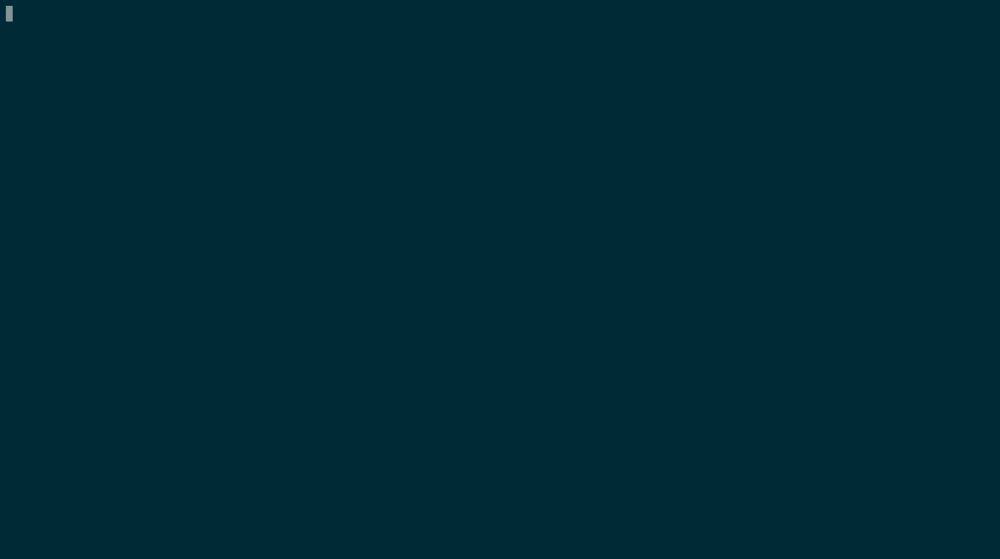

# Run a node on the Coordicide Alphanet

**When you run the Coordicide Alphanet software, your computer becomes a node in the network. By running a node, you can test the network and keep up to date with regular changes. When all the modules become available, this network will become the Coordicide testnet, which is a release candidate for the next IOTA protocol.**

## Prerequisites

To complete this guide, you need the following:

* An Internet connection
* A [public IP address](root://general/0.1/how-to-guides/expose-your-local-device.md) that's either static or connected to a dynamic DNS service such as [duckdns.org](https://www.duckdns.org)
* At least version 1.12 of the Go programming language (we recommend the latest version)
* GCC: For macOS, you can install GCC using [Homebrew](https://brew.sh/) (`brew install gcc`). For Windows, you can [install TDM-GCC](http://tdm-gcc.tdragon.net/download). For Linux (Ubuntu 18.04), you can [install GCC from the `build-essential` package](https://linuxize.com/post/how-to-install-gcc-compiler-on-ubuntu-18-04/).
* [Git](https://git-scm.com/downloads)
* [Forward the following ports](root://general/0.1/how-to-guides/expose-your-local-device.md) to the device that's running the node:

    * **Autopeering port:** 14626
    * **Gossip port:** 14666

## Step 1. Download the code

1. In the command prompt, check your `GOPATH` environment variable

    ```bash
    go env GOPATH
    ````

2. In any directory outside of the one in your `GOPATH` environment variable, clone the `goshimmer` GitHub repository

    ```bash
    git clone https://github.com/iotaledger/goshimmer.git
    ```

3. Change into the `goshimmer` directory

    ```bash
    cd goshimmer
    ```

4. Install the dependencies

    ```bash
    go get
    ```

## Step 2. Run the node

When you run the node, it joins the network by autopeering with the entry node that's run by the IOTA Foundation. To autopeer with this entry node, you must make sure that the autopeering and gossip ports are forwarded to your node. By default, these ports are 14666 and 14626. If you don't forward these ports, you can still send transaction to your node, but it won't be able to connect to any neighbors.

1. Build the executable file

    ```bash
    go build -o shimmer
    ```
    
    Now, you have a file called `shimmer` that you need to execute.

2. To execute the `shimmer` file on Linux or macOS, do `./shimmer`. To execute the file on Windows, rename it to `shimmer.exe`, then execute it by double clicking the file, or by doing `.\shimmer` in the command prompt.

    :::info:
    You can customize some features of your node by adding [command-line flags](../references/command-line-flags.md) after the command to execute the file.
    :::



## Step 3. Send spam transactions to your node

The `spammer` API endpoint allows you to send your node spam transactions.

1. Open a web browser and enter the following into the address bar

    `http://localhost:8080/spammer?cmd=start`

    :::info:
    By default, this endpoint sends 1,000 transactions per second (TPS). If you want to change the TPS, you can add the `tps` query parameter. For example, to send 10,000 TPS, send a request to the following endpoint `http://localhost:8080/spammer?cmd=start&tps=10000`
    :::

2. To check that your node is receiving transactions, you can open the web user interface by going to localhost:8081 in a web browser.

    

    :::info:
    The displayed TPS may be lower than the value of the `tps` parameter you used. The reason for this difference may be due to limits with your computer hardware.
    :::

## Next steps

Now that your node is receiving transactions, [subscribe to events on your node](../how-to-guides/subscribe-to-events.md) to see that transaction data.

