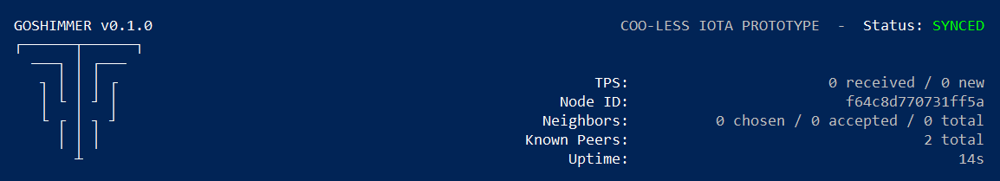

# Run a GoShimmer node

**When you run the GoShimmer software, your device becomes a node in the prototype network. By running a node, you can test the network and keep up to date with regular changes. When all the modules become available, this network will become the Coordicide testnet, which is a release candidate for the next IOTA protocol.**

You have two options for running a node. You either can run the node as a service in a Docker container, or you can build the node from source.

## Run a node in a Docker container

When you run a node in a Docker container, it's similar to running it in a lightweight virtual machine.

Some of the advantages of running a node in a Docker container include the following:

* You don't need to install all the tools and dependencies that the node needs such as a compiler and the Go programming language
* The node runs in the same way on any supported system architecture
* It's easier to run the node in the background, to stop it, and to see the logs

### Prerequisites

To complete this guide, you need the following:

* [Git](https://git-scm.com/downloads)

* [Forward the ports](root://general/0.1/how-to-guides/expose-your-local-device.md) 14626(TCP/UDP) and 14666 (TCP) to the device that's running the node
* A public IP address
* [A system architecture that Docker supports](https://docs.docker.com/install/#supported-platforms)

The Docker container is suitable for the following operating systems:
* Linux
* macOS
* Windows

:::info:
If you're using a Debian-based operating system, add `sudo` before all the commands in the following tasks.
:::

### Step 1. Install Docker

To build the Docker container, you must install Docker 17.05+ (for multi-stage build support) on your device.

1. [Install Docker](https://docs.docker.com/install/#supported-platforms). If you're running a version of macOS or Windows that's older than the system requirements, install the [Docker toolbox](https://docs.docker.com/toolbox/overview/) instead.

2. Make sure that Docker is installed

    ```bash
    docker run hello-world
    ```

    You should see some Docker information like the following:

    ```
    Unable to find image 'hello-world:latest' locally
    latest: Pulling from library/hello-world
    1b930d010525: Pull complete
    Digest: sha256:2557e3c07ed1e38f26e389462d03ed943586f744621577a99efb77324b0fe535
    Status: Downloaded newer image for hello-world:latest

    Hello from Docker!
    This message shows that your installation appears to be working correctly.

    To generate this message, Docker took the following steps:
    1. The Docker client contacted the Docker daemon.
    2. The Docker daemon pulled the "hello-world" image from the Docker Hub.
        (amd64)
    3. The Docker daemon created a new container from that image which runs the
        executable that produces the output you are currently reading.
    4. The Docker daemon streamed that output to the Docker client, which sent it
        to your terminal.

    To try something more ambitious, you can run an Ubuntu container with:
    docker run -it ubuntu bash

    Share images, automate workflows, and more with a free Docker ID:
    https://hub.docker.com/

    For more examples and ideas, visit:
    https://docs.docker.com/get-started/
    ```

### Step 2. Run the node

When you run the node, it joins the network by autopeering with the entry node that's run by us at the IOTA Foundation. To autopeer with this entry node, you must make sure that the autopeering and gossip ports are forwarded to your node. By default, these ports are 14666 and 14626. If you don't forward these ports, you can still send transaction to your node, but it won't be able to connect to any neighbors.

1. Clone the `goshimmer` repository
    
    ```bash
    git clone https://github.com/iotaledger/goshimmer.git
    ```

2. Change into the `goshimmer` directory

    ```bash
    cd goshimmer
    ```

3. Build the Docker image

    ```bash
    docker build -t goshimmer .
    ```

4. Run the Docker image

    Here, we run the Docker image in the background, forward the ports from your host device to the Docker container, and and use the [command-line flags](../references/command-line-flags.md) to enable the spammer, ZMQ, and dashboard plugins. These plugins allow you to send spam transactions to your node, monitor it for incoming transactions, and view the total number of transactions that it's processing in a web dashboard.

    :::info:
    If you have [Docker Compose](https://docs.docker.com/compose/), you can also use the `docker-compose up -d` command.
    :::

    ```bash
    sudo docker run -d --rm -p 14666:14666 -p 14626:14626 -p 14626:14626/udp -p 8080:8080 -p 8081:8081 -it -v mainnetdb:/app/mainnetdb goshimmer --node-enable-plugins "spammer zeromq dashboard"
    ```

    The container ID is displayed in the console.

    :::info:
    To have the Docker container restart on every reboot, add the `--restart=always` flag to the `run` command.
   :::

5. Copy the container ID, and use it to read the node's logs. Replace the `$ContainerID` placeholder with your container ID.

    ```bash
    docker logs -f $ContainerID
    ```

6. To see the status screen, attach the Docker container by doing the following. Replace the `$ContainerID` placeholder with your container ID.

    ```bash
    docker attach $ContainerID
    ```

:::success:Congratulations :tada:
You're now running a GoShimmer node.
:::



The status screen displays the following statistics in the top-right corner:

* **TPS:** The number of transactions per second, which are separated into two categories. The **received** transactions are those that the node has just appended to its ledger. The **new** transactions are solid transactions.
* **Node ID:** The node's public key that gives it a unique identity
* **Neighbors:** The number of neighbors that the node is connected to. All nodes can have a maximum of 8 neighbors. Each node chooses 4 neighbors to connect to and accepts incoming connections from 4 other neighbors that chose it.
* **Known peers:** The total number of nodes in the network. At the moment, the number of **neighborhood** nodes is the same as the number of **total** nodes. When the network allows sharding, the **neighborhood** nodes will be those that are in the node's shard.
* **Uptime:** The total amount of time during which the node has been running

:::info:
If you don't have any accepted neighbors, make sure that you've forwarded your `autopeering` TCP/UDP port (14626) to your device.
:::

## Build a node from source

When you build the node from the source code, you need to make sure that you have the prerequisites such as GCC, and the Go programming language.

### Prerequisites

To complete this guide, you need the following:

* At least version 1.12 of the Go programming language (we recommend the latest version)
* GCC: For macOS, you can install GCC using [Homebrew](https://brew.sh/) (`brew install gcc`). For Windows, you can [install TDM-GCC](http://tdm-gcc.tdragon.net/download). For Linux (Ubuntu 18.04), you can [install GCC from the `build-essential` package](https://linuxize.com/post/how-to-install-gcc-compiler-on-ubuntu-18-04/).
* [Git](https://git-scm.com/downloads)

* [Forward the ports](root://general/0.1/how-to-guides/expose-your-local-device.md) 14626(TCP/UDP) and 14666 (TCP) to the device that's running the node
* A public IP address

### Step 1. Download the code

1. In the command prompt, check your `GOPATH` environment variable

    ```bash
    go env GOPATH
    ```

    :::info:
    This directory is called `$GOPATH`.
    :::

2. Clone the `goshimmer` repository anywhere outside of `$GOPATH`
    
    ```bash
    git clone https://github.com/iotaledger/goshimmer.git
    ```

### Step 2. Run the node

When you run the node, it joins the network by autopeering with the entry node that's run by us at the IOTA Foundation. To autopeer with this entry node, you must make sure that the autopeering and gossip ports are forwarded to your node. By default, these ports are 14666 and 14626. If you don't forward these ports, you can still send transaction to your node, but it won't be able to connect to any neighbors.

1. Change into the `goshimmer` directory

    ```bash
    cd goshimmer
    ```

2. Build the executable file

    ```bash
    go build -o shimmer
    ```
    
    Now, you have a file called `shimmer` that you need to execute.

3. Execute the `shimmer` file, according to your operating system:

* **Linux and macOS:** `./shimmer --enable-node-plugins "spammer zeromq dashboard"`
* **Windows:** Rename the file to `shimmer.exe`, then execute it by doing `.\shimmer --node-enable-plugins "spammer zeromq dashboard"` in the command prompt

Here, we run the run the node in the background, and use the [command-line flags](../references/command-line-flags.md) to enable the spammer, ZMQ, and dashboard plugins. These plugins allow you to send spam transactions to your node, monitor it for incoming transactions, and view the total number of transactions that it's processing in a web dashboard.

:::info:
If you see a `permission denied` error, try executing the file as an administrator.
:::

:::success:Congratulations :tada:
You're now running a GoShimmer node.
:::


The status screen displays the following statistics in the top-right corner:

* **TPS:** The number of transactions per second, which are separated into two categories. The **received** transactions are those that the node has just appended to its ledger. The **new** transactions are solid transactions.
* **Node ID:** The node's public key that gives it a unique identity
* **Neighbors:** The number of neighbors that the node is connected to. All nodes can have a maximum of 8 neighbors. Each node chooses 4 neighbors to connect to and accepts incoming connections from 4 other neighbors that chose it.
* **Known peers:** The total number of nodes in the network. At the moment, the number of **neighborhood** nodes is the same as the number of **total** nodes. When the network allows sharding, the **neighborhood** nodes will be those that are in the node's shard.
* **Uptime:** The total amount of time during which the node has been running

:::info:
If you don't have any accepted neighbors, make sure that you've forwarded your `autopeering` TCP/UDP port (14626) to your device.
:::

## Next steps

Now that your node is running, you can [send it spam transactions](../how-to-guides/send-spam.md) to test how many transactions per second your node can process.

