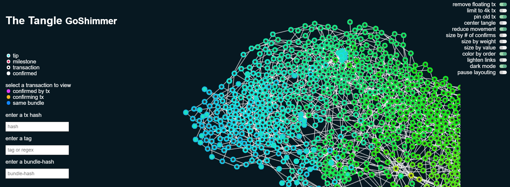

# Run a GoShimmer node

**In this guide, you install and run a node on the GoShimmer network to test the network and keep up to date with regular changes.**

You have the following options for running a node:

- Quickstart
- Native install

## Prerequisites

To run a node, you need the following:

- [Git](https://git-scm.com/downloads)
- [Forward ports](root://general/0.1/how-to-guides/expose-your-local-device.md) 14626(TCP/UDP) and 14666 (TCP) to the device that's running the node
- A public IP address

## Quickstart

In this section, you run a node on your native filesystem, using the pre-built executable file on the GoShimmer GitHub repository. 

1. Go to the [GoShimmer release page](https://github.com/iotaledger/goshimmer/releases)

2. Download the GoShimmer file for your operating system  

3. Use one of the following commands to execute the pre-built `goshimmer` file, depending on your operating system:

    ```bash
    # Linux and macOS
    ./goshimmer --node.enablePlugins "spammer","graph"
    # Windows
    .\goshimmer --node.enablePlugins "spammer","graph"
    ```

    :::info:
    You can run the file with the `-h` or `--help` flag to see a list of all configuration options.
    :::

:::success:Congratulations :tada:
You're now running a GoShimmer node.
:::


The status screen displays the following statistics in the top-right corner:

- **TPS:** The number of transactions per second, which are separated into two categories. The **received** transactions are those that the node has just appended to its ledger. The **new** transactions are solid transactions.
- **Node ID:** The node's public key that gives it a unique identity
- **Neighbors:** The number of neighbors that the node is connected to. All nodes can have a maximum of 8 neighbors. Each node chooses 4 neighbors to connect to and accepts incoming connections from 4 other neighbors that chose it.
- **Known peers:** The total number of nodes in the network. At the moment, the number of **neighborhood** nodes is the same as the number of **total** nodes. When the network allows sharding, the **neighborhood** nodes will be those that are in the node's shard.
- **Uptime:** The total amount of time during which the node has been running

:::info:
If you don't have any accepted neighbors, make sure that you've forwarded your `autopeering` TCP/UDP port (14626) to your device.
:::

## Native install

In this section, you build the GoShimmer executable file from source and run it.

### Prerequisites

To complete this guide, you need the following:

- At least version 1.13 of the Go programming language (we recommend the latest version)
- GCC: For macOS, you can install GCC using [Homebrew](https://brew.sh/) (`brew install gcc`). For Windows, you can [install TDM-GCC](http://tdm-gcc.tdragon.net/download). For Linux (Ubuntu 18.04), you can [install GCC from the `build-essential` package](https://linuxize.com/post/how-to-install-gcc-compiler-on-ubuntu-18-04/).

### Build and run the GoShimmer executable

1. In the command-line interface, check your `GOPATH` environment variable

    ```bash
    go env GOPATH
    ```

    :::info:
    This directory is called `$GOPATH`.
    :::

2. Clone the `goshimmer` repository anywhere outside of `$GOPATH`
    
    ```bash
    git clone https://github.com/iotaledger/goshimmer.git
    ```

3. Change into the `goshimmer` directory and download the submodules

    ```bash
    cd goshimmer
    git submodule init
    git submodule update
    ```

4. Use one of the following commands to build your executable file, depending on your operating system

    ```bash
    # Linux and macOS
    go build -o goshimmer
    # Windows
    go build -o  goshimmer.exe
    ```

    Now, you have a file called `goshimmer` that you need to execute.

5. Open the `config.json` file and replace the `enablePlugins` field with the following to enable the spammer API endpoint and the Tangle visualizer

    ```bash
    "enablePlugins":["spammer", "graph"]
    ```

    :::info:
    You can run the file with the `-h` or `--help` flag to see a list of all configuration options.
    :::

6. Use one of the following commands to execute the `goshimmer` file, depending on your operating system:

    ```bash
    # Linux and macOS
    ./goshimmer
    # Windows
    goshimmer
    ```

    :::info:
    If you see a `permission denied` error, try executing the file as an administrator.
    :::

:::success:Congratulations :tada:
You're now running a GoShimmer node.
:::


The status screen displays the following statistics in the top-right corner:

- **TPS:** The number of transactions per second, which are separated into two categories. The **received** transactions are those that the node has just appended to its ledger. The **new** transactions are solid transactions.
- **Node ID:** The node's public key that gives it a unique identity
- **Neighbors:** The number of neighbors that the node is connected to. All nodes can have a maximum of 8 neighbors. Each node chooses 4 neighbors to connect to and accepts incoming connections from 4 other neighbors that chose it.
- **Known peers:** The total number of nodes in the network. At the moment, the number of **neighborhood** nodes is the same as the number of **total** nodes. When the network allows sharding, the **neighborhood** nodes will be those that are in the node's shard.
- **Uptime:** The total amount of time during which the node has been running

:::info:
If you don't have any accepted neighbors, make sure that you've forwarded your `autopeering` TCP/UDP port (14626) to your device.
:::

## Next steps

Now that your node is running, you can [send it spam transactions](../how-to-guides/send-spam.md) to test how many transactions per second your node can process.

To see the transactions in the GoShimmer network's Tangle, open the visualizer by going to `http://127.0.0.1:8082` in a web browser.



