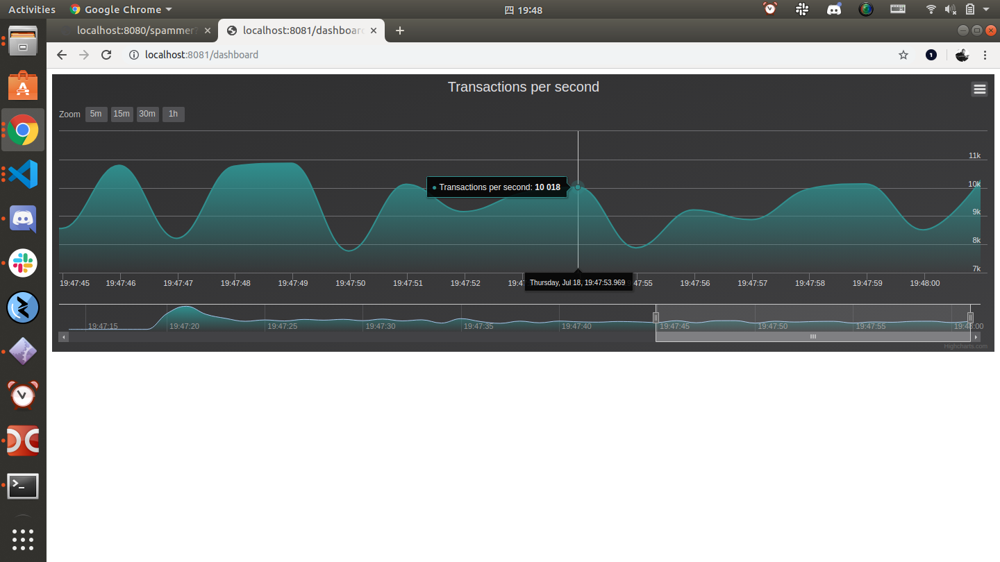

# Send spam transactions to your node

**To test how many transactions per second your node can process, you can use a `spammer` API endpoint to send it spam transactions.**

When you send your node spam transactions, it processes them, adds them to its ledger, and forwards them to its neighbors for processing.

1. Open a web browser and enter the following into the address bar. If you want to access your node through the Internet, replace `localhost` with your IP address.

    `http://localhost:8080/spammer?cmd=start`

    :::info:
    By default, this endpoint sends 1,000 transactions per second (TPS). If you want to change the TPS, you can add the `tps` query parameter. For example, to send 10,000 TPS, send a request to the following endpoint `http://localhost:8080/spammer?cmd=start&tps=10000`
    :::

2. To check that your node is receiving transactions, open the dashboard by going to `http://localhost:8081/dashboard` in a web browser

    
    
    :::info:
    The displayed TPS may be lower than the value of the `tps` parameter you used. The reason for this difference may be due to limits with your computer hardware.
    :::

## Next steps

Now that your node is receiving transactions, you can [monitor it for incoming transaction](../how-to-guides/subscribe-to-events.md) to see the transaction data.