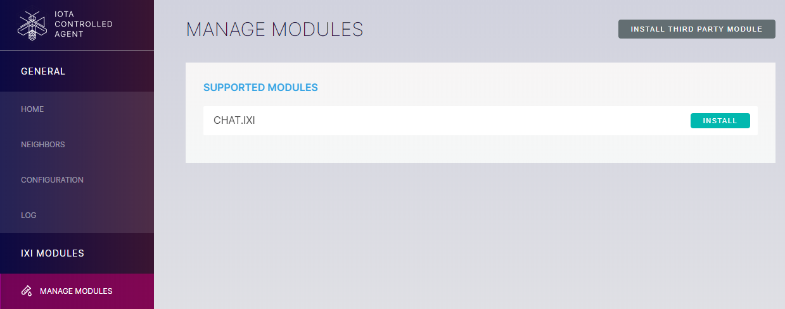

# Install an IXI module

**IXI modules extend the basic functionality of the Ict by streaming data from the gossip protocol into custom applications. You may want to install an IXI modules for a specific purpose, for example if you want to use a module that allows you chat with other nodes on the network.**

## Prerequisites

Find an [IXI module](../references/ixi-modules.md) that you want to install.

---

1. In a web browser such as Google Chrome, enter the address of your Ict website

    :::info:
    If you don't know the address of your Ict website, or you're having trouble connected to it, [find solutions in the troubleshooting guide](../references/troubleshooting.md).
    :::

2. Log in

    

    :::info:
    If you've forgotten your password, [find it in the configuration file](../references/troubleshooting.md).
    :::

3. Go to **MANAGE MODULES**

    In the SUPPORTED MODULES section, you'll see a list of official IXI modules that have been developed by the IOTA Foundation.

4. To install an [official module](../references/ixi-modules.md), click **INSTALL** next to its name

5. To install a [community module](../references/ixi-modules.md), click **INSTALL THIRD PARTY MODULE**, enter the GitHub repository where it's hosted, and click **INSTALL**

    

## Next steps

If you're familiar with the Java programming language, take a look at the IXI GitHub repository and [learn to build your own IXI module](https://github.com/iotaledger/ixi/blob/master/README.md).

If you want to [write an IXI module in a different programming language](https://github.com/iotaledger/bridge.ixi), use the Bridge.ixi module.