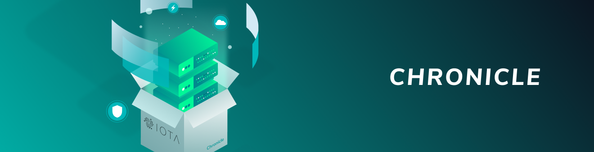

# Node software

**IOTA networks consist of interconnected nodes, which are computers that run the same node software. This software gives nodes read/write access to the Tangle and allows them to validate transactions and store them in their ledgers.**

-------------------------

## [IRI](../iri/introduction/overview.md)
The IRI (IOTA reference implementation) is open-source Java software that runs on the IOTA Mainnet. This software defines the current IOTA protocol, which allows clients to transfer the IOTA token among each other.
-------------------------

-------------------------

## [Chronicle](../chronicle/introduction/overview.md)
Chronicle is an addition to the IRI node software that allows you to store all transactions in a separate distributed database that's secure and scales well.
-------------------------

-------------------------

## [GoShimmer](../goshimmer/introduction/overview.md)
GoShimmer is open-source Go software that implements a prototype of an IOTA network without the Coordinator. This network is still in development, so not all modules exist, but new ones will be added when they are ready.
-------------------------

