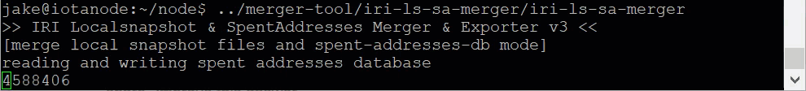

# Upgrade IRI

**When a new version of [IRI is released on GitHub](https://github.com/iotaledger/iri/releases), we recommend that you upgrade your local IRI to the new version. In this guide, you upgrade IRI to the latest version.**

## Upgrade to version 1.9.0

Version 1.9.0 comes with the following changes, which aren't backwards compatible:

- Empty `signatureMessageFragment` fields (all 9s) in transactions are truncated before being stored in the database to save memory

- All snapshot data and spent addresses are stored in a single database

Therefore, after you upgrade, you won't be able to downgrade.

### Node owners who configured IRI without local snapshots

If your node does not do local snapshots, you can upgrade IRI by simply [downloading the latest `.jar` file and running it](../how-to-guides/install-iri.md).

### Node owners who configured IRI to do local snapshots

If your node does local snapshots, you need to do one of the following:

- Merge your snapshot files and spent addresses into a single database

- Delete your snapshot files and spent addresses

#### Merge snapshot data and spent addresses

By merging your snapshot data and spent addresses into a single database, you can keep all your existing data and make it compatible with IRI version 1.9.0.

##### Prerequisites

This guide has been tested on Ubuntu 18.04 and 19.04.

To complete this guide, you need the following:

- Git
- Go version 1.12 or later

---

1. Stop IRI

2. Clone the [RocksDB repository](https://github.com/facebook/rocksdb)

    ```bash
    git clone https://github.com/facebook/rocksdb.git
    ```

3. Check out branch `5.17.fb`

    ```
    cd rocksdb
    git checkout 5.17.fb
    ```

4. Install the dependencies

    ```
    sudo apt-get install libgflags-dev libsnappy-dev zlib1g-dev libbz2-dev libzstd-dev liblz4-dev
    ```

5. Compile the RocksDB shared libraries and install them

    ```bash
    make shared_lib && make install-shared
    ```

This step can take a few minutes.

    When the libraries are installed, you should see the following:

    ```
    GEN      util/build_version.cc
    install -d /usr/local/lib
    for header_dir in `find "include/rocksdb" -type d`; do \
            install -d /usr/local/$header_dir; \
    done
    for header in `find "include/rocksdb" -type f -name *.h`; do \
            install -C -m 644 $header /usr/local/$header; \
    done
    install -C -m 755 librocksdb.so.5.17.4 /usr/local/lib && \
            ln -fs librocksdb.so.5.17.4 /usr/local/lib/librocksdb.so.5.17 && \
            ln -fs librocksdb.so.5.17.4 /usr/local/lib/librocksdb.so.5 && \
            ln -fs librocksdb.so.5.17.4 /usr/local/lib/librocksdb.so
    ```

6. Set your `LD_LIBRARY_PATH` environment variable to the `usr/local/lib` directory

    ```bash
    export LD_LIBRARY_PATH=/usr/local/lib
    ```

7. Clone the `iri-ls-sa-merger` repository into a new directory

    ```bash
    mkdir merger-tool
    cd merger-tool
    git clone https://github.com/iotaledger/iri-ls-sa-merger.git
    ```

8. Set the paths to your RocksDB files

    ```bash
    CGO_CFLAGS="-I/usr/local/include/rocksdb" \
    CGO_LDFLAGS="-L/usr/local/lib -lrocksdb -lstdc++ -lm -lz -lbz2 -lsnappy -llz4 -lzstd"
    ```

9. Compile the merger tool

    ```bash
    cd iri-ls-sa-merger
    go build
    ```

    If you see no output, the tool was compiled.

10. In the directory where you store your current local snapshots, and spent addresses, execute the merger tool

    ```bash
    ./iri-ls-sa-merger
    ```

    This tool can take a few minutes to merge your snapshot data and spent addresses into a single database.

    

    When the tool is finished, you should see something like the following:

    ```
    reading and writing spent addresses database
    persisted 13221363 spent addresses
    writing local snapshot data...
    ms index/hash/timestamp: 1332434/XUCOYISZFFJQYHZHKPPKBMHGDVOZEVFXPXUNLMQGJHLUORNXESE9COYKS9TPUFAZGHXDROMDCR9VA9999/1580794859
    solid entry points: 198
    seen milestones: 101
    ledger entries: 417725
    max supply correct: true
    size: 23267 KBs
    finished, took 4m23.905223678s
    ```

    :::info:
    For more information about how you can use this tool, see [the README file on GitHub](https://github.com/iotaledger/iri-ls-sa-merger#iri-localsnapshot--spentaddresses-merger).
    :::

Now, you have a `localsnapshots-db` directory, which contains all your snapshot data and spent addresses.

#### Delete your snapshot files and spent addresses

If you don't want to keep your exisiting snapshot data, you can simply delete it.

1. Stop IRI

2. Delete your snapshot data and spent addresses

    ```bash
    sudo rm mainnet.snapshot*
    sudo rm -r mainnetdb mainnet.log spent-addresses-db spent-addresses.log
    ```

3. Download the latest snapshot data from the IOTA Foundation's server

    ```bash
    sudo wget https://dbfiles.iota.org/mainnet/iri/latest-LS.tar
    ```

4. Extract the directory

    ```bash
    tar -xvf latest-LS.tar
    ```

Now, you have a `localsnapshots-db` directory, which contains all your snapshot data and spent addresses.

## Next steps

Now you can [download and run the latest version of IRI](../how-to-guides/install-iri.md).


