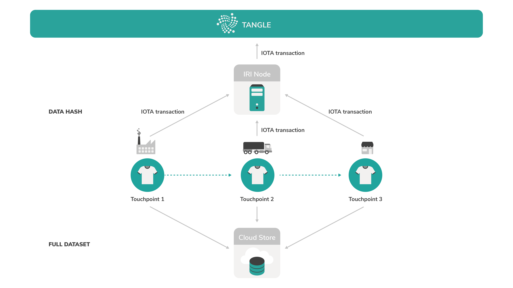
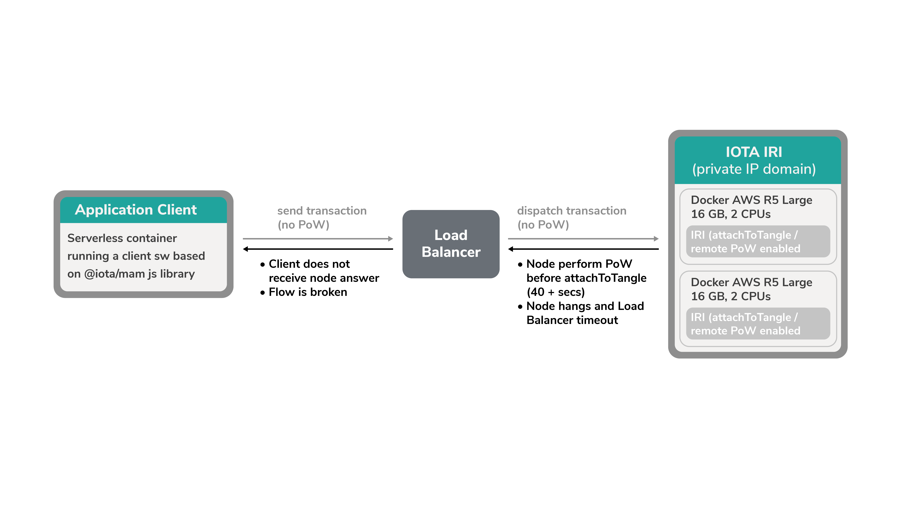
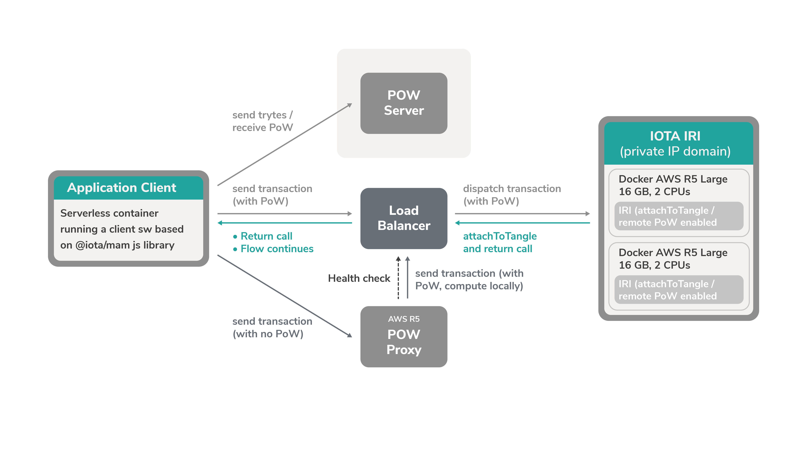

# Best practices for running a node

**When you run a node, you have lots of different options for setting up a reliable architecture. This article gives you some advice that we often give to our partners.**

Often, our partners leverage the Tangle to store and distribute a hash of their data for verification purposes.

At each point along the supply chain, any important data is stored on a cloud server then hashed and attached to the Tangle. With the hash on the Tangle, anyone with access to the cloud can verify the integrity of the cloud data by hashing it and comparing it to the immutable hash on the Tangle.
​
:::info:
[Read our blog post to find out more about how EVRYTHNG uses IOTA](https://blog.iota.org/iota-evrythng-2a9b4b9d922d).
:::

## Nodes

To increase the chances of your application connecting to an available node, it's often best practice to run one or more local nodes.

To host these nodes it's best to make sure that the host device has enough computational power to run reliably. For example, a good benchmark is to run each node on an instance of a virtual private server such as an [Amazon Web Services (AWS) R5 Large server](https://aws.amazon.com/ec2/instance-types/r5/) with 16 GB RAM and two virtual CPUs.

:::info:
Read our guide on [running a node on Linux](../how-to-guides/run-an-iri-node-on-linux.md), or on [running a node in a Docker container](../how-to-guides/run-an-iri-node-in-docker.md).
:::

### Proof of work

When you're setting up your nodes, you have the option to allow them to do [proof of work](root://dev-essentials/0.1/concepts/minimum-weight-magnitude.md). When this feature is enabled, client applications can ask your node to do proof of work by calling the `attachToTangle` API endpoint. This option is called remote proof of work.

Proof of work takes time and uses your node's computational power. So, depending on how often you send transactions to your nodes, you may want to keep this feature disabled by default in the [remote-limit-api](../references/iri-configuration-options.md#remote-limit-api) configuration option.

This way, client applications can use [other options for proof of work](root://dev-essentials/0.1/concepts/minimum-weight-magnitude.md#options-for-doing-proof-of-work) such as doing it themselves (local PoW) or outsourcing it to a PoW proxy server.

:::info:
Read our guide for [setting up a PoW proxy server](../how-to-guides/install-a-pow-proxy.md).

Learn how to [do local PoW in Node.js](https://github.com/iotaledger/ccurl.interface.js).
:::

## Client applications

For a client application that will communicate with your nodes through API endpoints, it's best to use one of the IOTA client libraries on an instance of a serverless architecture such as [AWS Lambda](https://aws.amazon.com/lambda/). This way, your application is not restricted by hardware and has a high availability.

:::info:
[Get started with the IOTA client libraries](root://getting-started/0.1/tutorials/get-started.md).
:::

## Load balancer

When you have a client application and some nodes, it's best practice to make sure that the client's API calls are distributed among all nodes so that no single one is overloaded.

To evenly distribute the API calls among all your nodes, you can run a reverse proxy server that will act as a load balancer.

This way, you can even have one domain name for your reverse proxy server that all nodes will send their API calls to. But, on the backend, the nodes with the most spare computational power will process the request and return the response to the reverse proxy server.

:::info:
Read our guide on [setting up a reverse proxy server](../how-to-guides/set-up-a-reverse-proxy.md) for your node.
:::

## Integrations support

If you want to share your own recommendations, or if you want help integrating IOTA into your own architecture, get in touch with our team at: integrations@iota.org