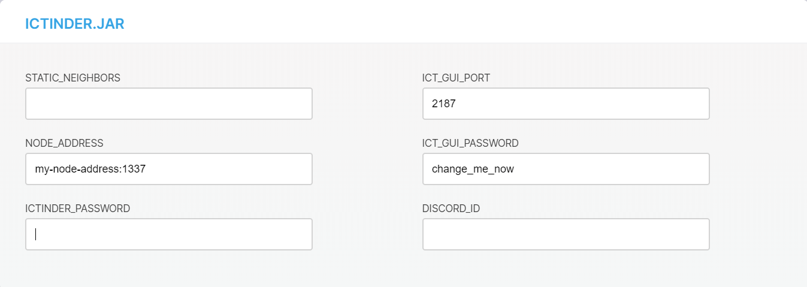

# Find neighbors

**To gossip transactions around the network, nodes must send and receive transactions among other nodes called neighbors. To find neighbors, you can either ask the community on Discord, or use the IcTinder module.**

The Ict allows you to have a maximum of three neighbors.

:::info:
We recommend asking your neighbors to install the [Spam.ixi module](../references/ixi-modules.md) so that they send you some transactions, allowing you to check that they're connected.
:::

## Find neighbors on Discord

The community often discusses Ict-related topics in the `ict-help` and `ict-discussion` channels. Here, you can find users who are also looking for neighbors and connect to them.

1. Go to [Discord](https://discordapp.com/invite/fNGZXvh), and in the`ict-help` channel, say that you're looking for Ict neighbors

    :::warning:Keep your IP address secret
    Don't share your node's IP address or URL in the channel. Wait until someone directly messages you, then you can both exchange details.
    :::

2. If you can't find any neighbors in the channel, enter `!ictnodes` in the channel

    You'll receive a direct message from the automated Neigh-Bot user.

3. In the direct message, enter `!addnode` followed by your node's IP address or URL. For example, `!addnode example.com 1337`

4. Wait until you receive a message with the IP address or URL of a neighbor

## Set up autopeering with the IcTinder module

To find neighbors, use the IcTinder module to register your node for auto-peering. This IXI module adds and removes neighbors by doing the following:

* Publish statistics about your node's current neighbors to the central API
* Receive recommended neighbors with good statistics from the central API
* Download the recommended neighbors from the central API and connect to them.

:::info:
To download the IcTinder module, your node must have version 0.6-SNAPSHOT of the Ict.
:::

1. In [Discord](https://discordapp.com/invite/fNGZXvh), start a private message with the automated Ictinder user

    ```bash
    !ictinder
    ```

2. Register yourself to receive authenticatation credentials and make a note of them

    ```bash
    !register
    ```

3. In a web browser such as Google Chrome, enter the address of your Ict website

    :::info:
    If you don't know your Ict website, or you're having trouble connected to it, [find solutions in the troubleshooting guide](../references/troubleshooting.md).
    :::

4. Log into the Ict website

    

    :::info:
    If you've forgotten your password, [find it in the configuration file](../references/troubleshooting.md).
    :::

5. Go to **MANAGE MODULES** > **INSTALL THIRD PARTY MODULE**

6. Enter `mikrohash/ictinder`, click **INSTALL**, then refresh the page

7. Go to **ICTINDER**

8. Enter your configuration settings:

    * `static_neighbors`: Enter the addresses of static neighbors you don't want the IcTinder module to remove in the following format: `host:port`
    * `ict_gui_port` and `ict_gui_password`: Enter the same values that are in the **CONFIGURATION** tab
    * `node_address`: Enter the public address that neighbors can use to connect to your node in the following format: `host:port`
    * `discord_id` and `ictinder_password`: Enter the authentication credentials that the Ictinder user sent you on Discord

    

9. Click **Save**

:::Success:
The IcTinder module is monitoring your neighbors and will replace them with new ones if they're unreliable.
When the module has chosen neighbors for you, you'll be notified on Discord. To delete a neighbor, you can go log into the [IcTinder website](http://qubiota.com/ictinder2).
:::
