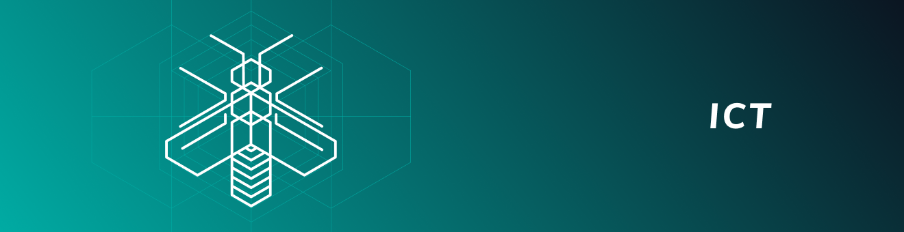

# Node software

**IOTA networks consist of interconnected nodes, which are computers that run the same node software. This software gives nodes read/write access to the Tangle and allows them to validate transactions and store them in their ledgers.**

-------------------------

## [IRI](../iri/0.1/introduction/overview.md)
The IRI (IOTA reference implementation) is open-source Java software that runs on the IOTA Mainnet. This software defines the current IOTA protocol, which allows clients to transfer the IOTA token among each other.
-------------------------

-------------------------

## [Ict](../ict/0.1/introduction/overview.md)
The Ict (IOTA controlled agent) is open-source Java software that defines an **experimental** version of the future IOTA protocol. This version is designed to be more lightweight and modular than the IRI so that even devices on the Internet of Things can run it. This software is being rewritten in the Rust programming language. As a result, the Ict will eventually be replaced by the new Rust version called **Bee**.
-------------------------

-------------------------

## [Coordicide Alphanet](../ict/0.1/introduction/overview.md)
The Coordicide Alphanet is open-source Go software that implements a prototype of an IOTA network without the Coordinator. This network is still in development, so not all modules exist, but new ones will be added when they are ready. When this network is complete, the modules will be added to the Rust version of the Ict (Bee).
-------------------------

