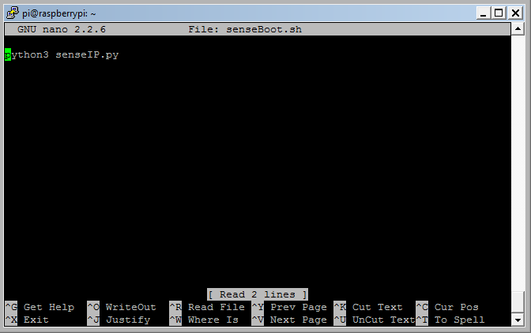

### Headless Operation (optional)

If you plan to run AstroPiOTA without a monitor and keyboard, you need it's network address to interact with it over SSH.  This can be tricky.  One method that works pretty well, is creating a script to retrieve the RasPi IP address at boot and print it on a scrolling marquee across the Sense HAT LEDs.  Configure a cron job so RasPi runs this script at every reboot.

Python 3 comes pre-installed on RasPi.  In your home folder, open a text editor.  

```sudo nano senseIP.py```

Type or copy the following Python script

```
import socket
from sense_hat import SenseHat
sense = SenseHat()

def getIP():
        s = socket.socket(socket.AF_INET, socket.SOCK_DGRAM)
        try:
                s.connect(('192.168.255.255',1))        #lab network used for this example
                IP = s.getsockname()[0]
        except:
                IP = '127.0.0.1'
        finally:
                s.close()
        return IP

senseIP = getIP()
for x in range(3):
        sense.show_message(senseIP, scroll_speed=0.2)
```

Save this file and create a new shell script

``` sudo nano senseBoot.sh```

Add one instruction to run senseIP.py

```python3 senseIP.py```



Save the schell script and schedule a cron job to run when RasPi reboots

```crontab -e```

Add this command at the bottom of this file:  /tmp/crontab.0QNkTW/crontab

```@reboot /home/pi/senseBoot.sh```


Unplug monitor, keyboard, and mouse, then reboot RasPi.  Wait a second or two, then see its IP address scrolling across the Sense HAT LED panel.  In order to shutdown gracefully, use PuTTY to create an SSH connection.  Logon then type ```sudo shutdown now```

