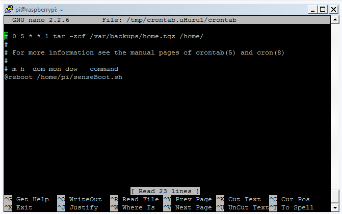

# Connect to the Raspberry Pi through SSH

**If you want to run AstroPiOTA without a monitor and keyboard, you need it's network address to interact with it over SSH. To find the IP address of the Raspberry Pi, you can use a Python script.**

Python 3 comes pre-installed on Raspberry Pi.

1. In your home folder, create a new file called SenseIP.py
         ```bash
        $ sudo nano senseIP.py
        ```

2. Add the following code to the file:

    ```python
        import socket
        from sense_hat import SenseHat
        sense = SenseHat()

        def getIP():
                s = socket.socket(socket.AF_INET, socket.SOCK_DGRAM)
                try:
                        s.connect(('192.168.255.255',1))        #lab network used for this example
                        IP = s.getsockname()[0]
                except:
                        IP = '127.0.0.1'
                finally:
                        s.close()
                return IP

        senseIP = getIP()
        for x in range(3):
                sense.show_message(senseIP, scroll_speed=0.2)
    ```

3. Save the file and create a new shell script

    ```bash
    $ sudo nano senseBoot.sh
    ```

4. Run the senseIP.py script

    ```bash
    $ python3 senseIP.py
    ```

    

5. Save the shell script and schedule a cron job to run it when Raspberry Pi reboots

    ```bash
    $ crontab -e
    ```

6. Add the following command at the bottom of the /tmp/crontab.0QNkTW/crontab file:  

    ```
    @reboot /home/pi/senseBoot.sh
    ```

    

7. Reboot Raspberry Pi to start the cron job. Wait a second or two, then see its IP address scrolling across the Sense HAT LED panel.

8. Open an SSH connection and connect to the IP address of your Raspberry Pi

To shutdown the Raspberry Pi, do the following:

```bash
$ sudo shutdown now
```


