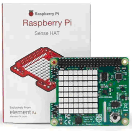
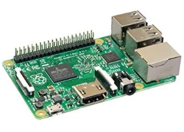
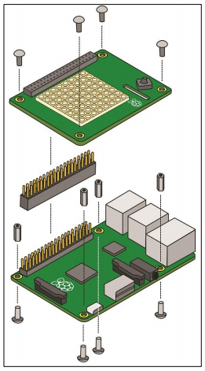

# Build your own AstroPiOTA

**In order to run AstroPiOTA, you must have the correct hardware and operating system for a Raspberry Pi.**

[Sense HAT version 1.0](https://thepihut.com/products/raspberry-pi-sense-hat-astro-pi)

## Prerequisites

Raspberry Pi can be purchased alone or in the [Raspberry Pi 3 Model B Starter Pack](https://www.digikey.com/catalog/en/partgroup/raspberry-pi-3-model-b-starter-pack-includes-a-raspberry-pi-3/70316?utm_adgroup=Kits&slid=&gclid=CjwKCAiAl7PgBRBWEiwAzFhmml25rcO7V-oO0hwQ4RdoVFCj-Sj2AnGcsFBi8ArlMDn74owwLJaywBoCBhUQAvD_BwE). This starter pack includes the SD Memory Card with Raspbian pre-installed plus some additional components for other experiments.

> Raspberry Pi 3 B+ (B plus) has pins that prevent attaching Sense HAT version 1.0. 

There are two ways to interact with Raspberry Pi, directly and over SSH. In order to interact directly, get a USB keyboard and mouse plus an HDMI-ready monitor or TV. Interact over SSH using [PuTTY](https://www.chiark.greenend.org.uk/~sgtatham/putty/latest.html)

You may power Raspberry Pi with a wall plug or a USB battery capable of powering mobile phones.
 
## Operating System

For this example, I purchased the pre-installed card that comes with the Starter Pack. If you are starting from scratch, follow the [Raspberry Pi getting started guide](https://projects.raspberrypi.org/en/projects/raspberry-pi-getting-started/2). W3Schools also has a [getting started guide](https://www.w3schools.com/nodejs/nodejs_raspberrypi.asp). Download the Starter Pack version at: [Raspbian GNU/Linux 8 "Jessie" (2016-11-25-raspbian-jessie.img)](http://downloads.raspberrypi.org/raspbian/images/)

## Connect Components

- [Carefully attach SenseHat to Raspberry Pi](https://docs-emea.rs-online.com/webdocs/1436/0900766b81436bef.pdf)

Permission to use diagram requested from Raspberry Pi

- Connect keyboard and mouse to USB ports on Raspberry Pi
- Connect monitor or TV to HDMI port on Raspberry Pi
- Connect power cord on Raspberry Pi

>When you plug in the power cord, Raspberry Pi will power on

[Run AstroPiOTA](../how-to-guides/run.md)
