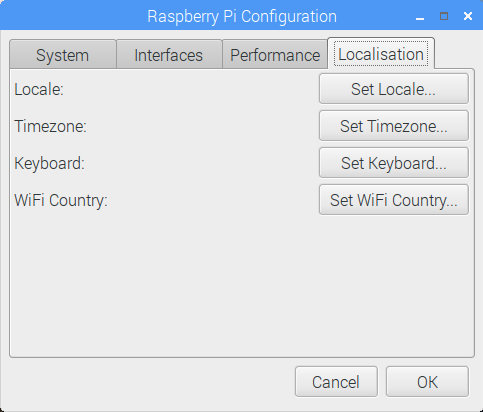
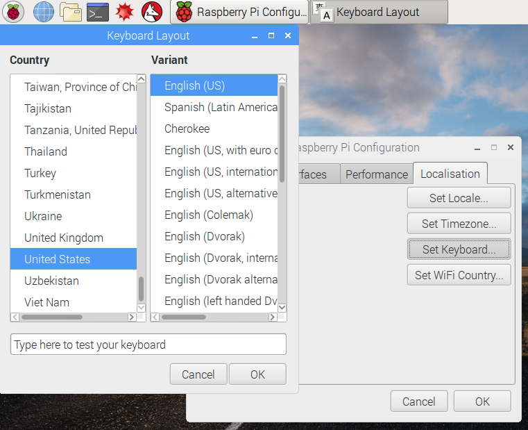
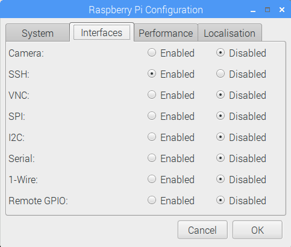
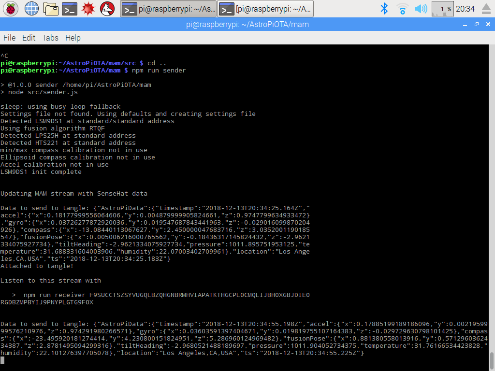
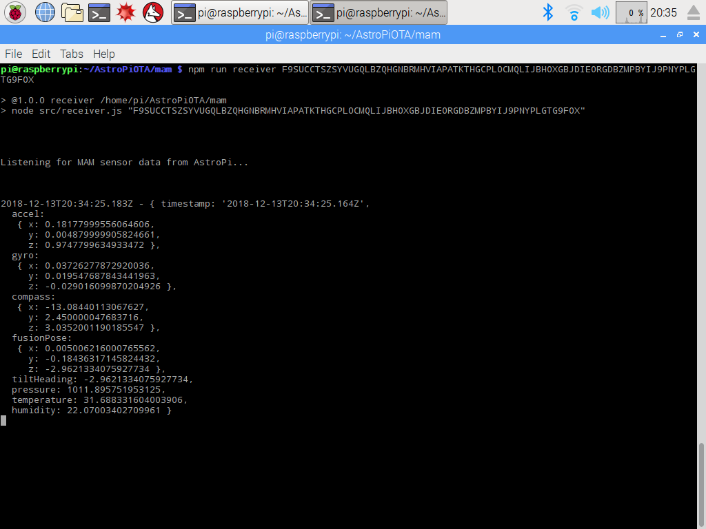

# Run AstroPiOTA

The following instructions assume the operating system is configured. Because this installation has several components, scripts are included to make sure that each component works individually before combining them.  

## Prerequisites

The following prerequisites are pre-installed on Raspbian Jessie:

- Python3
- Pip3.2
- Node.js (8+)
- [AstroPiOTA package](https://github.com/NelsonPython/AstroPiOTA.git)
- [Sense HAT Node.js package](https://www.npmjs.com/package/node-sense-hat)
- [IOTA JavaScript Library](https://github.com/iotaledger/iota.lib.js)


## Configure Raspberry Pi

The easiest way to configure Raspberry Pi is by directly interacting with it. Plug-in monitor, keyboard and mouse.

1. Turn on the Raspberry Pi, which will automatically boot with the default user and password

    ```
    Default username:  pi
    Default password:  raspberry
    ```

2. Connect the Raspberry Pi to WiFi 

3. Set the keyboard mapping to USA English. Otherwise, you will be surprised when installation commands fail because the pipe symbol (|) is mapped to the tilde symbol (~).

4. Click the Raspberry in the menu, and go to **Preferences** > **Raspberry Pi Configuration**  

    

5. Click **Localisation** > **Set Keyboard**, and select **United States -> English (US)**. You can also set your locale, timezone, and WiFi country.  

    

6. Click **Interfaces** and enable SSH so you can connect remotely with PuTTY 

    

## Install Node.js

Raspbian Jessie comes with NodeRed, which must be removed.

1. Remove NodeRed and legacy nodejs modules

    ```bash
    sudo apt-get remove nodered -y
    sudo apt-get remove nodejs nodejs-legacy -y
    ```

2. Reboot the Raspberry Pi

3. Install Node.js 8

    ```bash
    curl -sL https://deb.nodesource.com/setup_8.x | sudo bash -
    sudo apt-get install nodejs -y
    node -v
    npm -v
    ```

## Install the IOTA JavaScript Library

1. Download and install the IOTA JavaScript library

    ```bash
    git clone https://github.com/iotaledger/iota.lib.js
    cd iota.lib.js
    sudo npm install iota.lib.js
    ```

2. Check your installation by retrieving Node information from the IOTA Developer's Tangle.  Open a text file and copy this script:

  ```javascript
  var request = require('request');

  var command = {
      'command': 'getNodeInfo'
  };

  var options = {
    url: 'https://nodes.devnet.iota.org:443',
    method: 'POST',
    headers: {
      'Content-Type': 'application/json',
      'X-IOTA-API-Version': '1',
      'Content-Length': Buffer.byteLength(JSON.stringify(command))
    },
    json: command
  };

  request(options, function (error, response, data) {
    if (!error && response.statusCode == 200) {
      console.log(data);
    }
  });
  ```

3. Save the file in the iota.lib.js folder as `getNode.js` then run it

    ```bash
    node getNode.js
    ```

You should see statistics about the node, including `appName`, `appVersion`, `latestMilestone`, `neighbors`, `tips`, and more

## Install Sense HAT

1. Install Sense Hat in the AstroPiOTA package. Sense HAT requires that Python drivers be installed manually:

    ```bash
    sudo apt-get update
    sudo apt-get install sense-hat
    sudo pip-3.2 install pillow
    ```

**Note:** See the [Driver documentation](https://pythonhosted.org/sense-hat/) for more information

2. To make sure that Sense HAT is working, open python3 and do these commands:

    ```python
    python3
    >>>from sense_hat import SenseHat
    >>>sense = SenseHat()
    >>>sense.show_message("Hello Sense Hat")
    ```

The message "Hello Sense Hat" will scroll across the Sense Hat led panel.

3. Now, install node-sense-hat in your user folder

    ```bash
    sudo npm install --unsafe-perm --verbose node-sense-hat
    ```

For more information see the following resources:

[Sense HAT node library](https://github.com/balena-io-playground/node-sense-hat)

[sense-hat npm](https://www.npmjs.com/package/sense-hat)


## Install AstroPiOTA

Download and install AstroPiOTA

```bash
git clone https://github.com/NelsonPython/AstroPiOTA.git
sudo npm install
```

## Run AstroPiOTA

1. Open a terminal window and execute the sender.js script

    ```bash
    npm run sender
    ```

    You should see a command in the output:

    ```
    npm run receiver ADDRESSXXXXXXXXXXXXXXXXXXXXXXXXXXXXXXXXXXXXXXXXXXXXXXXXXXXXXXXXXXXXXXXXXXXXXXXXXX
    ``` 

2. Copy the output command and paste it into another terminal window to monitor the MAM Stream




