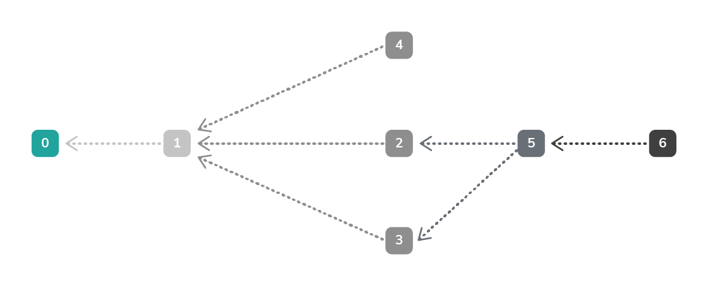

# The Tangle overview

**The Tangle is the data structure that's formed by the connections among transactions in a node's ledger. Nodes use these connections to traverse transactions in the ledger, validate them, and reach a consensus on which ones are confirmed.**

In 2015, Professor Serguei Popov introduced the Tangle in the [IOTA whitepaper](https://iota.org/IOTA_Whitepaper.pdf) as a type of [directed acyclic graph](https://en.wikipedia.org/wiki/Directed_acyclic_graph) (DAG).

The Tangle takes the form of a DAG because each transaction must have a connection to two other transactions. These connections are referenced in a transaction's [`branchTransaction` and `trunkTransaction` fields](root://iota-basics/0.1/references/structure-of-a-transaction.md).

In each of these fields is the transaction hash of either a transaction in the same bundle or a [tip transaction](../concepts/tip-selection.md). It's these hashes that connect transactions together and **attach them to the Tangle**. If a transaction's fields such as the `value` field were to change, the transaction hashes would change and invalid all transactions that have direct or indirect references to them. This way, transactions that are attached to the Tangle are immutable.

:::info:
All transaction hashes are subject to [proof of work](../concepts/proof-of-work.md) to protect the network from spam.
:::

## Transaction hierarchy

The connections among transactions form a family tree, whereby if one transaction is a **child**, its branch and trunk transactions are its **parents**.

In the Tangle, old transactions are drawn on the left and new ones are attached to them from the right.

:::info:
Transaction 0 is the genesis transaction, which is the very first transaction in the Tangle.
:::

In this diagram of the Tangle, transaction 6 has a direct reference to transaction 5, thus transaction 5 is a **parent** of transaction 6.

Transaction 6 has an indirect reference to transaction 3, thus transaction 3 is a **grandparent** of transaction 6.

During tip selection, nodes traverse transactions through their references and validate their bundles. As a result, all children approve their parents and their parents' entire history, which is called a subtangle.

## Consensus and confirmation

Nodes will never update the balances of addresses in a [transfer](root://iota-basics/0.1/concepts/bundles-and-transactions.md) until all transactions in it are confirmed.

Although all individual nodes validate transactions according to a set of rules, confirmation is the result of a consensus among all nodes. When all nodes accept the valid transaction according to a shared critera, that transaction is confirmed.

At the moment, nodes consider a transaction as confirmed when it's approved by a [milestone](../concepts/the-coordinator.md).

## Further Research

The IOTA Foundation has an active research department that focuses on developing the Tangle and its related protocols.

* [Academic Papers](https://www.iota.org/research/academic-papers)
* [Roadmap](https://www.iota.org/research/roadmap)
