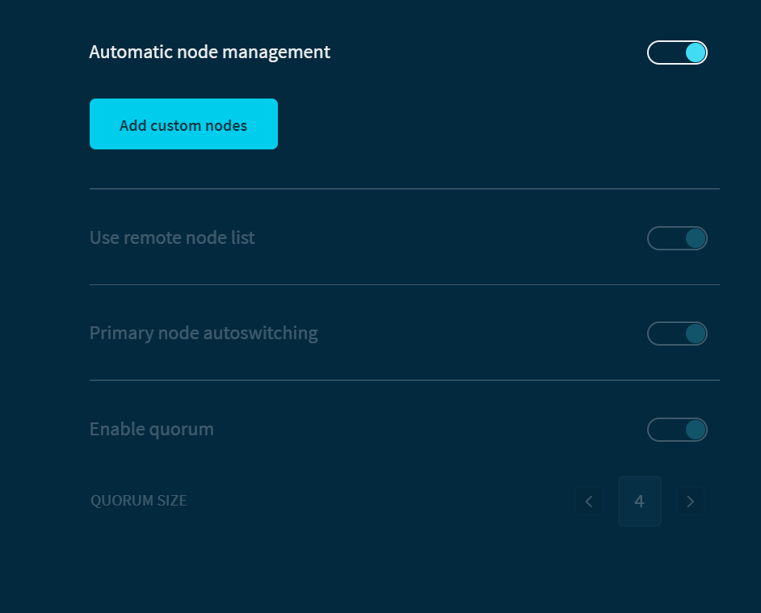

# Connect to custom nodes

**You can connect to one or more custom nodes either instead of the default [node quorum](../concepts/node-quorum.md) or in addition to it. For example, you may want to be able to connect to your own nodes or even connect to nodes on the Devnet.**

:::info:
All nodes in Trinity must use the HTTPS protocol.
:::

## Connect to custom nodes

As well as connecting to a single custom node, you can also add multiple custom nodes and use them as a node quorum. This way, you aren't restricted to using the built-in remote list of nodes that Trinity uses.

1. Go to **Settings** > **Node** > **Add custom nodes**,  and enter the URL or IP address of the nodes you want to add

    :::info:
    To connect to a quorum of custom nodes, add more than one.
    :::

2. Disable the **Automatic node management** option

3. Disable the **Primary node autoswitching** option

    :::warning:
    When enabled, this option switches to a different node from Trinity's list of defaults if the primary one goes offline.

    If your node goes offline, Trinity won't be able to connect to any nodes to update the information it displays.
    :::

4. Select your node from the dropdown menu

    :::warning:Devnet nodes
    If your custom node is a Devnet node, you must also disable the **Use remote list** and **Primary node autoswitching** options. The nodes in that list are Mainnet nodes, so they're incompatible with the Devnet.
    :::

5. Click **Save**

:::success:Congratulations! :tada:
All the information that Trinity displays about the Tangle is now sent from your custom nodes.
:::

