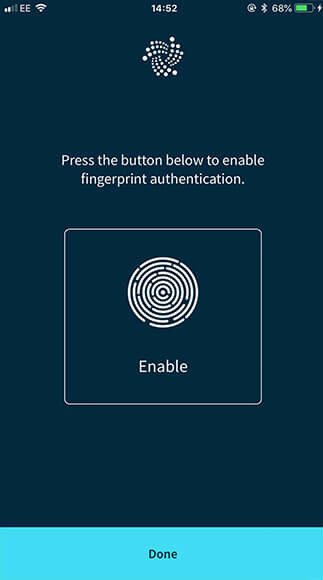

# Set up biometric authentication (mobile devices only)

**Biometric authentication is a security process that allows you to log into Trinity with your fingerprint. When you set up biometric authentication, you'll have the option to log into Trinity using either your fingerprint or your password.**

To access security settings on a mobile device, go to **Settings** > **Security settings**.

1. Click **Biometric authentication**
2. Click **Enable**
3. Click **Done**

