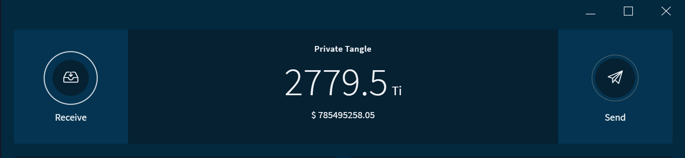

# One-command private Tangle

**This application allows you to set up your own IOTA network by using a single [Docker](https://www.docker.com/why-docker) command. When you run this command, you'll have your own IOTA test network and [2.7Pi](root://dev-essentials/0.1/references/units-of-iota-tokens.md) (the maximum amount) of test IOTA tokens to use. You can use this application to test your ideas and applications without risking any monetary value.**

:::info:Go to GitHub
For quickstart instructions or to read the source code, [go to the GitHub repository](https://github.com/iota-community/one-command-tangle).
:::

:::warning:
This code still in beta development. Do not use this code in production environments.
:::

## Why use this application?

For testing, you may not want to publish test data on one of the public networks. Instead, you can run your own private network with the same total supply of test tokens as those in the [IOTA Mainnet](root://getting-started/0.1/references/iota-networks.md#mainnet). This way, you can create applications that transfer data and value without anyone outside of your network seeing those transactions.

When you're ready to use your application on the Mainnet, you can disconnect it from your private IRI node and connect it to one on the Mainnet.

## How the one-command Tangle works

The test network runs one [IRI node](root://node-software/0.1/iri/introduction/overview.md) and an instance of [Compass](root://compass/0.1/introduction/overview.md) on your localhost (not connected to the Internet).

The IRI node receives transactions, validates them, and keeps an up-to-date record of users' balances.

At regular intervals, Compass sends the IRI node zero-value transactions called [milestones](root://dev-essentials/0.1/concepts/the-tangle.md#milestones) that reference other transactions. Any transaction that's referenced by a milestone is considered confirmed. At this point, the node updates any balances that were affected by the confirmed transaction.

The total supply of tokens are stored on the first address of this seed: `SEED99999999999999999999999999999999999999999999999999999999999999999999999999999`.

:::warning:Do not expose your private Tangle to the Internet
The purpose of this application is to allow you to quickly set up a test IOTA network. To do so, this application uses a pre-calculated Merkle tree. As a result, you should use this application only for testing.
:::

## Prerequisites

To use this application, you need the following:

* At least 4GB of free RAM
* [Docker and Docker Compose](https://docs.docker.com/compose/install/)
* [Git](https://git-scm.com/downloads)

## Step 1. Run the application

1. Clone this repository

    ```bash
    git clone https://github.com/iota-community/one-command-tangle.git
    ```
 
2. In the `one-command-tangle` directory, execute the `docker-compose up` command

    :::info:
    If you're using a Debian-based operating system, you may need to add `sudo` before this command.
    :::

 In the console, you should see that the IRI node is running and receiving milestones from Compass.
 
 

 :::info:
 Compass uses a pre-built [Merkle tree](root://dev-essentials/0.1/concepts/the-tangle.md#milestones) (in the `layers` directory) with a depth of 20. This Merkle tree is large enough for Compass to send milestones for over a year at 30-second intervals.
 :::

### Host an optional utilities website for your private Tangle

The [utils.iota.org website](https://utils.iota.org/) has utilities that make it easier to use an IOTA network. For example, you can use the website to interact with an IOTA network, compress transaction trytes, and convert the value of IOTA tokens into different currencies.

You can host your own utilites website that makes it easier to use your private Tangle.

#### Prerequisites

If you want to use all the functionalities of the utilities website, you need the following configuration credentials:

* For the [Tangle explorer](https://utils.iota.org/), you need [Amazon DynamoDB credentials](https://aws.amazon.com/dynamodb/)

* For the [currency converter](https://utils.iota.org/currency-conversion), you need a [Fixer API key](https://rapidapi.com/fixer/api/fixer-currency) and a [CoinMarketCap API key](https://coinmarketcap.com/api/)

* For the [IOTA area codes map](https://utils.iota.org/area-codes), you need a [Google Maps API key](https://developers.google.com/maps/documentation/javascript/get-api-key)

---

1. Add any configuration credentials to the files in the `/config/tools/` directory. The Amazon Dynamo DB credentials, the Fixer API key, and the CoinMarketCap API key are set in the `/config/tools/tools-api-config.json` file. The Google Maps API key is set in the `/config/tools/tools-config.json` file.

2. Execute the `docker-compose up` command with your configuration credentials

    ```bash
    docker-compose -f docker-compose.yml -f docker-compose-tools.yml up
    ```

3. In a web browser, go to `http://localhost:4001` to open your Tangle utilities website.
 
## Step 2. Interact with the network

When the application is running, you can interact with the network through the IRI node's API port at the following address `http://localhost:14265`.

See a list of [API endpoints](root://node-software/0.1/iri/references/api-reference.md).

--------------------
### GetBalances
Using the [JavaScript client library](root://client-libraries/0.1/introduction/overview.md) with Node.js, you can call the [`getBalances`](root://node-software/0.1/iri/references/api-reference.md#getbalances) endpoint to get the total balance of the seed.

If you've never used the IOTA client libraries before, we recommend completing [the getting started tutorial](root://getting-started/0.1/tutorials/send-a-zero-value-transaction-with-nodejs.md).

 ```js
 var request = require('request');

 const iota = require('@iota/core');

 Iota = iota.composeAPI({
     provider: 'http://localhost:14265'
 });

 var address = iota.generateAddress('SEED99999999999999999999999999999999999999999999999999999999999999999999999999999',0);

 getBalance(address);

 function getBalance(address) {

     var command = {
     'command': 'getBalances',
     'addresses': [
     address
     ],
     'threshold':100
     }

     var options = {
     url: 'http://localhost:14265',
     method: 'POST',
     headers: {
     'Content-Type': 'application/json',
     'X-IOTA-API-Version': '1',
     'Content-Length': Buffer.byteLength(JSON.stringify(command))
     },
     json: command
     };

     request(options, function (error, response, data) {
         if (!error && response.statusCode == 200) {
         console.log(JSON.stringify(data,null,1));
         }
     });
 }
 ```
---
### Response
```json
{
 "balances": [
  "2779530283277761"
 ],
 "references": [
  "BDZPAONKWQTVCXFFO9GBTJ9GGWPRLITXZ9BMYALTCVWNOLFYPNHFJHPDWICRPGCZWUNDQHV9UDEXGW999"
 ],
 "milestoneIndex": 7,
 "duration": 1
}
```
--------------------

## Step 3. Connect to your private Tangle through a wallet

If you want to send and receive transactions through a user interface, you can connect to your private Tangle through one of the IOTA wallets.

We have two wallets that you can use:

* **Light wallet:** You can connect to your private Tangle without exposing your IRI node to the Internet
* **Trinity:** You must expose your IRI node to the Internet through an HTTPS connection

### Connect to the light wallet

The [IOTA Light Wallet](https://github.com/iotaledger/wallet/releases) is a basic user interface that allows you to connect to your IRI node at `http://localhost:14265`.

1. Log into the wallet with your seed: `SEED99999999999999999999999999999999999999999999999999999999999999999999999999999`

2. To connect to your node, go to **Tools** > **Edit Node Configuration**, and enter the URL of your node (`http://localhost:14265`)

    

3. Go to **RECEIVE** > **ATTACH TO TANGLE** to see your full balance

    

### Connect to Trinity

[Trinity](root://wallets/0.1/trinity/introduction/overview.md) is the official IOTA  wallet for macOS, Windows, Linux, iOS, and Android. This wallet allows you to connect only to nodes that support the HTTPS protocol.

To connect to Trinity, you can configure the one-command Tangle's Docker container to start a secure Caddy proxy server that uses Let's Encrypt SSL certificates.

:::warning:
This application uses a pre-computed Merkle tree with a seed that's in the `docker-compose.yml` file. As a result, if anyone has the URL of your node, they can use the Compass seed to take over your private Tangle.
:::

#### Prerequisites

You need the following:

* A domain name whose [A-record](https://support.dnsimple.com/articles/a-record/) points to your public IP address

* A device that's running the one-command Tangle, which is exposed to the Internet on ports 80 and 443 (you may need to forward ports)

---

1. In the `/config/tools/ssl/Caddyfile` file, change the `your-domain.com` and `your@email.com` placeholders to your chosen domain name and email address

2. Execute the `docker-compose up` command with your Caddy configuration options

    ```bash
    docker-compose -f docker-compose.yml -f docker-compose-ssl.yml up
    ```

3. In a web browser, go to the URL of your IRI node. For example, if your domain name is `privatetangle.com`, go to `https://privatetangle.com`

    The web browser will display the following, which means that your IRI node is exposed to the Internet on port 443:

    ```
    {
    "error": "Invalid API Version",
    "duration": 0
    }
    ```

    Now, you can connect to the IRI node.

4. In Trinity, [create an account](root://wallets/0.1/trinity/how-to-guides/create-an-account.md) with your seed

    ```
    SEED99999999999999999999999999999999999999999999999999999999999999999999999999999
    ```

5. Go to **Settings** > **Node** > **Add custom nodes**,  and enter the URL of your IRI node

6. Disable the **Automatic node management** option, the **Primary node autoswitching** option, and the **Use remote list** option 

7. Select your node from the dropdown menu

8. Click **Save**

:::success:Congratulations! :tada:
All the information that Trinity displays about the Tangle is now sent from the IRI node in your private Tangle.
:::



:::info:
If you want to keep your private Tangle offline, but keep the HTTPS support, [follow the Caddy instructions for using your own certificate and key](https://caddyserver.com/docs/tls). Then, add the volumes for the certificate and key files to the `docker-compose-ssl.yml` file under `volumes` in the `proxy` object.

If you do this, you will not be able to access your private Tangle in Trinity.
:::

## Restart the network

If you want to restart the network, press **Ctrl + C**. Then, in the `.env` file, remove the `-bootstrap` flag from the `EXTRA_COMPASS_FLAGS` variable before running the command again.

## Next steps

Use one of our other tools and utilities with your new network.

Try out the [MAM watcher](../mam-watcher/overview.md) to send encrypted messages through your network.

:::info:
Make sure to change the node URL `https://nodes.devnet.thetangle.org:443` to the URL of your node in both the `sender.js` file and the `fetcher.js` file.
:::
