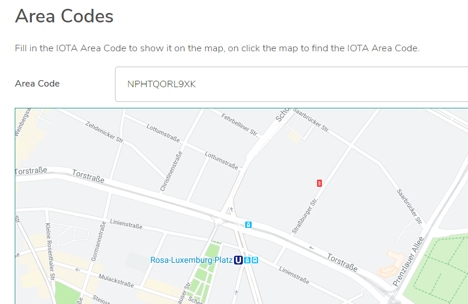

# IOTA area codes overview

**IOTA area codes (IAC) are a proposed standard for tagging IOTA transactions with a geo-location, which allows you to be filter them by location.**

Transactions on the Tangle can sometimes contain information that's specific to a certain area such as service advertisements or sensor information.

By using IACs, you can tag a transaction with an area and allow someone else to find it by querying for transactions with a similar IAC.

## About IACs

IACs are a clone of [Open Location Codes](https://en.wikipedia.org/wiki/Open_Location_Code) (OLC), which includes some minor changes to make them compatible with [tryte encoding](root://dev-essentials/0.1/concepts/trinary.md):

* The numbers and letters that make up a code are called _trytes_, which include the following: `FGHJKLMNOPQRSTUVXWYZ`
* The separator that comes after the eighth tryte in an IAC is a `9` instead of a `+`
* The `A` tryte is used for padding IACs instead of a `0`

## Reading IACs

IACs are a way of encoding locations into a form that is shorter and easier to use than coordinates in the usual form of latitude and longitude.

For example, the latitude and longitude coordinates of the address of the IOTA Foundation are 52.529510, 13.413018. The IAC for these coordinates is : `NPHTQORL9XK`.

Because an IAC consists of trytes, you can easily add them to the `tag` field of a transaction to tag it with a location.

An IAC consists of three parts (excluding the `9` separator):

- The first four trytes are the area code, describing a region of roughly 100 km x 100 km. For example, `NPHT` represents an area that includes Berlin and parts of Potsdam
- The next six trytes are the local code, describing an area as small as 14 m x 14 m
- The final two trytes are for extra precision

| **IAC length (trytes)**   | **Approximate area**|
|:--------------|:---------------------|
|2       |2200 km |
|4      | 110 km |
|6          | 5.5 km     |
|8            | 275 m        |
|10  | 14 m              |
|11    |3.5 m |
|12 |Less than 3 m|

:::info:
For more information about IACs, [read our blog post](https://blog.iota.org/iota-area-codes-a-proposal-to-geo-tag-iota-transactions-d3c457d1df1b).
:::

## Tag a transaction with a geo-location

You can use the IAC API to encode your own IAC from a latitude and longitude, then add it to the `tag` field of a transaction.

In this example, we use the IOTA JavaScript library to create a zero-value transaction that's tagged with an IAC. Then, we send it to the Devnet, and use a Tangle explorer to check that the transaction is attached to the Tangle.

### Prerequisites

To complete this tutorial, you need the following:

* Node.js 8, or Node.js 10 or higher. We recommend the [latest LTS](https://nodejs.org/en/download/).
* A code editor such as [Visual Studio Code](https://code.visualstudio.com/Download)
* Access to a command prompt

* The [`@iota/core`](root://getting-started/0.1/tutorials/get-started.md) and [`@iota/area-codes`](https://github.com/iotaledger/iota-area-codes) packages

:::info:
If you've never used the IOTA client libraries before, we recommend completing [the getting started tutorial](root://getting-started/0.1/tutorials/send-a-zero-value-transaction-with-nodejs.md)
:::

### Step 1. Find some coordinates

To encode a geo-location into an IAC, you need some latitude and longitude coordinates. In this example, we use Google Maps to find the coordinates.

1. [Open Google Maps](https://www.google.co.uk/maps) and search for an address

2. Right click near the location pin and click **What's here?**

3. Copy the coordinates

    

    Here, we searched for the address of the IOTA Foundation

### Step 2. Tag a transaction with the coordinates

To tag a transaction with some coordinates, you need to encode them as an IAC.

In this example, we use the [IAC API](https://github.com/iotaledger/iota-area-codes/blob/master/docs/api.md) to create an IAC from coordinates, then we add the IAC to the `tag` field of a transaction and send it to the [Devnet](root://getting-started/0.1/references/iota-networks.md#devnet). The Devnet is similar to the Mainnet, except the tokens are free. Any transactions that you send to the Devnet do not exist on other networks such as the Mainnet.

1. Create a new file called `index.js` in your working directory, then require the IOTA client libraries

    ```js
    const Iota = require('@iota/core');
    const iotaAreaCodes = require('@iota/area-codes');
    ```

2. Create an instance of the IOTA object and use the `provider` field to connect to a Devnet node

    ```js
    const iota = Iota.composeAPI({
    provider: 'https://nodes.devnet.iota.org:443'
    });
    ```

3. Create a variable to store your seed

    ```js
    const seed =
    'PUEOTSEITFEVEWCWBTSIZM9NKRGJEIMXTULBACGFRQK9IMGICLBKW9TTEVSDQMGWKBXPVCBMMCXWMNPDX';
    ```

    :::info:
    This seed doesn't have to contain any addresses with IOTA tokens. If you enter a seed that consists of less than 81 characters, the library will append 9s to the end of it to make 81 characters.
    :::

4. Encode the coordinates into an IAC

    ```js
    var iac = iotaAreaCodes.encode(52.529510, 13.413018, iotaAreaCodes.CodePrecision.EXTRA);
    ```

    :::info:
    Here, we use [extra precision](https://github.com/iotaledger/iota-area-codes/blob/master/docs/api.md#CodePrecision) to define a smaller area.
    :::

5. Add the IAC to the `tag` field of a zero-value transaction and send it in a bundle

    ```js
    const transfers = [
    {
    value: 0,
    address: "HELLOWORLDHELLOWORLDHELLOWORLDHELLOWORLDHELLOWORLDHELLOWORLDHELLOWORLDHELLOWORLDD",
    tag: iac
    }
    ];

    iota.prepareTransfers(seed, transfers)
    .then(trytes => {
    return iota.sendTrytes(trytes, 3/*depth*/, 9/*MWM*/)
    })
    .then(bundle => {
    console.log("Bundle sent with the tagged transaction");
    })
    .catch(err => {
    // Catch any errors
    console.log(err);
    });
  ```

6. Find any transactions that are tagged with the same IAC and decode it back into coordinates

    ```js
    var locations =[];

    iota.findTransactions({tags:[iac]})
        .then(trytes => {
    iota.getTransactionObjects(trytes)
        .then(
            array => {
                for(i=0;i<array.length;i++){
                    let areaCode = iotaAreaCodes.extract(array[i].tag);
                    let data = iotaAreaCodes.decode(areaCode);
                    locations.push({"lat": data.latitude, "lng":data.longitude});
                }
                    console.log(`${locations[i]} transactions found with the ${iac} tag`)
            }
        )
    })
    .catch(err => {
    // Catch any errors
    console.log(err);
    });
    ```

:::success:Congratulations :tada:
You've just used the IAC API to tag a transaction with a geo-location, and find any transactions with the same tag.
:::

### Run the code

Click the green button to run the sample code in this guide and see the results in the web browser.

<iframe height="600px" width="100%" src="https://repl.it/@jake91/IOTA-area-codes?lite=true" scrolling="no" frameborder="no" allowtransparency="true" allowfullscreen="true" sandbox="allow-forms allow-pointer-lock allow-popups allow-same-origin allow-scripts allow-modals"></iframe>

You can also run the sample code on your own device by using the following command

```bash
node index.js
```

You should see something like the following:

```
IOTA Area Code NPHTQORL9XKF
index.js:15
Object {lat: 52.52951250000001, lng: 13.413015624999982}
index.js:51
Object {lat: 52.52951250000001, lng: 13.413015624999982}
index.js:51
Object {lat: 52.52951250000001, lng: 13.413015624999982}
index.js:51
Object {lat: 52.52951250000001, lng: 13.413015624999982}
index.js:51
Object {lat: 52.52951250000001, lng: 13.413015624999982}
index.js:51
Object {lat: 52.52951250000001, lng: 13.413015624999982}
index.js:51
Object {lat: 52.52951250000001, lng: 13.413015624999982}
Bundle sent with tagged transaction
```

## Next steps

Use the [IAC finder utility](https://utils.iota.org/area-codes) to find the location of a new IAC.



:::info:
The [Devnet Tangle explorer](https://devnet.thetangle.org/) also uses the IAC API to decode IACs for you.
Just search for your transaction and scroll down.
:::

Try removing trytes from the right of an IAC to expand the area.

