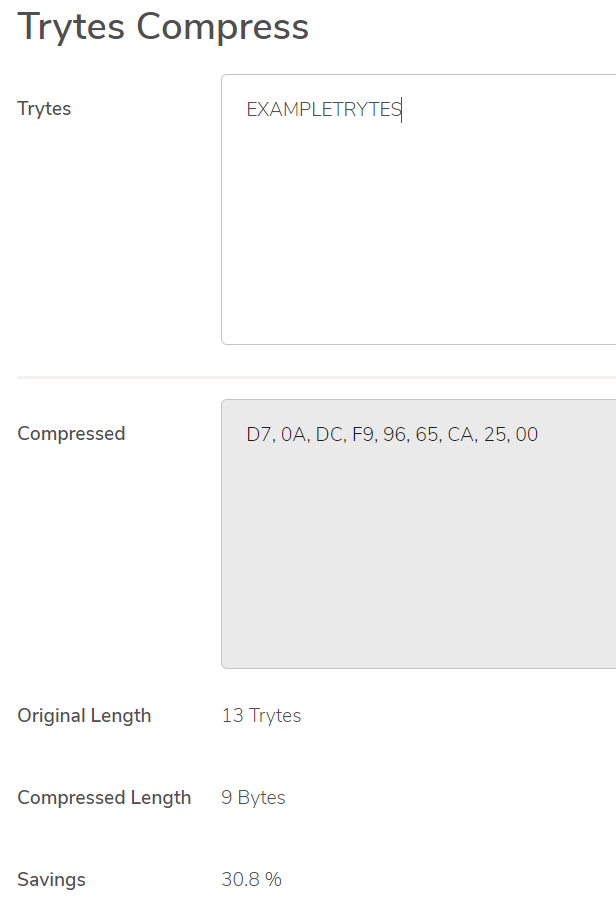

# Trytes compressor overview

**When you send a bundle of transactions to a node, sometimes those transactions don't reach the rest of the network, so they will never be confirmed. For example, a node may go offline before it can forward your transactions to its neighbors. As a result, we recommend that you store the transaction trytes so that you can later rebroadcast or reattach them. To store transaction trytes in a smaller memory space, use the trytes compressor tool to compress the trytes into bytes.**

The algorithm that compresses the trytes uses a combination of run-length encoding and huffman encoding based on a static huffman tree to reduce the amount of memory space that they occupy by up to 75%.

This algorithm is also lightweight enough to be used by embedded devices.

## Compress and store a zero-value transaction

In this example, we create and send a transaction on the [Devnet](root://getting-started/0.1/references/iota-networks.md#devnet). The Devnet is similar to the Mainnet, except the tokens are free. Any transactions that you send to the Devnet do not exist on other networks such as the Mainnet.

Then, we use the [trytes compressor API](https://github.com/iotaledger/tryte-compress-js/blob/master/docs/api.md) to compress the transaction trytes and store them in a binary file on the local device.

### Prerequisites

To complete this tutorial, you need the following:

* Node.js 8, or Node.js 10 or higher. We recommend the [latest LTS](https://nodejs.org/en/download/).
* A code editor such as [Visual Studio Code](https://code.visualstudio.com/Download)
* Access to a command prompt
* An Internet connection
* The [`@iota/core`](root://getting-started/0.1/tutorials/get-started.md), [`@iota/converter`](https://github.com/iotaledger/iota.js/tree/next/packages/converter), and [`@iota/tryte-compress`](https://github.com/iotaledger/tryte-compress-js) packages

:::info:
If you've never used the IOTA client libraries before, we recommend completing [the getting started tutorial](root://getting-started/0.1/tutorials/send-a-zero-value-transaction-with-nodejs.md)
:::

### Step 1. Set up the sample

1. Create a new file called `index.js` in your working directory, then require the libraries

    ```js
    const Iota = require('@iota/core');
    const Compressor = require('@iota/tryte-compress');
    const Converter = require('@iota/converter');
    const fs = require('fs');
    ```

2. Create an instance of the IOTA object and use the `provider` field to connect to a Devnet node

    ```js
    const iota = Iota.composeAPI({
    provider: 'https://nodes.devnet.iota.org:443'
    });
    ```

3. Create variables to store your seed and an address to use in the transaction

    ```js
    const seed =
    'PUEOTSEITFEVEWCWBTSIZM9NKRGJEIMXTULBACGFRQK9IMGICLBKW9TTEVSDQMGWKBXPVCBMMCXWMNPDX';

    const address = 'HELLOWORLDHELLOWORLDHELLOWORLDHELLOWORLDHELLOWORLDHELLOWORLDHELLOWORLDHELLOWORLDD';
    ```

    :::info:
    This seed doesn't have to contain any addresses with IOTA tokens.
    
    If you enter a seed that consists of less than 81 characters, the library will append 9s to the end of it to make 81 characters.
    :::

4. Create a transfers object that specifies the amount of IOTA tokens you want to send, the message that you want to send, and the address to send it to

    ```js
    const message = Converter.asciiToTrytes('Hello World!');
    const transfers = [
    {
        value: 0,
        address: address,
        message: message
    }
    ];
    ```

5. Create a bundle from the `transfers` object, store the returned trytes in a global variable, then send them to the node

    ```js

    let bundleTrytes;

    iota.prepareTransfers(seed, transfers)
    .then(trytes => {
        // Store the trytes in a global variable
        bundleTrytes = trytes[0];
        return iota.sendTrytes(trytes, 3/*depth*/, 9/*MWM*/)
    })
    .then(bundle => {
        // Store the tail transaction hash and the transaction trytes
        storeTailTransaction(bundle[0].hash, bundleTrytes);
    })
    .catch(error => {
        // Catch any errors
        console.log(error);
    });
    ```

6. Create the `storeTailTransaction` function that compresses the trytes and saves them to a binary file

    ```js
    function storeTailTransaction (transactionHash, bundleTrytes) {

    let compressed = Compressor.compressTrytes(bundleTrytes);

    let wstream = fs.createWriteStream(transactionHash);

    wstream.on('finish', function () {
        console.log(`Compressed tail transaction trytes were saved to: ${transactionHash}`);
      });

    wstream.write(compressed);

    wstream.end();

    }
    ```

    :::info:
    Here, we use the transaction hash to name the file.
    :::


:::success:Congratulations :tada:
Whenever you send a transaction, you are now compressing the transaction trytes and storing them on your local device.
:::

### Step 2. Run the code

You can run the sample code by using the following command

```bash
node index.js
```

You should see something like the following:

```
Compressed tail transaction trytes were saved to: MZGKBEXTDCVNBRZYFLFPWWQKWT9OB9ULHKQDHTCMQGITEIXKUDJJU9KVOW9UEIKJAMQAOJU9OITXEV999
```

## Sample code

```js
// Require the libraries
const Iota = require('@iota/core');
const Compressor = require('@iota/tryte-compress');
const Converter = require('@iota/converter');
const fs = require('fs');

// Create a new instance of the IOTA object
// Use the `provider` field to specify which IRI node to connect to
const iota = Iota.composeAPI({
provider: 'https://nodes.devnet.iota.org:443'
});

const address = 'HELLOWORLDHELLOWORLDHELLOWORLDHELLOWORLDHELLOWORLDHELLOWORLDHELLOWORLDHELLOWORLDD';

const seed = 'PUEOTSEITFEVEWCWBTSIZM9NKRGJEIMXTULBACGFRQK9IMGICLBKW9TTEVSDQMGWKBXPVCBMMCXWMNPDX';

const message = Converter.asciiToTrytes('Compress transaction trytes tutorial');

const transfers = [
    {
    value: 0,
    address: address,
    message: message
    }
];

let bundleTrytes;

iota.prepareTransfers(seed, transfers)
  .then(trytes => {
    // Store the trytes in a global variable
    bundleTrytes = trytes[0];
    return iota.sendTrytes(trytes, 3/*depth*/, 9/*MWM*/)
  })
  .then(bundle => {
    // Store the tail transaction hash and the transaction trytes
    storeTailTransaction(bundle[0].hash, bundleTrytes);
    var JSONBundle = JSON.stringify(bundle,null,1);
    console.log(`Sent bundle: ${JSONBundle}`);
  })
  .catch(error => {
    // Catch any errors
    console.log(error);
});


function storeTailTransaction (transactionHash, bundleTrytes) {

    let compressed = Compressor.compressTrytes(bundleTrytes);

    let wstream = fs.createWriteStream(transactionHash);

    wstream.on('finish', function () {
        console.log(`Compressed tail transaction trytes were saved to: ${transactionHash}`);
      });

    wstream.write(compressed);

    wstream.end();
}
```

## Next steps

Use the [trytes compressor utility](https://utils.iota.org/compress) to compress trytes in a user interface and see what memory savings you make.

    

Use the trytes compressor API to decompress the trytes before resending them to a node. For example, you could do the following:

    ```js
    function readCompressedTailTransaction (file){

        let transactionBytes = fs.readFileSync(file);

        let transactionTrytes = Compressor.decompressTrytes(transactionBytes);

        console.log(transactionTrytes);

    }
    ```
