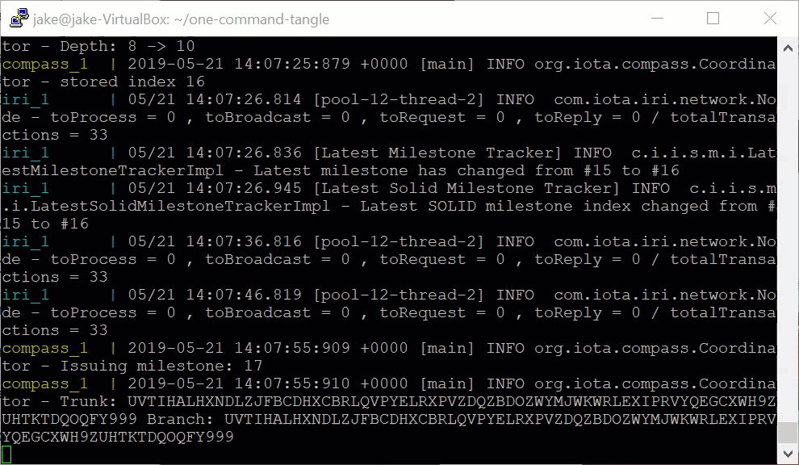
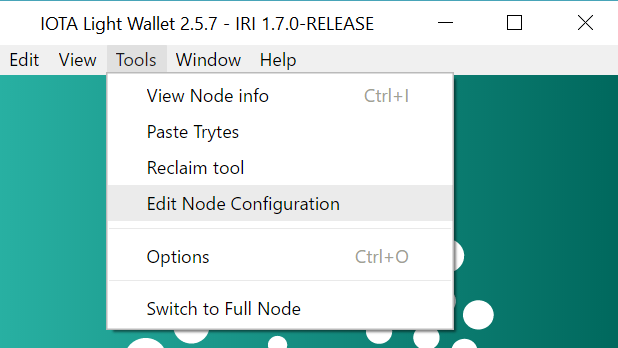
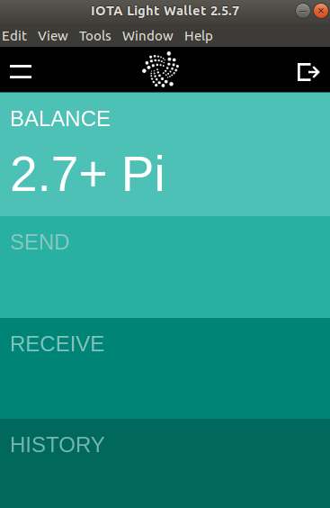

# One-command private test Tangle

**This application allows you to set up your own IOTA network by using a single [Docker](https://www.docker.com/why-docker) command. When you run this command, you'll have your own IOTA test network and [2.7Pi](root://iota-basics/0.1/references/units-of-iota-tokens.md) (the maximum amount) of test IOTA tokens to use. You can use this application to test your ideas and applications without risking any monetary value.**

:::info:Go to GitHub
For quickstart instructions or to read the source code, [go to the GitHub repository](https://github.com/iota-community/one-command-tangle).
:::

:::warning:
This code still in beta development. Do not use this code in production environments.
:::

## Why use this application?

For testing, you may not want to publish test data on one of the public networks. Instead, you can run your own private network with the same total supply of test tokens as those in the [IOTA Mainnet](root://getting-started/0.1/references/iota-networks.md#mainnet). This way, you can create applications that transfer data and value without anyone outside of your network seeing those transactions.

When you're ready to use your application on the Mainnet, you can disconnect it from your private IRI node and connect it to one on the Mainnet.

## How it works

The test network runs one [IRI node](root://iri/0.1/introduction/overview.md) and an instance of [Compass](root://compass/0.1/introduction/overview.md) on your localhost (not connected to the Internet).

The IRI node receives transactions, validates them, and keeps an up-to-date record of users' balances.

At regular intervals, Compass sends the IRI node zero-value transactions called [milestones](root://the-tangle/0.1/concepts/the-coordinator.md#milestones) that reference other transactions. Any transaction that's referenced by a milestone is considered confirmed. At this point, the node updates any balances that were affected by the confirmed transaction.

The total supply of tokens are stored on the first address of this seed: `SEED99999999999999999999999999999999999999999999999999999999999999999999999999999`.

:::warning:Do not expose this network to the Internet
The purpose of this application is to allow you to quickly set up a test IOTA network. To do so, this application uses a pre-calculated Merkle tree. As a result, you should use this application only for testing on your own local network.
:::

## Prerequisites

To use this application, you need the following:

* [Docker and Docker Compose](https://docs.docker.com/compose/install/)
* At least 4GB of free RAM

## Step 1. Run the application

1. Clone this repository

    ```bash
    git clone https://github.com/iota-community/one-command-tangle.git
    ```
 
2. In the `one-command-tangle` directory, execute the `docker-compose up` command

    :::info:
    If you're using a Linux operating system, you may need to add `sudo` before this command.
    :::

 In the console, you should see that the IRI node is running and receiving milestones from Compass.
 
 

 :::info:
 Compass uses a pre-built [Merkle tree](root://the-tangle/0.1/concepts/the-coordinator.md#milestones) (in the `layers` directory) with a depth of 20. This Merkle tree is large enough for Compass to send milestones for over a year at 30-second intervals.
 :::
 
## Step 2. Interact with the network

When the application is running, you can interact with the network through the IRI node's API port at the following address http://localhost:14265.

See a list of [API endpoints](root://iri/0.1/references/api-reference.md).

--------------------
### GetBalances
Using the [JavaScript client library](root://client-libraries/0.1/introduction/overview.md) with Node.js, you can call the [`getBalances`](root://iri/0.1/references/api-reference.md#getbalances) endpoint to get the total balance of the seed.

If you've never used the IOTA client libraries before, we recommend completing [this tutorial](root://getting-started/0.1/tutorials/send-a-zero-value-transaction-with-nodejs.md).

 ```js
 var request = require('request');

 const iota = require('@iota/core');

 Iota = iota.composeAPI({
     provider: 'http://localhost:14265'
 });

 var address = iota.generateAddress('SEED99999999999999999999999999999999999999999999999999999999999999999999999999999',0);

 getBalance(address);

 function getBalance(address) {

     var command = {
     'command': 'getBalances',
     'addresses': [
     address
     ],
     'threshold':100
     }

     var options = {
     url: 'http://localhost:14265',
     method: 'POST',
     headers: {
     'Content-Type': 'application/json',
     'X-IOTA-API-Version': '1',
     'Content-Length': Buffer.byteLength(JSON.stringify(command))
     },
     json: command
     };

     request(options, function (error, response, data) {
         if (!error && response.statusCode == 200) {
         console.log(JSON.stringify(data,null,1));
         }
     });
 }
 ```
---
### Response
```json
{
 "balances": [
  "2779530283277761"
 ],
 "references": [
  "BDZPAONKWQTVCXFFO9GBTJ9GGWPRLITXZ9BMYALTCVWNOLFYPNHFJHPDWICRPGCZWUNDQHV9UDEXGW999"
 ],
 "milestoneIndex": 7,
 "duration": 1
}
```
--------------------

## Step 3. Connect to the network through a wallet

If you want to send and receive transactions on the network through a user interface, you can configure the [IOTA Light Wallet](https://github.com/iotaledger/wallet/releases) to connect to your node at http://localhost:14265 and log in with your seed: `SEED99999999999999999999999999999999999999999999999999999999999999999999999999999`.

1. To connect to your node, go to **Tools** > **Edit Node Configuration**, and enter the URL of your node (http://localhost:14265)

    

2. Go to **RECEIVE** > **ATTACH TO TANGLE** to see your full balance

    

## Restart the network

If you want to restart the network, press **Ctrl + C**, and remove the `-bootstrap` flag from the `docker-compose.yml` file before running the command again.

## Next steps

Use one of our other tools and utilities with your new network.

Try out the [MAM watcher](../mam-watcher/overview.md) to send encrypted messages through your network.

:::info:
Make sure to change the node URL `https://nodes.devnet.thetangle.org:443` to the URL of your node (`http:127.0.0.1:14265`) in both the `sender.js` file and the `fetcher.js` file.
:::
