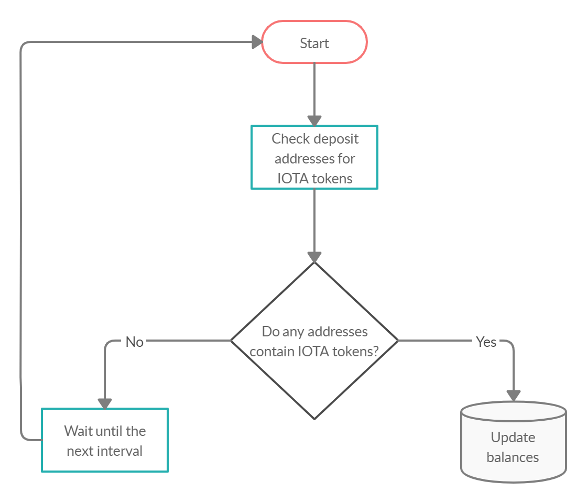
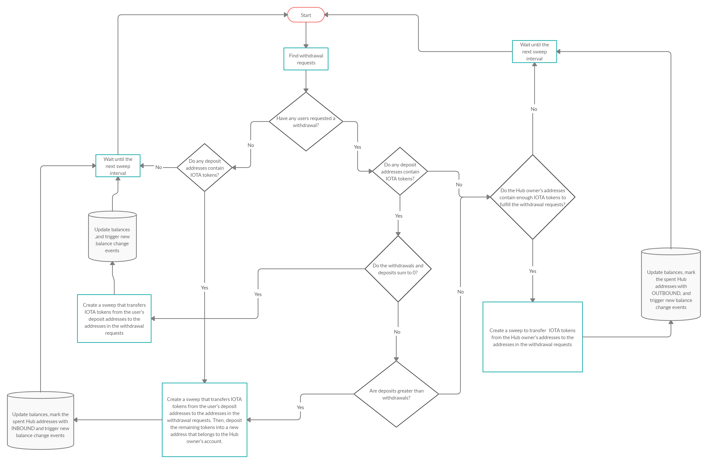
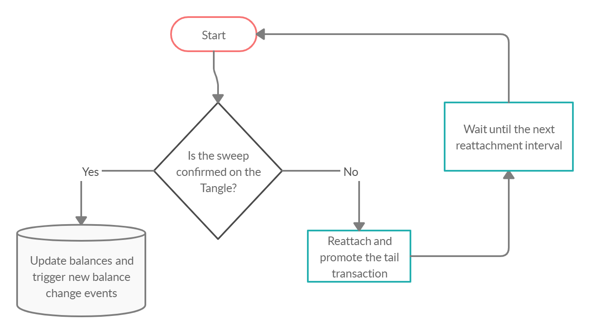

# Sweeps

**A sweep is a [bundle](root://getting-started/0.1/basics/bundles.md) that balances users' withdrawals and deposits. When a user deposits IOTA tokens into an address, Hub tries to use those IOTA tokens to fulfill withdrawal requests.**

## The reason for sweeps

Hub reduces the risk of a user withdrawing from a [spent address](root://getting-started/0.1/basics/addresses.md#spent-addresses) by transferring IOTA tokens from users' deposit addresses to a Hub owner's address at regular intervals.

## How sweeps work

Hub finds all deposit address that have a non-zero balance and that are not included in any pending sweeps.

Then, Hub checks for pending withdrawal requests.

Using this information, Hub creates a sweep that transfers any deposited IOTA tokens to the chosen withdrawal addresses.

If the total amount of IOTA tokens in withdrawal requests is less than the total amount of deposited IOTA tokens, Hub creates an output [transaction](root://getting-started/0.1/basics/transactions.md) to deposit the remaining balance into a new address that belongs to the Hub owner for safe keeping.

If the total amount of deposited IOTA tokens is less than the total amount of withdrawals, Hub creates an input transaction to withdraw enough IOTA tokens from the Hub owner's addresses to fulfill the remaining withdrawal balance.

After Hub sends the sweep to a node, Hub monitors the tail transaction for confirmation and [reattaches and promotes](root://getting-started/0.1/basics/reattach-rebroadcast-promote.md) it until it's confirmed.

