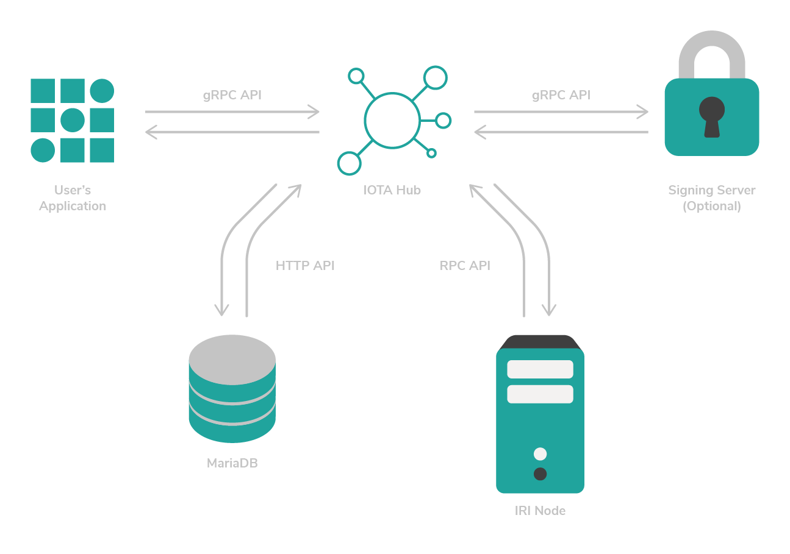

# Install Hub

**By installing Hub, you can create new users, manage their seeds, and issue deposits and withdrawals by using simple API calls.**



## Prerequisites

A Linux [Ubuntu 18.04 LTS](https://www.ubuntu.com/download/server) server. If you are on a Windows or Mac operating system, you can [create a Linux server in a virtual machine](root://general/0.1/how-to-guides/set-up-virtual-machine.md).

## Step 1. Install the dependencies

To compile Hub, you need to install the dependencies.

1. Make sure that your local `apt` repository is up to date

	```bash
	sudo apt update 
	sudo apt upgrade
	```

2. Install a compiler, such as GCC, Clang, or a toolchain from [@iota_toolchains](https://github.com/iotaledger/toolchains)

	```bash
	sudo apt install -y gcc-7
	```

3. Install the dependencies for the Bazel binary installer

	```bash
	sudo apt install -y pkg-config zip g++ zlib1g-dev unzip python
	```

4. Download the binary installer for the [latest version of Bazel](https://github.com/bazelbuild/bazel/releases)

	```bash
	wget https://github.com/bazelbuild/bazel/releases/download/0.29.1/bazel-0.29.1-installer-linux-x86_64.sh
	```
	The download may take some time.
	
	If everything went well, you should see the following in the output:

	```
	HTTP request sent, awaiting response ... 200 OK
	```

5. Give yourself permission to execute the script

	```bash
	chmod +x bazel-0.29.1-installer-linux-x86_64.sh
	```

6. Install Bazel

	```bash
	./bazel-0.29.1-installer-linux-x86_64.sh --user
	```

	The `--user` flag installs Bazel to the `$HOME/bin` directory on your system.

7. Add the `$HOME/bin` directory to your `$PATH` variable

	```BASH
	PATH="$PATH:$HOME/bin"
	```

8. Install the `pyparsing` package for Python

	```bash
	sudo apt install -y python-pyparsing
	```

9. Install Git

	```bash
	sudo apt install -y git
	```

## Step 2. Install the database server

Hub stores data such as user IDs, addresses, and balances in a database.

By default, Hub uses [MariaDB 10.2.1+](https://mariadb.com/) because it supports CHECK constraints. A CHECK constraint restricts the data you can add to the table. If you attempt to insert invalid data in a column, MariaDB throws an error.

The default repositories for Ubuntu 18.04 LTS don't provide a package that can be used for the database. Instead, you can install a custom Personal Package Archive (PPA) for the official MariaDB repository.

1. Request a GNU Privacy Guard (GPG) key to download the PPA

	```bash
	sudo apt-key adv --recv-keys --keyserver hkp://keyserver.ubuntu.com:80 0xF1656F24C74CD1D8
	```

2. Add the MariaDB repository
	
	```bash
	sudo add-apt-repository 'deb [arch=amd64,arm64,ppc64el] http://ftp.utexas.edu/mariadb/repo/10.3/ubuntu bionic main'
	```

3. Make sure that your local `apt` repository is up to date

	```bash
	sudo apt update
	```

4. Install the MariaDB server

	```bash
	sudo apt install mariadb-server
	```

	During the installation, you'll be prompted to enter a root password for MariaDB. Enter a secure password and remember it. You will need it later on.

	

5. Make sure that MySQL is installed

	```bash
	mysql --version
	```

The output should display something like the following:

```shell
mysql  Ver 15.1 Distrib 10.3.10-MariaDB, for debian-linux-gnu (x86_64) using readline 5.2
```
 
Here, you can see that MariaDB 10.3.10 is installed, which is a later version than the minimum of 10.2.1.

## Step 3. Build Hub

After setting up all these dependencies it's time to install Hub.

1. Clone the GitHub repository

	```bash
	git clone https://github.com/iotaledger/hub.git
	```

2. Change into the `hub` directory

	```bash
	cd hub
	```

3. Build Hub from the source code:

	```bash
	bazel build -c opt //hub:hub
	```

This process can take a while, depending on the hardware or virtual machine.

:::success:Success
After the build is complete, the output should display something like the following:

```shell
Target //hub:hub up-to-date:
	bazel-bin/hub/hub
INFO: Elapsed time: 1531.342s, Critical Path: 208.27s
INFO: 1377 processes: 1377 linux-sandbox.
INFO: Build completed successfully, 1811 total actions
```
:::

## Step 4. Create the database

After Hub is installed, you need to create the database tables that store Hub's data.

:::info:
In these commands, make sure to replace the `myrootpassword` placeholder with the root password you chose when you installed MariaDB.
:::

1. Create a database called hub

	```bash
	echo "CREATE DATABASE hub" | mysql -uroot -pmyrootpassword
	```

2. Load the database schema from the Hub source code into the database

	```bash
	mysql -h127.0.0.1 -uroot -pmyrootpassword hub < schema/schema.sql
	```

3. Import the database triggers

	```bash
	mysql -h127.0.0.1 -uroot -pmyrootpassword hub < schema/triggers.mariadb.sql
	```

## Step 5. Run Hub

To run Hub, you need to execute the binary file that was created during the build process. This binary file is located in the `./bazel-bin/hub/hub` directory.

Before you can run the binary file, you need to configure it.

1\. Create a shell script file called `start.sh`

```bash
nano start.sh
```

2\. In the start.sh file, add the command for running hub with the [command line flags](../references/command-line-flags.md) that you want to use

--------------------
### Best practice

We recommend connecting Hub to a local Mainnet node that you control. If you don't have a local Mainnet node, [read about the IRI node software](root://node-software/0.1/iri/introduction/overview.md) for guides on setting one up.

This command connects to a local Mainnet node on port 14265.

Replace the value of the `salt` flag with a string of at least 20 characters. This value is used by Hub to create seeds, so keep it secret.

Replace the value of the `dbPassword` flag with the root password you chose when you installed MariaDB.

```shell
#!/bin/bash
	
./bazel-bin/hub/hub \
	--salt CHANGETHIS \
	--db hub \
	--dbUser root \
	--dbPassword myrootpassword \
	--apiAddress 127.0.0.1:14265 \
	--minWeightMagnitude 14 \
	--listenAddress 127.0.0.1:50051
```
---
### HTTPS Devnet node

For testing purposes, you may want to connect to a remote Devnet node. Most remote nodes use an HTTPS connection, so this command has the the [`--useHttpsIRI` flag](../references/command-line-flags.md#useHttpsIRI) set to `true`.

The Devnet is similar to the Mainnet, except the tokens are free. Any transactions that you send to the Devnet do not exist on other networks such as the Mainnet.

Replace the value of the `salt` flag with a string of at least 20 characters. This value is used by Hub to create seeds, so keep it secret.

Replace the value of the `dbPassword` flag with the root password you chose when you installed MariaDB.

```shell
#!/bin/bash
	
./bazel-bin/hub/hub \
	--salt CHANGETHIS \
	--db hub \
	--dbUser root \
	--dbPassword myrootpassword \
	--apiAddress nodes.devnet.iota.org:443 \
	--minWeightMagnitude 9 \
	--listenAddress 127.0.0.1:50051 \
	--useHttpsIRI true
```
--------------------

:::warning:Warning
To secure the salt, we recommend [installing a signing server](../how-to-guides/install-the-signing-server.md).
:::

:::info:
To view the available [command line flags](../references/command-line-flags.md) in Hub, you can also do the following:

```bash
./bazel-bin/hub/hub --help
```
:::
	
3\. Give yourself permission to execute the script

```bash
chmod a+x start.sh
```

4\. Run the shell script to start Hub

```bash
./start.sh
```

:::success:Congratulations
:tada: Hub is now running!
:::

You're running Hub in your shell session. If you close this session, Hub will stop. Therefore, you might want to consider running Hub in a screen/tmux session, a system-wide service, or a supervised process.

For this tutorial, you'll use a supervisor process to make sure that Hub always runs and automatically restarts after a reboot or a crash. 

5\. Install the `supervisor` package (press `CTRL+C` to exit the current shell session):

```bash
sudo apt install -y supervisor
```

6\. Create a configuration file for the supervised process

```bash
sudo nano /etc/supervisor/conf.d/hub.conf
```

7\. Add the following lines to the hub.conf file. Replace the value of the `user` field with your username, and make sure that the paths in the `command`, `directory`, `stderr_logfile`, and `stdout_logfile` fields are correct for your user.

```shell
[program:hub]
command=/home/dave/hub/start.sh
directory=/home/dave/hub/
user=dave
autostart=true
autorestart=true
stderr_logfile=/home/dave/hub/err.log
stdout_logfile=/home/dave/hub/info.log
```

8\. Save the hub.conf file and reload supervisor

```bash
sudo supervisorctl reload
```

Hub should now be running in the background and should automatically start again after a server reboot or a crash.

9\. Check the supervisor status

```bash
sudo supervisorctl status
```

:::success:Success
The output should display something like the following:

```shell
hub                              RUNNING   pid 9983, uptime 0:01:22
```
:::

## Step 6. Test Hub

On startup, Hub provides either a gRPC server or a RESTful API server for you to interact with:

* [gRPC API reference](../references/grpc-api-reference.md)
* [RESTful API reference](../references/restful-api-reference.md)

In this guide, we expose the gRPC API.

:::info:
If you want to use the RESTful API, you must start Hub with the `--serverType http` command line flag.
:::

You can communicate with the Hub gRPC API through any programming language that supports [gRPC](https://grpc.io/). In this guide, you'll use Python with some prebuilt examples.

1. Download the sample code from GitHub

	```bash
	cd ~
	git clone https://github.com/fijter/rpchub-test.git \
	cd rpchub-test
	```

2. This example code has dependencies. To avoid installing the dependencies in your global Python environment, create a virtual environment

	```bash
	sudo apt-add-repository multiverse && sudo apt update
	sudo apt install -y python3-venv
	python3 -m venv env
	```

3. Activate the virtual environment in a shell session

	```bash
	. env/bin/activate
	```

	:::info:
	To exit the virtual environment, use the `deactivate` command.
	:::

4. Install the dependencies

	```bash
	pip install -r requirements.txt
	```
  
5. Create a new user account in Hub

	```bash
	python examples/create_user.py
	```

	The output should display the following:

	```bash
	New user with id 'user-1' created!
	```

6. Create a new deposit address for the user

	```bash
	python examples/get_address.py
	```

	The output should display a new deposit address for user-1. Feel free to send it a couple of IOTA tokens to try it out with [Trinity](root://wallets/0.1/trinity/introduction/overview.md)!

7. Get the balance and history for the user  

	```bash
	python examples/balance.py
	```

If you sent IOTA tokens to the deposit address in step 6, the output should display something like the following:

```shell
10 i available for test 'user-1'
History:
events {
	timestamp: 1540856214000
	type: DEPOSIT
	amount: 10
}
```

If you look at the deposit address history in a Tangle explorer such as [thetangle.org](https://thetangle.org/), you will see that Hub moved the funds away from the deposit address and into a another address (Hub owner's address where funds are aggregated until a user requests a withdrawal). This process is called a [sweep](../concepts/sweeps.md).

## Next steps

To improve the security of your Hub, connect it to a [signing server](../how-to-guides/install-the-signing-server.md).
