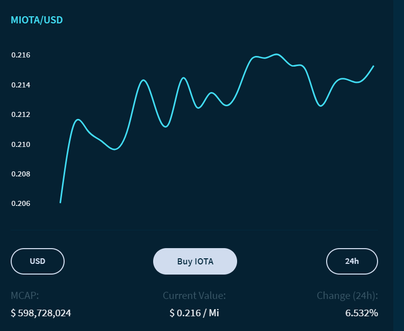
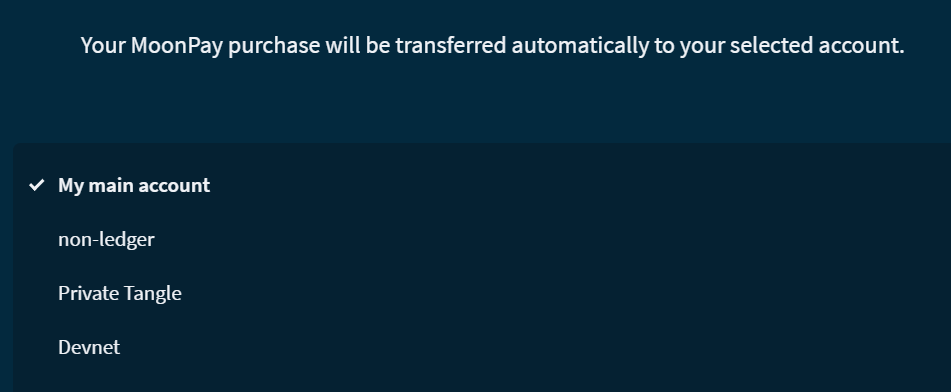

# Buy IOTA tokens in Trinity

**In this guide, you learn how to buy IOTA in Trinity. This process involves sending your personal data to a third-party provider called MoonPay. Trinity does not store any of your personal data.**

1. Click **Buy IOTA** and select the account to which you want your IOTA tokens to be sent

    

2. 