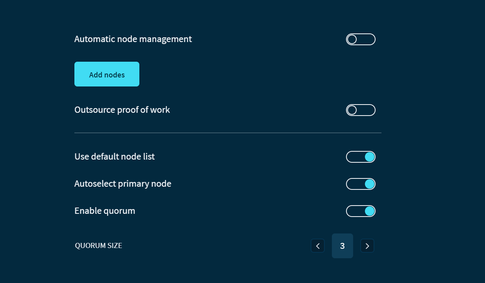

# Connect to custom nodes

**Trinity interacts with the Tangle through a [quorum](../concepts/node-quorum.md) of default nodes. You can choose to add one of your own nodes to the quorum, connect to a quorum of custom nodes, or connect to a specific node to use for proof of work.**

:::info:
All nodes in Trinity must communicate over HTTPS.
:::

## Connect Trinity to a quorum of custom nodes

As well as connecting to a single custom node, you can also add multiple custom nodes and use them as a node quorum. This way, you aren't restricted to using the built-in remote list of Trinity nodes.

1. Go to **Settings** > **Node** > **Add custom nodes**,  and enter the URL or IP address of the nodes you want to add

    :::info:
    To connect to a quorum of custom nodes, add more than one.
    :::

2. Disable the **Automatic node management** option

3. Disable the **Primary node autoswitching** option

    :::warning:
    When enabled, this option allows Trinity to connect to one of its defaults nodes if the primary one goes offline.

    By disabling this option, Trinity won't be able to connect to any nodes if the primary node goes offline.
    :::

4. Select your node from the dropdown menu

    :::warning:Devnet nodes
    If your custom node is a Devnet node, you must also disable the **Use remote list** option. The nodes in that list are Mainnet nodes, so they're incompatible with the Devnet.
    :::

5. Click **Save**

:::success:Congratulations! :tada:
All the information that Trinity displays about the Tangle is now sent from your custom nodes.
:::

## Outsource proof of work

Before you send a transaction, it must include a [proof of work](root://dev-essentials/0.1/concepts/minimum-weight-magnitude.md). Proof of work requires a computer to use energy to do computations. By default proof of work is done on the computer that is running Trinity.

You can use the Outsouce proof of work option to ask a specific node to do the proof of work for your transactions

